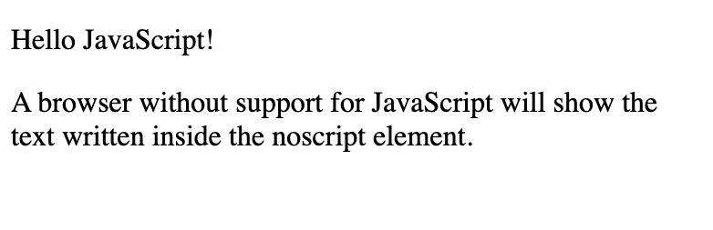

### JavaScript data button

```
<!DOCTYPE html>
<html>
<body>

<h1 style="color:CornflowerBlue;">JavaScript</h1>

<button type="button"
style="background-color:burlywood; border-color:blue; color:white"
onclick="document.getElementById('demo').innerHTML = Date()">
Click me to display Date and Time</button>

<p id="demo"></p>

</body>
</html> 
```


### The HTML `<script>` Tag

The HTML `<script>` tag is used to define a client-side script (JavaScript).

The `<script>` element either contains script statements, or it points to an external script file through the `src` attribute.

Common uses for JavaScript are image manipulation, form validation, and dynamic changes of content.

To select an HTML element, JavaScript most often uses the `document.getElementById()` method.

### JavaScript can change styles:

```
<!DOCTYPE html>
<html>
<body>

<h1>JavaScript</h1>

<p id="demo">JavaScript can change the style of an HTML element.</p>

<script>
function myFunction() {
  document.getElementById("demo").style.fontSize = "25px"; 
  document.getElementById("demo").style.color = "yellow";
  document.getElementById("demo").style.backgroundColor = "blue";        
}
</script>

<button type="button" onclick="myFunction()">Click Me!</button>

</body>
</html>
```


```
<!DOCTYPE html>
<html>
<body>

<h1>My First JavaScript</h1>
<p>Here, a JavaScript changes the value of the src (source) attribute of an image.</p>

<script>
function light(sw) {
  var pic;
  if (sw == 0) {
    pic = "doc-files/light1.jpg"
  } else {
    pic = "doc-files/light2.jpg"
  }
  document.getElementById('myImage').src = pic;
}
</script>


<p>
<button type="button" onclick="light(1)">Light On</button>
<button type="button" onclick="light(0)">Light Off</button>
</p>

</body>
</html>
```


### The HTML <noscript> tag

```
<!DOCTYPE html>
<html>
<body>

<p id="demo"></p>

<script>
document.getElementById("demo").innerHTML = "Hello JavaScript!";
</script>

<noscript>Sorry, your browser does not support JavaScript!</noscript>

<p>A browser without support for JavaScript will show the text written inside the noscript element.</p>
 
</body>
</html>
```



