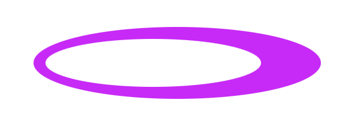
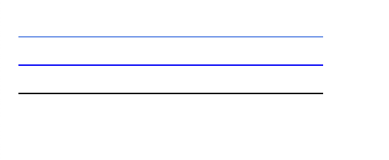

## SVG - `<circle>`

```
<!DOCTYPE html>
<html>
<body>

<h1>SVG</h1>

<svg width="150" height="150">
   <circle cx="75" cy="75" r="70" stroke="mediumblue" stroke-width="4" fill="dodgerblue" />
</svg> 
 
</body>
</html>
```


## Ellipse - `<ellipse>`

`cx` attribute defines the `x` coordinate of the center of the ellipse

`cy` attribute defines the `y` coordinate of the center of the ellipse

`rx` attribute defines the horizontal radius

`ry` attribute defines the vertical radius


```
<!DOCTYPE html>
<html>
<body>

<svg height="140" width="200">
  <ellipse cx="100" cy="80" rx="70" ry="50" style="fill:rgb(94, 94, 232);stroke:purple;stroke-width:5" />
</svg>

</body>
</html>
```


```
<!DOCTYPE html>
<html>
<body>

<svg height="150" width="300">
  <ellipse cx="140" cy="100" rx="120" ry="30" style="fill:rgb(87, 9, 113)" />
  <ellipse cx="120" cy="70" rx="90" ry="20" style="fill:rgb(123, 83, 210)" />
  <ellipse cx="110" cy="45" rx="70" ry="15" style="fill:rgb(156, 121, 236)" />
</svg>

</body>
</html>
```


```
<!DOCTYPE html>
<html>
<body>

<svg height="100" width="300">
  <ellipse cx="140" cy="50" rx="120" ry="30" style="fill:rgb(217, 0, 255)" />
  <ellipse cx="120" cy="50" rx="90" ry="20" style="fill:white" />
</svg>

</body>
</html>
```




## Rectangle - `<rect>`

```
<!DOCTYPE html>
<html>
<body>

<svg width="200" height="100">
  <rect width="150" height="80" style="fill:rgb(66, 66, 228);stroke-width:10;stroke:rgb(233, 21, 21)" />
</svg>
 
</body>
</html>
```


`x` attribute defines the left position of the rectangle (e.g. x="40" places the rectangle 40 px from the left margin)


`y` attribute defines the top position of the rectangle (e.g. y="30" places the rectangle 30 px from the top margin)


The CSS fill-opacity property defines the opacity of the fill color (legal range: 0 to 1)

The CSS stroke-opacity property defines the opacity of the stroke color (legal range: 0 to 1)

```
<!DOCTYPE html>
<html>
<body>

<svg width="200" height="180">
  <rect x="40" y="30" width="100" height="100" style="fill:blue;stroke:pink;stroke-width:5;fill-opacity:0.2;stroke-opacity:0.8" />
</svg>
 
</body>
</html>
```


```
<!DOCTYPE html>
<html>
<body>

<svg width="200" height="180">
  <rect x="40" y="20" rx="20" ry="20" width="100" height="100" style="fill:rgb(238, 12, 80);stroke:rgb(55, 31, 231);stroke-width:5;opacity:0.5" /> 
</svg>

</body>
</html>
```


## Line - `<line>`

`x1` attribute defines the start of the line on the x-axis

`y1` attribute defines the start of the line on the y-axis

`x2` attribute defines the end of the line on the x-axis

`y2` attribute defines the end of the line on the y-axis


```
<!DOCTYPE html>
<html>
<body>

<svg height="210" width="300">
  <line x1="0" y1="0" x2="100" y2="100" style="stroke:rgb(129, 16, 210);stroke-width:5" />
</svg>

</body>
</html>
```


## Polygon - `<polygon>`

```
<!DOCTYPE html>
<html>
<body>

<svg height="220" width="300">
  <polygon points="200,10 250,190 160,210" style="fill:rgb(238, 147, 243);stroke:purple;stroke-width:5" />
</svg>

</body>
</html>
```


```
<!DOCTYPE html>
<html>
<body>

<svg height="270" width="300">
  <polygon points="220,40 250,210 170,250 123,234" style="fill:rgb(131, 45, 230);stroke:rgb(58, 0, 128);stroke-width:5" />
</svg>

</body>
</html>
```


```
<!DOCTYPE html>
<html>
<body>

<svg height="210" width="300">
  <polygon points="100,10 40,198 190,78 10,78 160,198" style="fill:rgb(238, 154, 235);stroke:purple;stroke-width:5;fill-rule:nonzero;"/>  
</svg>

</body>
</html>
```


```
<!DOCTYPE html>
<html>
<body>

<svg height="210" width="300">
  <polygon points="100,10 40,198 190,78 10,78 160,198" style="fill:rgb(198, 151, 234);stroke:purple;stroke-width:5;fill-rule:evenodd;"/>
</svg>

</body>
</html>
```


## Polyline - `<polyline>`

```
<!DOCTYPE html>
<html>
<body>

<svg height="180" width="300">
  <polyline points="0,40 40,40 40,80 80,80 80,120 120,120 120,160" style="fill:rgb(255, 255, 255);stroke:rgb(124, 65, 241);stroke-width:4" />
</svg>

</body>
</html>
```


## Path - `<path>`

https://developer.mozilla.org/en-US/docs/Web/SVG/Attribute/d

Comands: 

M = moveto

L = lineto

H = horizontal lineto

V = vertical lineto

C = curveto

S = smooth curveto

Q = quadratic Bézier curve

T = smooth quadratic Bézier curveto

A = elliptical Arc

Z = closepath


```
<!DOCTYPE html>
<html>
<body>

<svg height="210" width="400">
  <path  
  fill="none"
    stroke="red"
   
    d="M 10,50
           Q 25,25 40,50
           t 30,0 30,0 30,0 30,0 30,0" />
</svg>

</body>
</html>
```


```
<!DOCTYPE html>
<html>
<body>

<svg height="210" width="400">
  <path  d="M 10,50
  Q 25,25 40,50
  t 30,0 30,0 30,0 30,0 30,0" stroke="green" stroke-width="3" />
</svg>

</body>
</html>
```


```
<!DOCTYPE html>
<html>
<body>

<svg height="210" width="400">
  <path d="M150 0 L75 200 L225 200 Z" fill="orange" stroke="red" stroke-width="3" />
</svg>

</body>
</html>
```


## SVG `<text>`

```
<!DOCTYPE html>
<html>
<body>

<svg height="30" width="200">
  <text x="0" y="15" fill="purple">SVG text</text>
</svg>
 
</body>
</html>
```


## Rotate text on several lines with a link 


```
<!DOCTYPE html>
<html>
<body>

<svg height="200" width="200"  xmlns:xlink="http://git.artemi.uk/xlink">
  <text x="20" y="20" style="fill:rgb(116, 141, 232);" transform="rotate(30 20,40)" >Lines:
    <tspan x="20" y="50" transform="rotate(30 20,40)">First line</tspan>
    <a xlink:href="http://git.artemi.uk/" target="_blank">
      <tspan x="20" y="80" fill="red" transform="rotate(30 20,40)">Link line</tspan>
    </a>
  </text>
</svg>
 
</body>
</html>
```


## `stroke`

```
<!DOCTYPE html>
<html>
<body>

<svg height="80" width="300">
  <g fill="none">
    <path stroke="cornflowerblue" d="M5 20 l215 0" />
    <path stroke="blue" d="M5 40 l215 0" />
    <path stroke="black" d="M5 60 l215 0" />
  </g>
</svg>
 
</body>
</html>
```


## `stroke-width`

```
<!DOCTYPE html>
<html>
<body>

<svg height="80" width="300">
  <g fill="none" stroke="blue">
    <path stroke-width="2" d="M5 20 l215 0" />
    <path stroke-width="4" d="M5 40 l215 0" />
    <path stroke-width="6" d="M5 60 l215 0" />
  </g>
</svg>
 
</body>
</html>
```


## `stroke-linecap`

```
<!DOCTYPE html>
<html>
<body>

<svg height="80" width="300">
  <g fill="none" stroke="blue" stroke-width="6">
    <path stroke-linecap="butt" d="M5 20 l215 0" />
    <path stroke-linecap="round" d="M5 40 l215 0" />
    <path stroke-linecap="square" d="M5 60 l215 0" />
  </g>
</svg>
 
</body>
</html>
```


## `stroke-dasharray`

```
<!DOCTYPE html>
<html>
<body>

<svg height="80" width="300">
  <g fill="none" stroke="blue" stroke-width="4">
    <path stroke-dasharray="5,5" d="M5 20 l215 0" />
    <path stroke-dasharray="10,10" d="M5 40 l215 0" />
    <path stroke-dasharray="20,10,5,5,5,10" d="M5 60 l215 0" />
  </g>
</svg>
 
</body>
</html>
```


