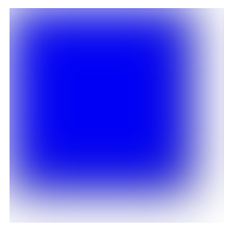
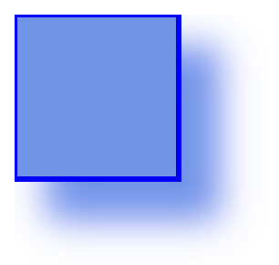
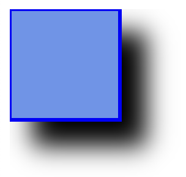
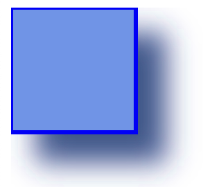
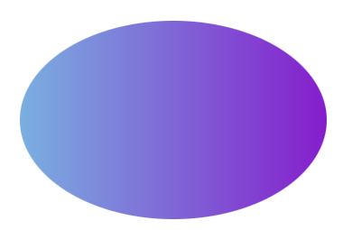
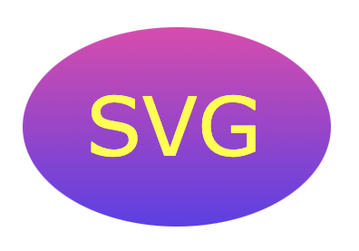
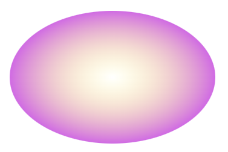
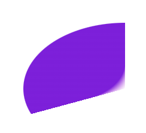

# SVG `<defs>` and `<filter>`

All internet SVG filters are defined within a `<defs>` element

 `<filter>` element is used to define an SVG filter.

## `<feGaussianBlur>`

```
<!DOCTYPE html>
<html>
<body>

<svg height="200" width="200">
  <defs>
    <filter id="f1" x="0" y="0">
      <feGaussianBlur in="SourceGraphic" stdDeviation="20" />
    </filter>
  </defs>
  <rect width="150" height="150" stroke="black" stroke-width="10" fill="blue" filter="url(#f1)" />
  
</svg>

</body>
</html>
```


id attribute of the `<filter>` element defines a unique name for the filter

blur effect is defined with the `<feGaussianBlur>` element

`in="SourceGraphic"` part defines that the effect is created for the entire element

`stdDeviation` attribute defines the amount of the blur

filter attribute of the `<rect>` element links the element to the "f1" filter

## `<feOffset>`

```
<!DOCTYPE html>
<html>
<body>

<svg height="120" width="120">
  <defs>
    <filter id="f1" x="0" y="0" width="200%" height="200%">
      <feOffset result="offOut" in="SourceGraphic" dx="20" dy="20" />
      <feBlend in="SourceGraphic" in2="offOut" mode="normal" />
    </filter>
  </defs>
  <rect width="90" height="90" stroke="blue" stroke-width="5" fill="cornflowerblue" filter="url(#f1)" />
</svg>

</body>
</html>
```


```
<!DOCTYPE html>
<html>
<body>

<svg height="140" width="140">
  <defs>
    <filter id="f1" x="0" y="0" width="200%" height="200%">
      <feOffset result="offOut" in="SourceGraphic" dx="20" dy="20" />
      <feGaussianBlur result="blurOut" in="offOut" stdDeviation="10" />
      <feBlend in="SourceGraphic" in2="blurOut" mode="normal" />
    </filter>
  </defs>
  <rect width="90" height="90" stroke="blue" stroke-width="3" fill="cornflowerblue" filter="url(#f1)" />  
</svg>

</body>
</html>
```


The in attribute of the `<feOffset>` element is changed to "SourceAlpha" which uses the Alpha channel for the blur instead of the entire RGBA pixel

```
<!DOCTYPE html>
<html>
<body>

<svg height="140" width="140">
  <defs>
    <filter id="f1" x="0" y="0" width="200%" height="200%">
      <feOffset result="offOut" in="SourceAlpha" dx="20" dy="20" />
      <feGaussianBlur result="blurOut" in="offOut" stdDeviation="10" />
      <feBlend in="SourceGraphic" in2="blurOut" mode="normal" />
    </filter>
  </defs>
  <rect width="90" height="90" stroke="blue" stroke-width="3" fill="cornflowerblue" filter="url(#f1)" />
</svg>

</body>
</html>
```




`<feColorMatrix>` filter is used to transform the colors in the offset image closer to black. The three values of '0.2' in the matrix all get multiplied by the red, green and blue channels. Reducing their values brings the colors closer to black (black is 0)

```
<!DOCTYPE html>
<html>
<body>

<svg height="140" width="140">
  <defs>
    <filter id="f1" x="0" y="0" width="200%" height="200%">
      <feOffset result="offOut" in="SourceGraphic" dx="20" dy="20" />
      <feColorMatrix result = "matrixOut" in = "offOut" type = "matrix" values = "0.3 0 0 0 0 0 0.3 0 0 0 0 0 0.3 0 0 0 0 0 1 0"/>
      <feGaussianBlur result="blurOut" in="matrixOut" stdDeviation="10" />
      <feBlend in="SourceGraphic" in2="blurOut" mode="normal" />
    </filter>
  </defs>
  <rect width="90" height="90" stroke="blue" stroke-width="3" fill="cornflowerblue" filter="url(#f1)" />
</svg>

</body>
</html>
```



## `<linearGradient>`

```
<!DOCTYPE html>
<html>
<body>

<svg height="150" width="400">
  <defs>
    <linearGradient id="grad1" x1="0%" y1="0%" x2="100%" y2="0%">
      <stop offset="0%" style="stop-color:rgb(105, 177, 229);stop-opacity:1" />
      <stop offset="100%" style="stop-color:rgb(145, 11, 212);stop-opacity:1" />
    </linearGradient>
  </defs>
  <ellipse cx="200" cy="70" rx="85" ry="55" fill="url(#grad1)" />
</svg>

</body>
</html>
```



id attribute of the `<linearGradient>` tag defines a unique name for the gradient

x1, x2, y1,y2 attributes of the `<linearGradient>` tag define the start and end position of the gradient

The color range for a gradient can be composed of two or more colors. Each color is specified with a `<stop>` tag. 

The offset attribute is used to define where the gradient color begin and end

The fill attribute links the ellipse element to the gradient

```
<!DOCTYPE html>
<html>
<body>

<svg height="150" width="400">
  <defs>
    <linearGradient id="grad1" x1="0%" y1="0%" x2="0%" y2="100%">
      <stop offset="0%" style="stop-color:rgb(232, 62, 178);stop-opacity:1" />
      <stop offset="100%" style="stop-color:rgb(96, 62, 235);stop-opacity:1" />
    </linearGradient>
  </defs>
  <ellipse cx="200" cy="70" rx="85" ry="55" fill="url(#grad1)" />
  <text fill="#ffff00" font-size="45" font-family="Verdana" x="150" y="86">
    SVG</text>
</svg>

</body>
</html>
```


## `<radialGradient>`

```
<!DOCTYPE html>
<html>
<body>

<svg height="150" width="500">
  <defs>
    <radialGradient id="grad1" cx="50%" cy="50%" r="50%" fx="50%" fy="50%">
      <stop offset="0%" style="stop-color:rgb(255, 246, 71);stop-opacity:0" />
      <stop offset="100%" style="stop-color:rgb(223, 99, 234);stop-opacity:1" />
    </radialGradient>
  </defs>
  <ellipse cx="200" cy="70" rx="85" ry="55" fill="url(#grad1)" />
</svg>

</body>
</html>
```



```
<!DOCTYPE html>
<html>
<body>

<svg height="150" width="500">
  <defs>
    <radialGradient id="grad1" cx="20%" cy="30%" r="30%" fx="50%" fy="50%">
      <stop offset="0%" style="stop-color:rgb(227, 109, 231);stop-opacity:0" />
      <stop offset="100%" style="stop-color:rgb(136, 18, 226);stop-opacity:1" />
    </radialGradient>
  </defs>
  <ellipse cx="200" cy="70" rx="85" ry="55" fill="url(#grad1)" />
</svg>

</body>
</html>
```




