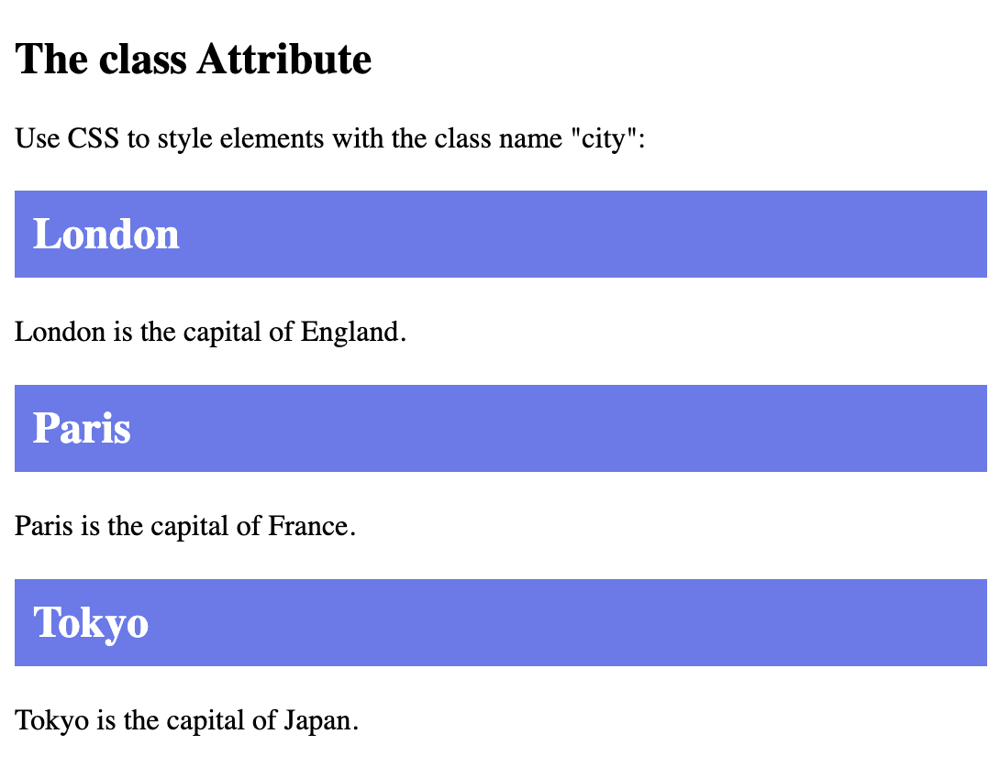
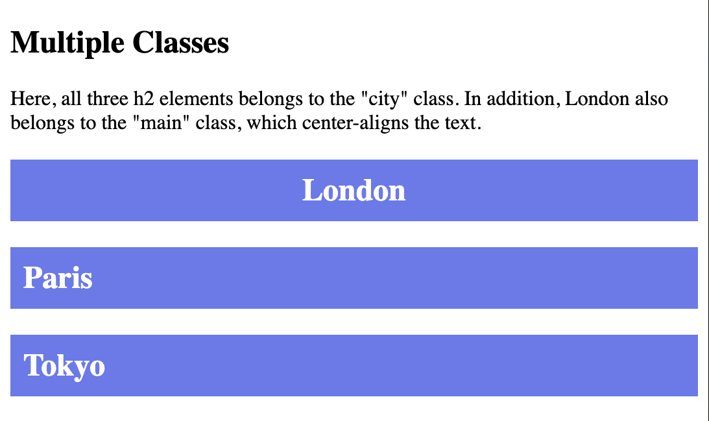
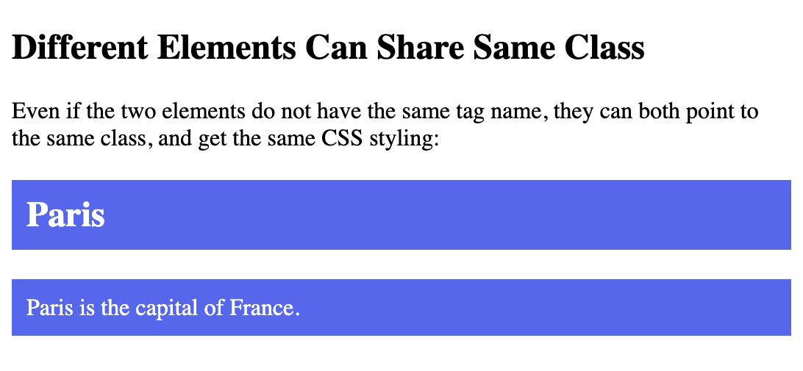
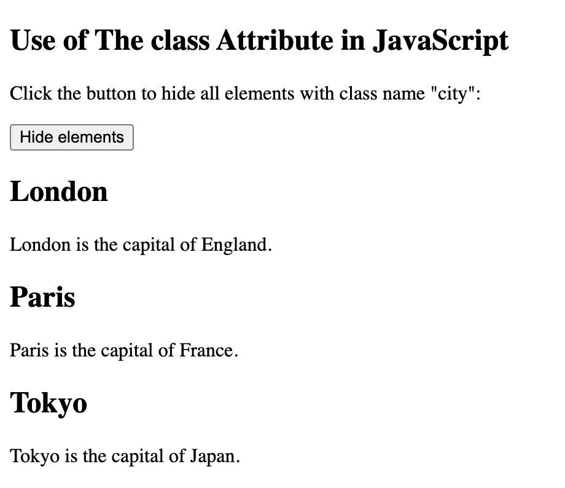
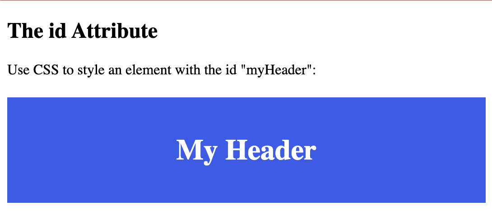
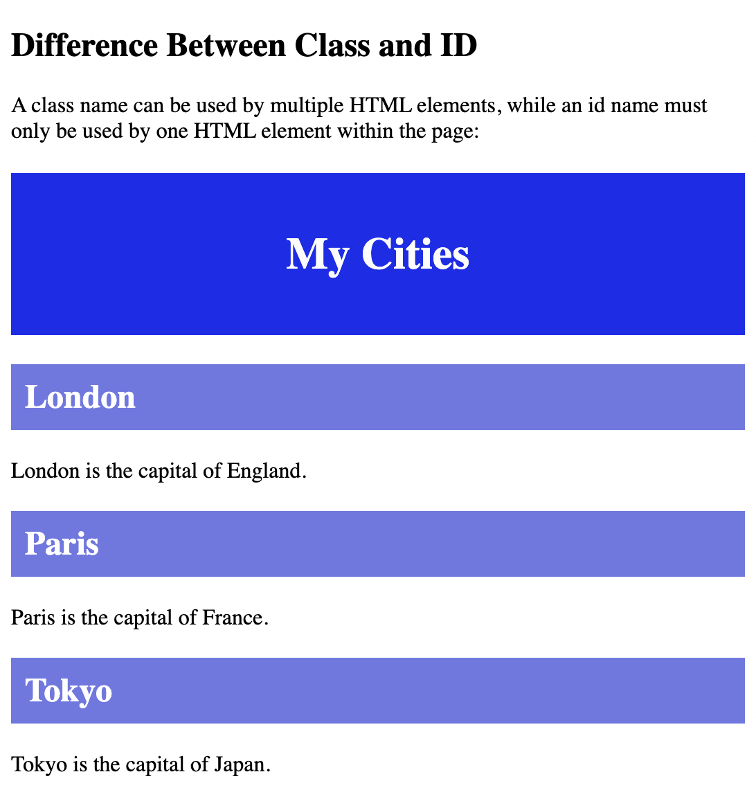
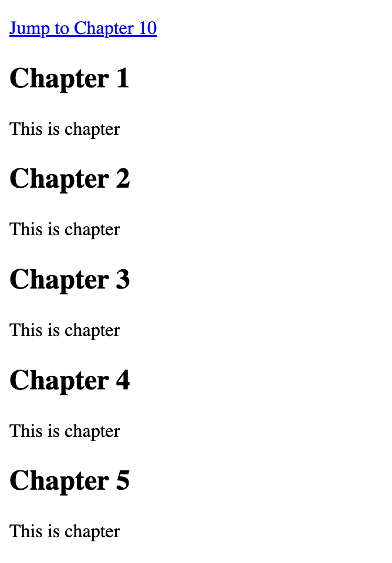
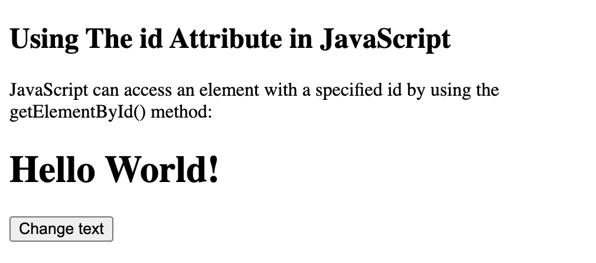

## Block-level elements

Block-level elements in HTML:

`<address>` `<article>` `<aside>` `<blockquote>` `<canvas>` `<dd>` `<div>` `<dl>` `<dt>` `<fieldset>` `<figcaption>` `<figure>` `<footer>` `<form>` `<h1>-<h6>` `<header>` `<hr>` `<li>` `<main>` `<nav>` `<noscript>` `<ol>` `<p>` `<pre>` `<section>` `<table>` `<tfoot>` `<ul>` `<video>`

Two commonly used block elements are: `<p>` and `<div>`.

The `<p>` element defines a paragraph in an HTML document.

### <div> element

The `<div>` element defines a division or a section in an HTML document.

`<div>` element is often used as a container for other HTML elements.

It has no required attributes, but style, class and id are common.

When used together with CSS, the `<div>` element can be used to style blocks of content:


```
<!DOCTYPE html>
<html>
<body>

<p style="border: 1px solid black">Hello World</p>
<div style="border: 1px solid black">Hello World</div>

<p>The P and the DIV elements are both block elements, and they will always start on a new line and take up the full width available (stretches out to the left and right as far as it can).</p>

</body>
</html>
```


```
<!DOCTYPE html>
<html>
<body>

<div style="background-color:rgb(136, 148, 244);color:rgb(2, 98, 241);padding:20px;">
  <h2>Cloud</h2>
  <p>A cloud is water vapour in the atmosphere (sky) that has condensed into very small water droplets or ice crystals that appear in visible shapes or formations above the ground.</p>
  <p>Clouds are heavy. The water in a cloud can have a mass of several million tons. Every cubic metre (m3) of the cloud has only about 5 grams of water in it. Cloud droplets are also about 1000 times heavier than evaporated water, so they are much heavier than air. They do not fall, but stay in the air, because there is warm air all round the heavier water droplets. When water changes from gas to droplets, this makes heat. Because the droplets are very small, they "stick" to the warm air.</p>
</div> 

</body>
</html>
```


## Inline elements

An inline element cannot contain a block-level element

Inline elements in HTML:

`<a>` `<abbr>` `<acronym>` `<b>` `<bdo>` `<big>` `<br>` `<button>` `<cite>` `<code>` `<dfn>` `<em>` `<i>` `` `<input>` `<kbd>` `<label>` `<map>` `<object>` `<output>` `<q>` `<samp>` `<script>` `<select>` `<small>` `<span>` `<strong>` `<sub>` `<sup>` `<textarea>` `<time>` `<tt>` `<var>`

### `<span>` element

`<span>` element is an inline container used to mark up a part of a text, or a part of a document.

The `<span>` element has no required attributes, but style, class and id are common.

```
<!DOCTYPE html>
<html>
<body>

<h1>The span element</h1>

<p>The grass is <span style="color:green;font-weight:bold;">green</span> and the clouds are <span style="color:blue;font-weight:bold;">blue</span>.</p>

</body>
</html>
```


```
<!DOCTYPE html>
<html>
<body>

<p>This is an inline span <span style="border: 1px solid black">Hello World</span> element inside a paragraph.</p>

<p>The SPAN element is an inline element, and will not start on a new line and only takes up as much width as necessary.</p>

</body>
</html>
```


## HTML `class` attribute


The class attribute is often used to point to a class name in a style sheet. It can also be used by a JavaScript to access and manipulate elements with the specific class name.


Three `<div>` elements with a class attribute with the value of "city". All of the three `<div>` elements will be styled equally according to the .city style definition in the head section:

```
<!DOCTYPE html>
<html>
<head>
<style>
.city {
  background-color: rgb(116, 161, 243);
  color: rgb(58, 2, 242);
  border: 2px solid rgb(255, 230, 0);
  margin: 20px;
  padding: 20px;
}
</style>
</head>
<body>

<div class="city">
<h2>London</h2>
<p>London is the capital of England.</p>
</div> 

<div class="city">
<h2>Paris</h2>
<p>Paris is the capital of France.</p>
</div>

<div class="city">
<h2>Tokyo</h2>
<p>Tokyo is the capital of Japan.</p>
</div>

</body>
</html>
```


### Two `<span>` elements with a class attribute with the value of "note". Both `<span>` elements will be styled equally according to the .note style definition in the head section:

```
<!DOCTYPE html>
<html>
<head>
<style>
.note {
  font-size: 120%;
  color: rgb(46, 46, 219);
}
</style>
</head>
<body>

<h1>My <span class="note">Important</span> Heading</h1>
<p>This is some <span class="note">important</span> text.</p>

</body>
</html>
```


### The `class` attribute

```
<!DOCTYPE html>
<html>
<head>
<style>
.city {
  background-color: rgb(103, 123, 239);
  color: white;
  padding: 10px;
}
</style>
</head>
<body>

<h2>The class Attribute</h2>
<p>Use CSS to style elements with the class name "city":</p>

<h2 class="city">London</h2>
<p>London is the capital of England.</p>

<h2 class="city">Paris</h2>
<p>Paris is the capital of France.</p>

<h2 class="city">Tokyo</h2>
<p>Tokyo is the capital of Japan.</p>

</body>
</html>
```



### Multiple classes

```
<!DOCTYPE html>
<html>
<head>
<style>
.city {
  background-color: rgb(103, 123, 239);
  color: white;
  padding: 10px;
} 

.main {
  text-align: center;
}
</style>
</head>
<body>

<h2>Multiple Classes</h2>
<p>Here, all three h2 elements belongs to the "city" class. In addition, London also belongs to the "main" class, which center-aligns the text.</p>

<h2 class="city main">London</h2>
<h2 class="city">Paris</h2>
<h2 class="city">Tokyo</h2>

</body>
</html>
```



### Different elements can share same class

```
<!DOCTYPE html>
<html>
<head>
<style>
.city {
  background-color: rgb(82, 104, 244);
  color: white;
  padding: 10px;
} 
</style>
</head>
<body>

<h2>Different Elements Can Share Same Class</h2>

<p>Even if the two elements do not have the same tag name, they can both point to the same class, and get the same CSS styling:</p>

<h2 class="city">Paris</h2>
<p class="city">Paris is the capital of France.</p>

</body>
</html>
```



### The `class` attribute in JavaScript

```
<!DOCTYPE html>
<html>
<body>

<h2>Use of The class Attribute in JavaScript</h2>
<p>Click the button to hide all elements with class name "city":</p>

<button onclick="myFunction()">Hide elements</button>

<h2 class="city">London</h2>
<p>London is the capital of England.</p>

<h2 class="city">Paris</h2>
<p>Paris is the capital of France.</p>

<h2 class="city">Tokyo</h2>
<p>Tokyo is the capital of Japan.</p>

<script>
function myFunction() {
  var x = document.getElementsByClassName("city");
  for (var i = 0; i < x.length; i++) {
    x[i].style.display = "none";
  }
}
</script>

</body>
</html>
```



## HTML `id` attribute

The HTML `id` attribute is used to specify a unique id for an HTML element.

You cannot have more than one element with the same id in an HTML document.

```
<!DOCTYPE html>
<html>
<head>
<style>
#myHeader {
  background-color: rgb(52, 92, 236);
  color: rgb(255, 255, 255);
  padding: 40px;
  text-align: center;
} 
</style>
</head>
<body>

<h2>The id Attribute</h2>
<p>Use CSS to style an element with the id "myHeader":</p>

<h1 id="myHeader">My Header</h1>

</body>
</html>
```


```
<!DOCTYPE html>
<html>
<head>
<style>
/* Style the element with the id "myHeader" */
#myHeader {
  background-color: rgb(25, 46, 237);
  color: rgb(252, 252, 252);
  padding: 40px;
  text-align: center;
}

/* Style all elements with the class name "city" */
.city {
  background-color: rgb(110, 120, 228);
  color: white;
  padding: 10px;
} 
</style>
</head>
<body>

<h2>Difference Between Class and ID</h2>
<p>A class name can be used by multiple HTML elements, while an id name must only be used by one HTML element within the page:</p>

<!-- An element with a unique id -->
<h1 id="myHeader">My Cities</h1>

<!-- Multiple elements with same class -->
<h2 class="city">London</h2>
<p>London is the capital of England.</p>

<h2 class="city">Paris</h2>
<p>Paris is the capital of France.</p>

<h2 class="city">Tokyo</h2>
<p>Tokyo is the capital of Japan.</p>

</body>
</html>
```



### Create a bookmark in HTML

First, use the id attribute to create a bookmark:

`<h2 id="C10">Chapter 10</h2>`

Then, add a link to the bookmark ("Jump to Chapter 10"), from within the same page:


`<a href="#C10">Jump to Chapter 10</a>`

```
DOCTYPE html>
<html>
<body>

<p><a href="#C10" style="color:Blue;">Jump to Chapter 10</a></p>


<h2>Chapter 1</h2>
<p>This is chapter </p>

<h2>Chapter 2</h2>
<p>This is chapter </p>

<h2>Chapter 3</h2>
<p>This is chapter </p>

<h2>Chapter 4</h2>
<p>This is chapter </p>

<h2>Chapter 5</h2>
<p>This is chapter </p>

<h2>Chapter 6</h2>
<p>This is chapter </p>

<h2>Chapter 7</h2>
<p>This is chapter </p>

<h2>Chapter 8</h2>
<p>This is chapter </p>

<h2>Chapter 9</h2>
<p>This is chapter </p>

<h2 id="C10">Chapter 10</h2>
<p>This is chapter </p>

<h2>Chapter 11</h2>
<p>This is chapter </p>

<h2>Chapter 12</h2>
<p>This is chapter </p>

<h2>Chapter 13</h2>
<p>This is chapter </p>


</body>
</html>
```



### Using the `id` attribute in JavaScript

```
<!DOCTYPE html>
<html>
<body>

<h2>Using The id Attribute in JavaScript</h2>
<p>JavaScript can access an element with a specified id by using the getElementById() method:</p>

<h1 id="myHeader">Hello World!</h1>
<button onclick="displayResult()">Change text</button>

<script>
function displayResult() {
  document.getElementById("myHeader").innerHTML = "Have a nice day!";
}
</script>

</body>
</html>
```


