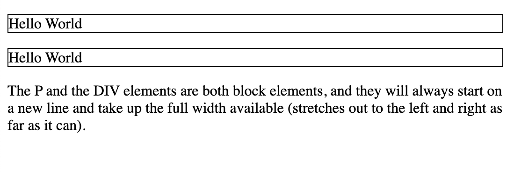
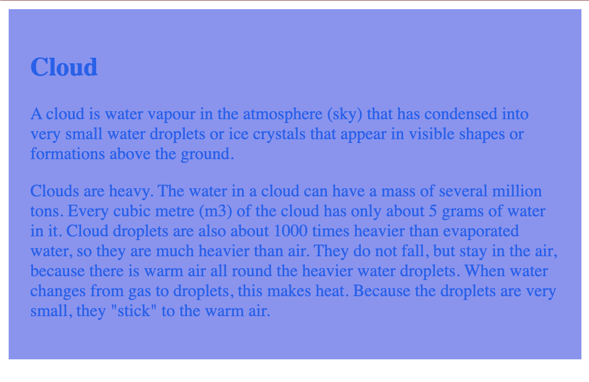
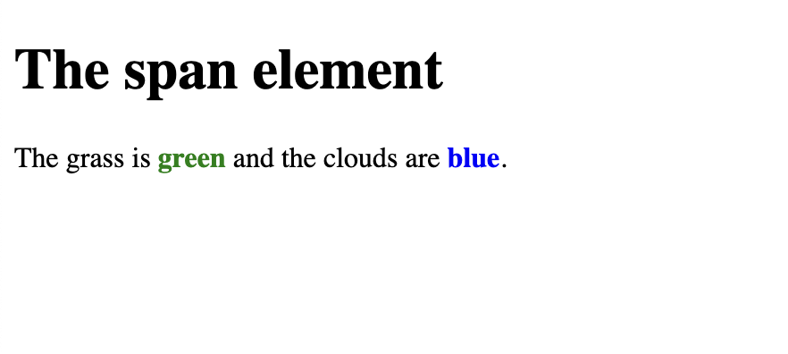
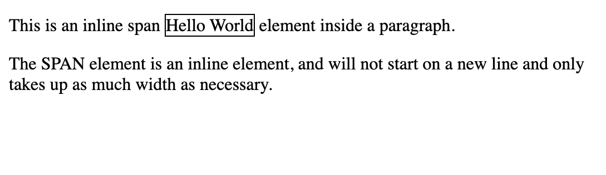
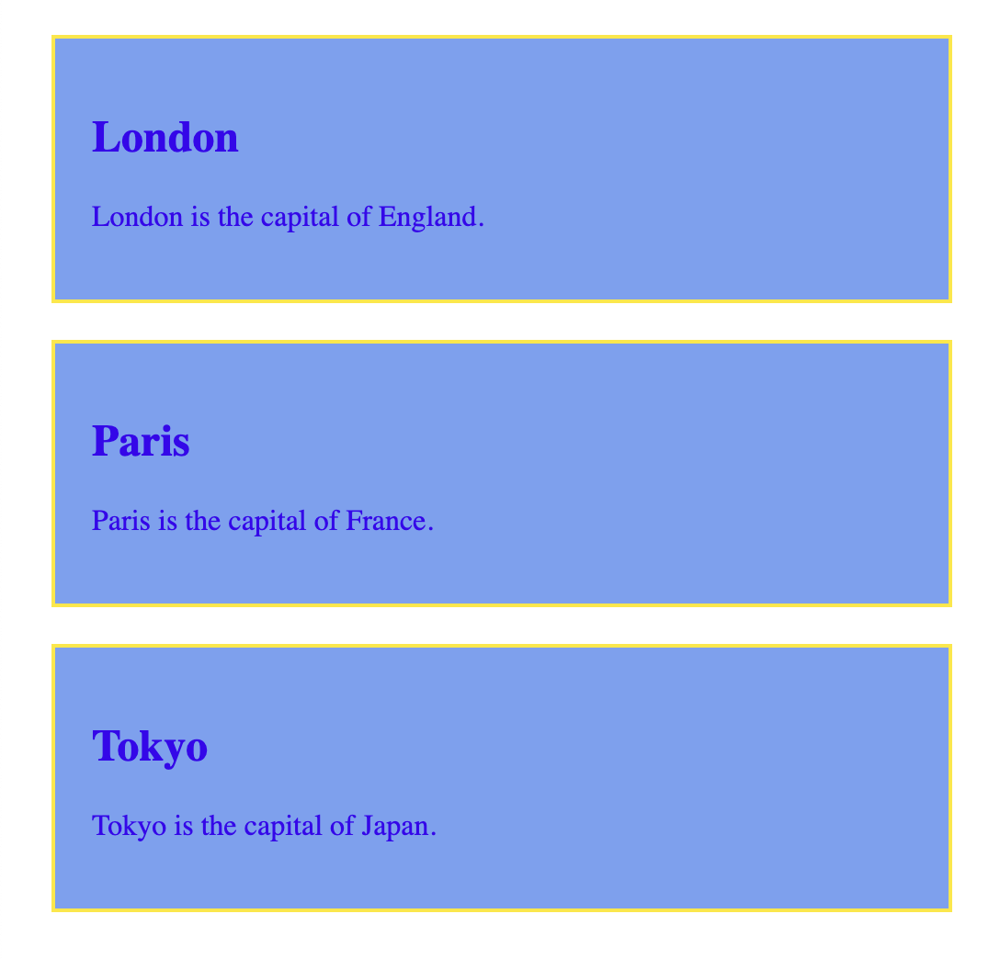
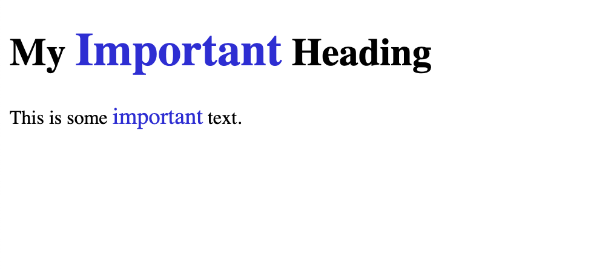

## Block-level elements

Block-level elements in HTML:

`<address>` `<article>` `<aside>` `<blockquote>` `<canvas>` `<dd>` `<div>` `<dl>` `<dt>` `<fieldset>` `<figcaption>` `<figure>` `<footer>` `<form>` `<h1>-<h6>` `<header>` `<hr>` `<li>` `<main>` `<nav>` `<noscript>` `<ol>` `<p>` `<pre>` `<section>` `<table>` `<tfoot>` `<ul>` `<video>`

Two commonly used block elements are: `<p>` and `<div>`.

The `<p>` element defines a paragraph in an HTML document.

### <div> element

The `<div>` element defines a division or a section in an HTML document.

`<div>` element is often used as a container for other HTML elements.

It has no required attributes, but style, class and id are common.

When used together with CSS, the `<div>` element can be used to style blocks of content:


```
<!DOCTYPE html>
<html>
<body>

<p style="border: 1px solid black">Hello World</p>
<div style="border: 1px solid black">Hello World</div>

<p>The P and the DIV elements are both block elements, and they will always start on a new line and take up the full width available (stretches out to the left and right as far as it can).</p>

</body>
</html>
```


```
<!DOCTYPE html>
<html>
<body>

<div style="background-color:rgb(136, 148, 244);color:rgb(2, 98, 241);padding:20px;">
  <h2>Cloud</h2>
  <p>A cloud is water vapour in the atmosphere (sky) that has condensed into very small water droplets or ice crystals that appear in visible shapes or formations above the ground.</p>
  <p>Clouds are heavy. The water in a cloud can have a mass of several million tons. Every cubic metre (m3) of the cloud has only about 5 grams of water in it. Cloud droplets are also about 1000 times heavier than evaporated water, so they are much heavier than air. They do not fall, but stay in the air, because there is warm air all round the heavier water droplets. When water changes from gas to droplets, this makes heat. Because the droplets are very small, they "stick" to the warm air.</p>
</div> 

</body>
</html>
```



## Inline elements

An inline element cannot contain a block-level element

Inline elements in HTML:

`<a>` `<abbr>` `<acronym>` `<b>` `<bdo>` `<big>` `<br>` `<button>` `<cite>` `<code>` `<dfn>` `<em>` `<i>` `` `<input>` `<kbd>` `<label>` `<map>` `<object>` `<output>` `<q>` `<samp>` `<script>` `<select>` `<small>` `<span>` `<strong>` `<sub>` `<sup>` `<textarea>` `<time>` `<tt>` `<var>`

### `<span>` element

`<span>` element is an inline container used to mark up a part of a text, or a part of a document.

The `<span>` element has no required attributes, but style, class and id are common.

```
<!DOCTYPE html>
<html>
<body>

<h1>The span element</h1>

<p>The grass is <span style="color:green;font-weight:bold;">green</span> and the clouds are <span style="color:blue;font-weight:bold;">blue</span>.</p>

</body>
</html>
```


```
<!DOCTYPE html>
<html>
<body>

<p>This is an inline span <span style="border: 1px solid black">Hello World</span> element inside a paragraph.</p>

<p>The SPAN element is an inline element, and will not start on a new line and only takes up as much width as necessary.</p>

</body>
</html>
```


## HTML `class` attribute


The class attribute is often used to point to a class name in a style sheet. It can also be used by a JavaScript to access and manipulate elements with the specific class name.


Three `<div>` elements with a class attribute with the value of "city". All of the three `<div>` elements will be styled equally according to the .city style definition in the head section:

```
<!DOCTYPE html>
<html>
<head>
<style>
.city {
  background-color: rgb(116, 161, 243);
  color: rgb(58, 2, 242);
  border: 2px solid rgb(255, 230, 0);
  margin: 20px;
  padding: 20px;
}
</style>
</head>
<body>

<div class="city">
<h2>London</h2>
<p>London is the capital of England.</p>
</div> 

<div class="city">
<h2>Paris</h2>
<p>Paris is the capital of France.</p>
</div>

<div class="city">
<h2>Tokyo</h2>
<p>Tokyo is the capital of Japan.</p>
</div>

</body>
</html>
```



Two `<span>` elements with a class attribute with the value of "note". Both `<span>` elements will be styled equally according to the .note style definition in the head section:




