`<canvas>` element is used to draw graphics, on the fly, via JavaScript.

`<canvas>` is container for graphics. To actually draw the graphics use JavaScript.

`<canvas>` has several methods for drawing paths, boxes, circles, text, and adding images.


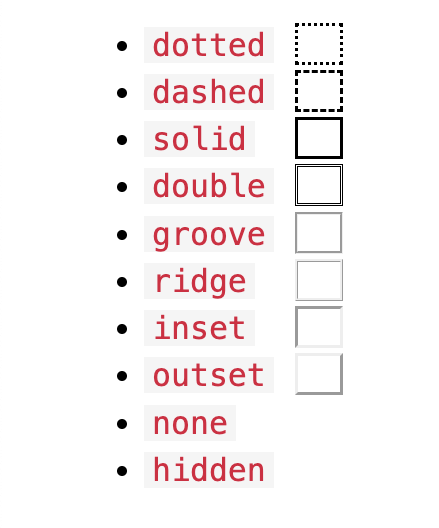


```
<!DOCTYPE html>
<html>
<body>
<h1>HTML5 Canvas</h1>

<canvas id="myCanvas" width="200" height="100" style="border:10px dashed rgb(13, 86, 221);"></canvas>

<script>
const canvas = document.getElementById("myCanvas");
const ctx = canvas.getContext("2d");

ctx.fillStyle = "#0066FF";
ctx.fillRect(10,10,180,80);
</script>

</body>
</html>
```

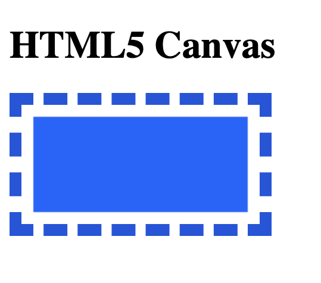


# Canvas coordinates 

`beginPath()` - begins a path

`moveTo(x,y)` - defines the starting point of the line

`lineTo(x,y)` - defines the ending point of the line

`stroke()` method draws to line. The default stroke color is black.


### Line 

```
<!DOCTYPE html>
<html>
<body>
<h1>HTML5 Canvas</h1>
<h2>Draw a Line</h2>

<canvas id="myCanvas" width="200" height="100" style="border:1px solid rgb(31, 97, 218);"></canvas>

<script>
// Create a canvas:
const canvas = document.getElementById("myCanvas");
const ctx = canvas.getContext("2d");

// Define a new path:
ctx.beginPath();

// Define a start point
ctx.moveTo(0,0);

// Define an end point
ctx.lineTo(200,100);

// Draw it
ctx.stroke();
</script>

</body>
</html>
```

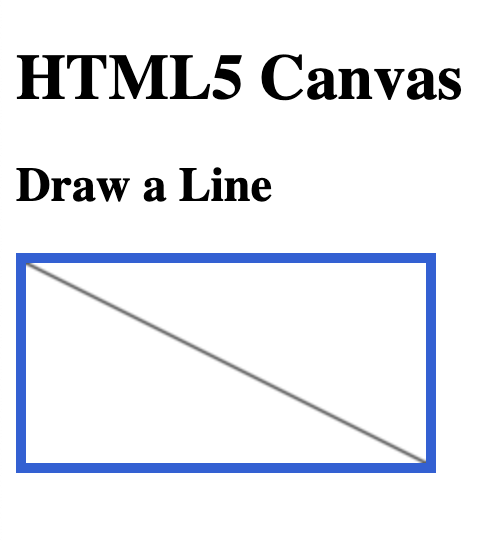

## `lineWidth` property

`lineWidth` property defines the line width to use, when drawing in the canvas context.


```
<!DOCTYPE html>
<html>
<body>
<h1>HTML5 Canvas</h1>
<h2>The lineWidth Propery</h2>

<canvas id="myCanvas" width="200" height="100" style="border:5px solid rgb(33, 69, 211);"></canvas>

<script>
const canvas = document.getElementById("myCanvas");
const ctx = canvas.getContext("2d");

ctx.beginPath();
ctx.moveTo(0,0);
ctx.lineTo(200,100);
ctx.lineWidth = 5;
ctx.stroke();
</script>

</body>
</html>
```

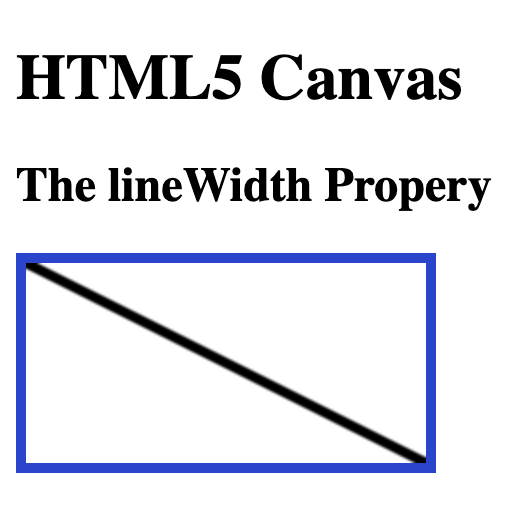


## `strokeStyle` property


`strokeStyle` property defines the style to use, when drawing in the canvas context.

```
<!DOCTYPE html>
<html>
<body>
<h1>HTML5 Canvas</h1>
<h2>The lineWidth Propery</h2>

<canvas id="myCanvas" width="200" height="100" style="border:5px solid rgb(33, 69, 211);"></canvas>

<script>
const canvas = document.getElementById("myCanvas");
const ctx = canvas.getContext("2d");

ctx.beginPath();

ctx.moveTo(0,0);
ctx.lineTo(200,100);
ctx.lineWidth = 5;
ctx.strokeStyle = "rgba(0, 0, 255, 0.5)";
ctx.fillStyle = "rgba(0, 0, 255, 0.5)";

ctx.stroke();
</script>

</body>
</html>
```
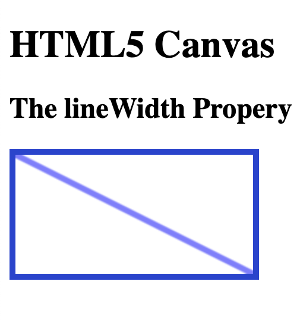


## `lineCap` property

`lineCap` property defines the cap style of the line (butt, round or square).

```
<!DOCTYPE html>
<html>
<body>
<h1>HTML5 Canvas</h1>
<h2>The lineCap Property</h2>

<canvas id="myCanvas" width="200" height="100" style="border:5px solid rgb(30, 63, 227);"></canvas>

<script>
const canvas = document.getElementById("myCanvas");
const ctx = canvas.getContext("2d");

ctx.moveTo(0,0);
ctx.lineTo(175,75);
ctx.lineWidth = 20;
ctx.lineCap = "round";
ctx.stroke();
</script>

</body>
</html>
```
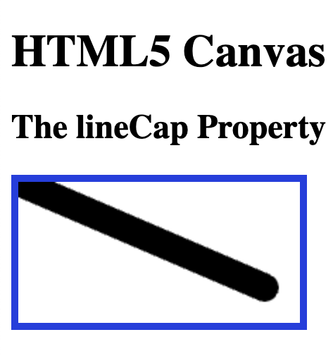

# Circle

`beginPath()` - begins a path

`arc`(x,y,r,startangle,endangle) - creates an arc/curve. 

To create a circle with arc(): Set start angle to 0 and end angle to `2*Math.PI`. The x and y parameters define the x- and y-coordinates of the center of the circle. The r parameter defines the radius of the circle.

```
<!DOCTYPE html>
<html>
<body>
<h1>HTML5 Canvas</h1>
<h2>The arc() Method</h2>

<canvas id="myCanvas" width="200" height="120" style="border:10px solid #2d2dd8;"></canvas>

<script>
const canvas = document.getElementById("myCanvas");
const ctx = canvas.getContext("2d");

ctx.beginPath();
ctx.arc(100,60,50,0,2*Math.PI);
ctx.stroke();
</script> 

</body>
</html>
```
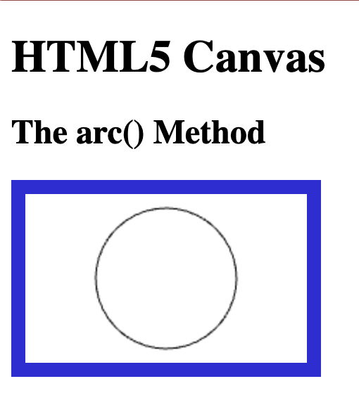


## Canvas Curves


beginPath() - Begin a path
arc(x,y,r,start,end) - Define a circle
stroke() - Stroke it

green Center: arc(100, 75, 50, 0 * Math.PI, 1.5 * Math.PI)
red Start angle: arc(100, 75, 50, 0, 1.5 * Math.PI)
blue End angle: arc(100, 75, 50, 0 * Math.PI, 1.5 * Math.PI)

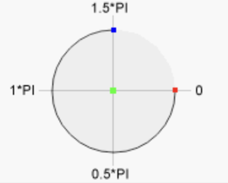

```
<!DOCTYPE html>
<html>
<body>
<h1>HTML5 Canvas</h1>
<h2>The arc() Method</h2>

<canvas id="myCanvas" width="300" height="150" style="border:5px solid rgb(67, 36, 220)"></canvas>

<script>
const c = document.getElementById("myCanvas");
const ctx = c.getContext("2d");
ctx.beginPath();
ctx.arc(100, 75, 50, 0.5 * Math.PI, 1.5 * Math.PI)

ctx.lineWidth = 5;
ctx.strokeStyle = "rgba(0, 0, 255, 1)";
ctx.fillStyle = "rgba(0, 0, 255, 1)";

ctx.stroke();
</script> 

</body>
</html>
```

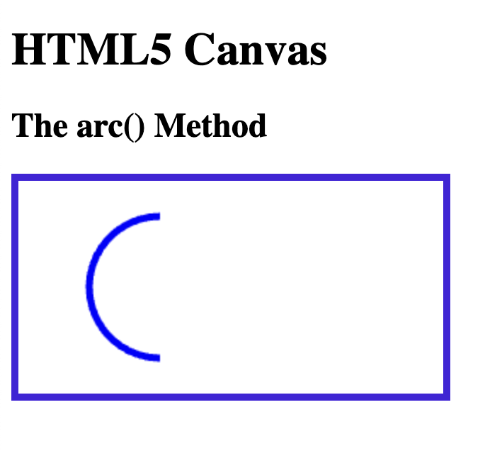

```
<!DOCTYPE html>
<html>
<body>
<h1>HTML5 Canvas</h1>
<h2>The arc() Method</h2>

<canvas id="myCanvas" width="300" height="150" style="border:1px solid grey"></canvas>

<script>
const c = document.getElementById("myCanvas");
const ctx = c.getContext("2d");
ctx.beginPath();
ctx.arc(100, 75, 50, 0, 2 * Math.PI);
ctx.fillStyle = "gray";
ctx.fill();
</script> 

</body>
</html>
```

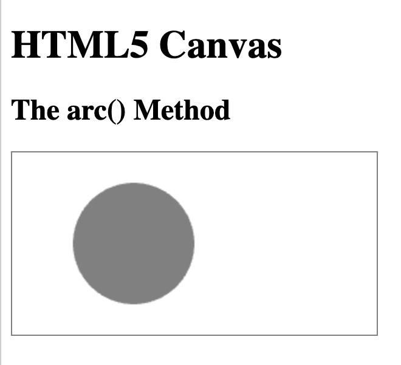


# Canvas shapes

```
<!DOCTYPE html>
<html>
<body>
<h1>HTML5 Canvas</h1>
<h2>Draw a Shape</h2>

<canvas id="myCanvas" width="200" height="150" style="border:5px solid rgb(44, 71, 224);"></canvas>

<script>
// Create a canvas:
const canvas = document.getElementById("myCanvas");
const ctx = canvas.getContext("2d");

// Define a new path:
ctx.beginPath();

// Define a start point
ctx.moveTo(30,30);

// Define points
ctx.lineTo(100,30);
ctx.lineTo(175,110);
ctx.lineTo(30,110);
ctx.lineTo(30,30);

// Draw it
ctx.stroke();
</script>

</body>
</html>
```

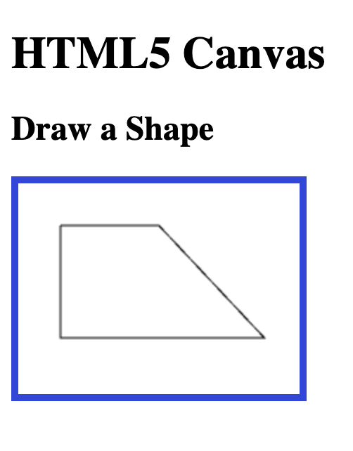


```
<!DOCTYPE html>
<html>
<body>
<h1>HTML5 Canvas</h1>
<h2>Draw a Shape</h2>

<canvas id="myCanvas" width="200" height="120" style="border:5px solid rgb(49, 87, 223);"></canvas>

<script>
// Create a canvas:
const canvas = document.getElementById("myCanvas");
const ctx = canvas.getContext("2d");

// Define a new path:
ctx.beginPath();

// Define a start point
ctx.moveTo(100,30);

// Define points
ctx.lineTo(100,30);
ctx.lineTo(175,100);
ctx.lineTo(30,100);
ctx.lineTo(100,30);

// Draw it
ctx.stroke();
</script>

</body>
</html>
```

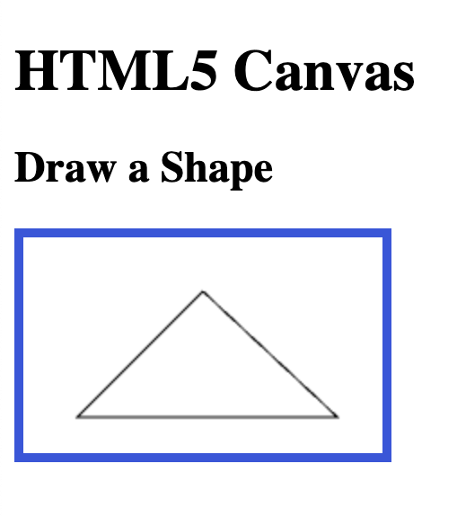


```
<!DOCTYPE html>
<html>
<body>
<h1>HTML5 Canvas</h1>
<h2>Draw a Shape</h2>

<canvas id="myCanvas" width="200" height="120" style="border:5px solid rgb(88, 98, 232);"></canvas>

<script>
// Create a canvas:
const canvas = document.getElementById("myCanvas");
const ctx = canvas.getContext("2d");

// Define a new path:
ctx.beginPath();

// Define a start point
ctx.moveTo(20,20);

// Define points
ctx.lineTo(175,20);
ctx.lineTo(175,100);
ctx.lineTo(20,100);
ctx.lineTo(20,20);

// Draw it
ctx.stroke();
</script>

</body>
</html>
```

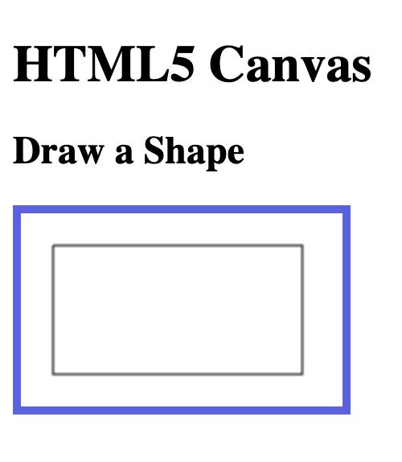


```
<!DOCTYPE html>
<html>
<body>
<h1>HTML5 Canvas</h1>
<h2>Draw Shapes</h2>

<canvas id="myCanvas" width="200" height="120" style="border:5px solid rgb(11, 32, 222);"></canvas>

<script>
// Create a canvas:
const canvas = document.getElementById("myCanvas");
const ctx = canvas.getContext("2d");

// Define a new path:
ctx.beginPath();

// Define a rectangle
ctx.moveTo(20,20);
ctx.lineTo(175,20);
ctx.lineTo(175,100);
ctx.lineTo(20,100);
ctx.lineTo(20,20);

// Define a triangle 
ctx.moveTo(100,20);
ctx.lineTo(175,100);
ctx.lineTo(20,100);
ctx.lineTo(100,20);

// Draw it
ctx.strokeStyle = "rgb(88, 98, 232)";
ctx.stroke();
</script>

</body>
</html>
```

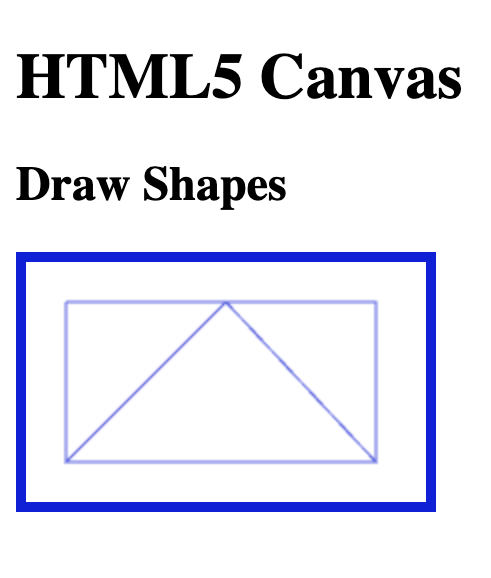


```
<!DOCTYPE html>
<html>
<body>
<h1>HTML5 Canvas</h1>
<h2>The rect() Method</h2>

<canvas id="myCanvas" width="300" height="160" style="border:5px solid rgb(34, 8, 227)"></canvas>

<script>
const canvas = document.getElementById("myCanvas");
const ctx = canvas.getContext("2d");

// midnight blue rectangle
ctx.beginPath();
ctx.lineWidth = "6";
ctx.strokeStyle = "#191970";
ctx.rect(15, 20, 260, 120);  
ctx.stroke();

// dodger blue rectangle
ctx.beginPath();
ctx.lineWidth = "4";
ctx.strokeStyle = "#1E90FF";
ctx.rect(40, 40, 50, 50);
ctx.stroke();

// light sky blue rectangle
ctx.beginPath();
ctx.lineWidth = "10";
ctx.strokeStyle = "#87CEFA";
ctx.rect(60, 60, 160, 60);
ctx.stroke();
</script> 

</body>
</html>
```

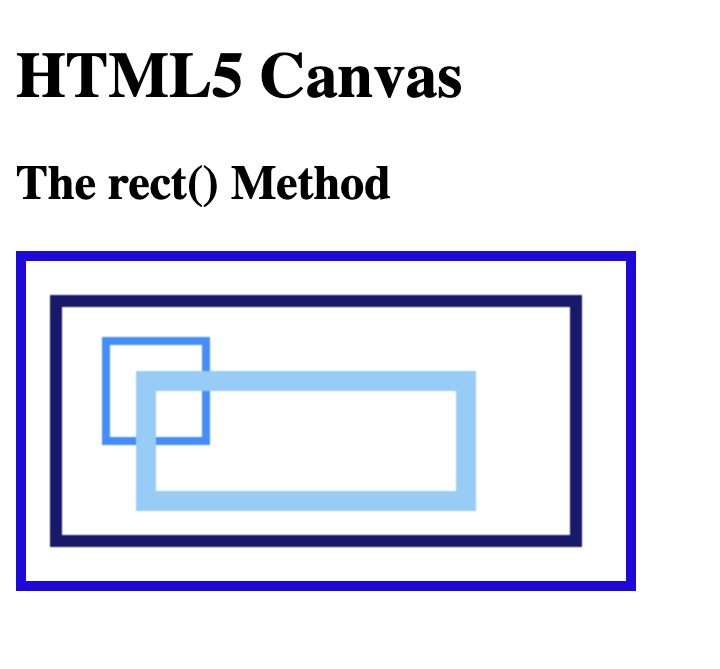

## `createLinearGradient()`

```
<!DOCTYPE html>
<html>
<body>
<h1>HTML5 Canvas</h1>

<canvas id="myCanvas" width="110" height="100" style="border:5px solid rgb(10, 14, 231);"></canvas>

<script>
const c = document.getElementById("myCanvas");
const ctx = c.getContext("2d");

// Create gradient
const grd = ctx.createLinearGradient(10,0,100,0);
grd.addColorStop(0,"blue");
grd.addColorStop(1,"white");

// Fill with gradient
ctx.fillStyle = grd;
ctx.fillRect(10,10,150,80);
</script>

</body>
</html>
```
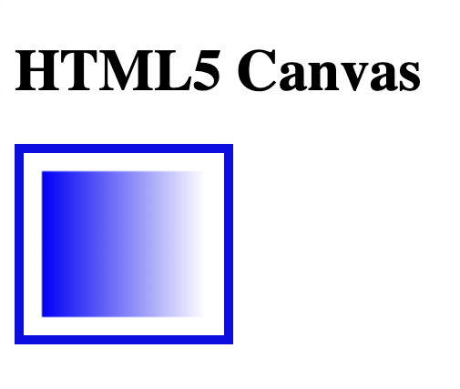

## `createRadialGradient()`
```
<!DOCTYPE html>
<html>
<body>
<h1>HTML5 Canvas</h1>

<canvas id="myCanvas" width="160" height="100" style="border:1px solid grey;"></canvas>

<script>
const c = document.getElementById("myCanvas");
const ctx = c.getContext("2d");

// Create gradient
const grd = ctx.createRadialGradient(75,50,5,90,60,100);
grd.addColorStop(0,"red");
grd.addColorStop(1,"blue");

// Fill with gradient
ctx.fillStyle = grd;
ctx.fillRect(10,10,140,80);
</script>

</body>
</html>
```

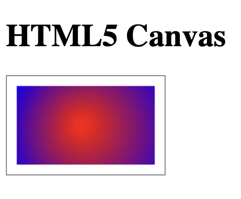

