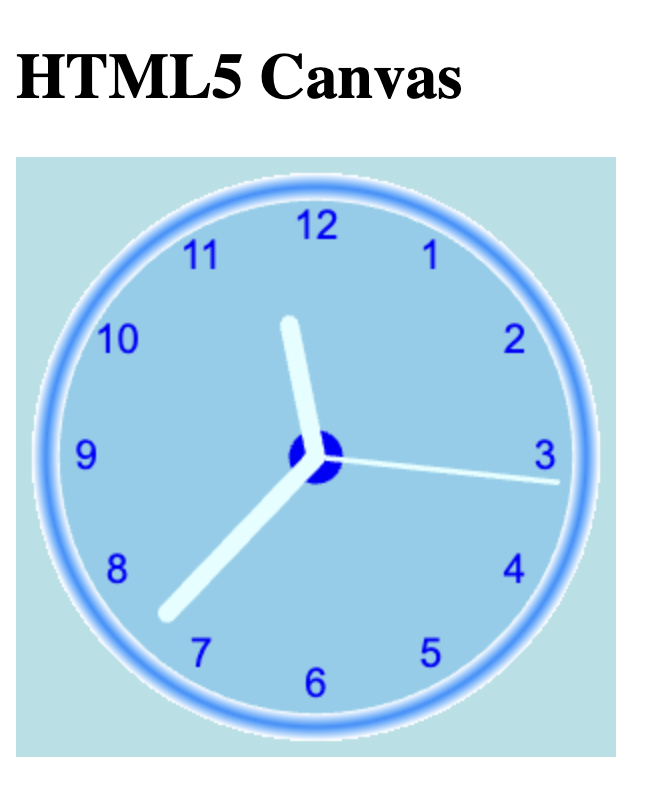

# Canvas Clock

Remap the (0,0) position (of the drawing object) to the center of the canvas:

`ctx.translate(radius, radius);`

Reduce the clock radius (to 90%) to draw the clock well inside the canvas:

`radius = radius * 0.90;`

Create a function to draw the clock:
```
function drawClock() {
  ctx.arc(0, 0, radius, 0 , 2 * Math.PI);
  ctx.fillStyle = "white";
  ctx.fill();
}
```

Create a drawFace() function for drawing the clock face:
```
function drawClock() {
  drawFace(ctx, radius);
}

function drawFace(ctx, radius) {
}
```

Draw the white circle:


```
ctx.beginPath();
ctx.arc(0, 0, radius, 0, 2 * Math.PI);
ctx.fillStyle = 'white';
ctx.fill();
```

Create a radial gradient (95% and 105% of original clock radius):
```
grad = ctx.createRadialGradient(0, 0, radius * 0.95, 0, 0, radius * 1.05);
```

Create 3 color stops, corresponding with the inner, middle, and outer edge of the arc:
```
grad.addColorStop(0, '#333');
grad.addColorStop(0.5, 'white');
grad.addColorStop(1, '#333');
```

The color stops create a 3D effect.

Define the gradient as the stroke style of the drawing object:

```
ctx.strokeStyle = grad;
```

Define the line width of the drawing object (10% of radius):
```
ctx.lineWidth = radius * 0.1;
```

Draw the circle:

```
ctx.stroke();
```

Draw the clock center:
```
ctx.beginPath();
ctx.arc(0, 0, radius * 0.1, 0, 2 * Math.PI);
ctx.fillStyle = '#333';
ctx.fill();
```

Set the font size (of the drawing object) to 15% of the radius:
```
ctx.font = radius * 0.15 + "px arial";
```

Set the text alignment to the middle and the center of the print position:
```
ctx.textBaseline = "middle";
ctx.textAlign = "center";
```

Calculate the print position (for 12 numbers) to 85% of the radius, rotated (PI/6) for each number:
```
for(num = 1; num < 13; num++) {
  ang = num * Math.PI / 6;
  ctx.rotate(ang);
  ctx.translate(0, -radius * 0.85);
  ctx.rotate(-ang);
  ctx.fillText(num.toString(), 0, 0);
  ctx.rotate(ang);
  ctx.translate(0, radius * 0.85);
  ctx.rotate(-ang);
}
```
Substitute:
```
drawClock();
```
With:
```
setInterval(drawClock, 1000);
```


```
<!DOCTYPE html>
<html>
<body>
<h1>HTML5 Canvas</h1>

<canvas id="canvas" width="300" height="300" style="background-color:powderblue"></canvas>

<script>
const canvas = document.getElementById("canvas");
const ctx = canvas.getContext("2d");
let radius = canvas.height / 2;
ctx.translate(radius, radius);
radius = radius * 0.90 
setInterval(drawClock, 1000);

function drawClock() {
  drawFace(ctx, radius);
  drawNumbers(ctx, radius);
  drawTime(ctx, radius);
}

function drawFace(ctx, radius) {
  const grad = ctx.createRadialGradient(0,0,radius*0.95, 0,0,radius*1.05);
  grad.addColorStop(0, 'white');
  grad.addColorStop(0.5, 'dodgerblue');
  grad.addColorStop(1, 'white');
  ctx.beginPath();
  ctx.arc(0, 0, radius, 0 , 2*Math.PI);
  ctx.fillStyle = "skyblue";
  ctx.fill();
  ctx.strokeStyle = grad;
  ctx.lineWidth = radius*0.1;
  ctx.stroke();
  ctx.beginPath();
  ctx.arc(0, 0, radius*0.1, 0, 2*Math.PI);
  ctx.fillStyle = 'blue';
  ctx.fill();
}

function drawNumbers(ctx, radius) {
  ctx.font = radius*0.15 + "px brush script MT";
  ctx.textBaseline="middle";
  ctx.textAlign="center";
  for(let num = 1; num < 13; num++){
    let ang = num * Math.PI / 6;
    ctx.rotate(ang);
    ctx.translate(0, -radius*0.85);
    ctx.rotate(-ang);
    ctx.fillText(num.toString(), 0, 0);
    ctx.rotate(ang);
    ctx.translate(0, radius*0.85);
    ctx.rotate(-ang);
  }
}

function drawNumbers(ctx, radius) {
  ctx.font = radius*0.15 + "px arial";
  ctx.textBaseline="middle";
  ctx.textAlign="center";
  for(let num = 1; num < 13; num++){
    let ang = num * Math.PI / 6;
    ctx.rotate(ang);
    ctx.translate(0, -radius*0.85);
    ctx.rotate(-ang);
    ctx.fillText(num.toString(), 0, 0);
    ctx.rotate(ang);
    ctx.translate(0, radius*0.85);
    ctx.rotate(-ang);
  }
}

function drawTime(ctx, radius){
    const now = new Date();
    let hour = now.getHours();
    let minute = now.getMinutes();
    let second = now.getSeconds();
    //hour
    hour=hour%12;
    hour=(hour*Math.PI/6)+
    (minute*Math.PI/(6*60))+
    (second*Math.PI/(360*60));
    drawHand(ctx, hour, radius*0.5, radius*0.07);
    //minute
    minute=(minute*Math.PI/30)+(second*Math.PI/(30*60));
    drawHand(ctx, minute, radius*0.8, radius*0.07);
    // second
    second=(second*Math.PI/30);
    drawHand(ctx, second, radius*0.9, radius*0.02);
}

function drawHand(ctx, pos, length, width) {
    ctx.beginPath();
    ctx.lineWidth = width;
    ctx.strokeStyle = "lightcyan";
    ctx.lineCap = "round";
    ctx.moveTo(0,0);
    ctx.rotate(pos);
    ctx.lineTo(0, -length);
    ctx.stroke();
    ctx.rotate(-pos);
}
</script>

</body>
</html>
```


