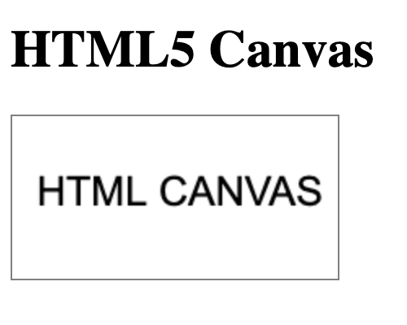
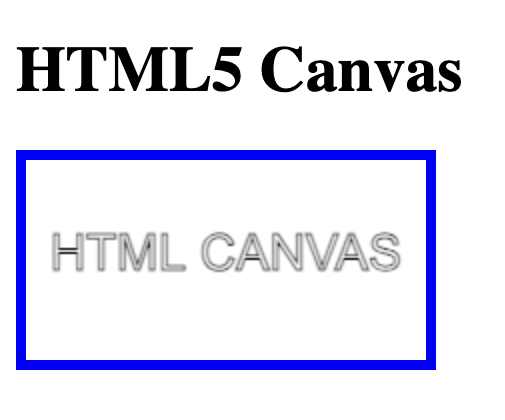
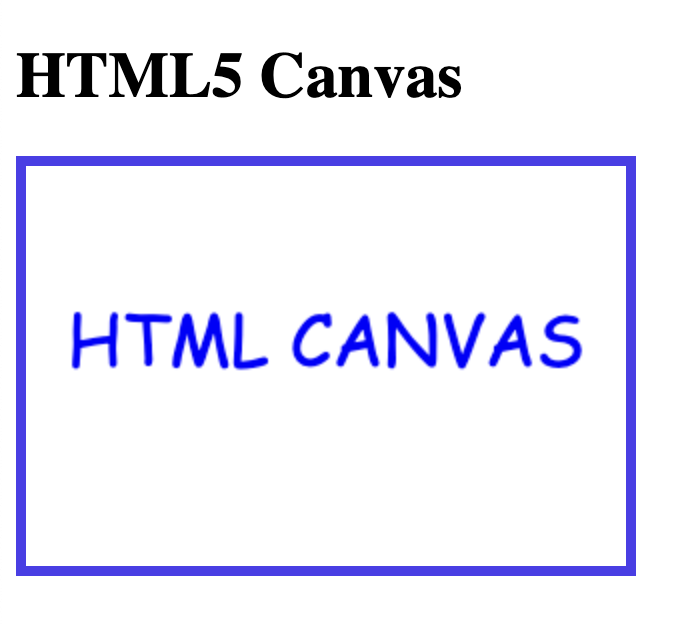
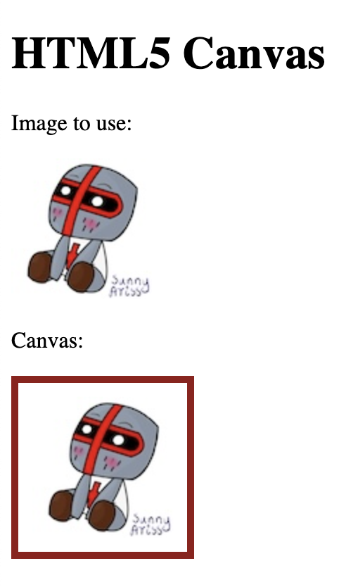

# Drawing text

`front` - defines the font properties for the text

`fillText(text,x,y)` - draws "filled" text on the canvas

`strokeText(text,x,y)` - draws text on the canvas (no fill)

## `fillText`
```
<!DOCTYPE html>
<html>
<body>
<h1>HTML5 Canvas</h1>

<canvas id="myCanvas" width="200" height="100" style="border:5px solid grey;"></canvas>

<script>
const canvas = document.getElementById("myCanvas");
const ctx = canvas.getContext("2d");

ctx.font = "25px Arial";
ctx.fillText("HTML CANVAS",15,55);
</script>

</body>
</html>
```



## `strokeText`
```
<!DOCTYPE html>
<html>
<body>
<h1>HTML5 Canvas</h1>

<canvas id="myCanvas" width="200" height="100" style="border:5px solid blue;"></canvas>

<script>
const canvas = document.getElementById("myCanvas");
const ctx = canvas.getContext("2d");

ctx.font = "25px Arial";
ctx.strokeText("HTML CANVAS",12,55);
</script>

</body>
</html>
```


```
<!DOCTYPE html>
<html>
<body>
<h1>HTML5 Canvas</h1>

<canvas id="myCanvas" width="300" height="200" style="border:5px solid rgb(75, 61, 236);"></canvas>

<script>
const canvas = document.getElementById("myCanvas");
const ctx=canvas.getContext("2d");

ctx.font="35px Comic Sans MS";
ctx.fillStyle = "blue";
ctx.textAlign = "center";
ctx.fillText("HTML CANVAS", canvas.width/2, canvas.height/2);
</script>

</body>
</html>
```


## Canvas - Images `drawImage`

```
<!DOCTYPE html>
<html>
<body>
<h1>HTML5 Canvas</h1>

<p>Image to use:</p>


<p>Canvas:</p>

<canvas id="myCanvas" width="120" height="120" style="border:5px solid rgb(147, 24, 24);"></canvas>

<script>
window.onload = function() {
  const canvas = document.getElementById("myCanvas");
  const ctx = canvas.getContext("2d");
  const img = document.getElementById("chibi");
  ctx.drawImage(img, 10, 10);
};
</script>

</body>
</html>
```



