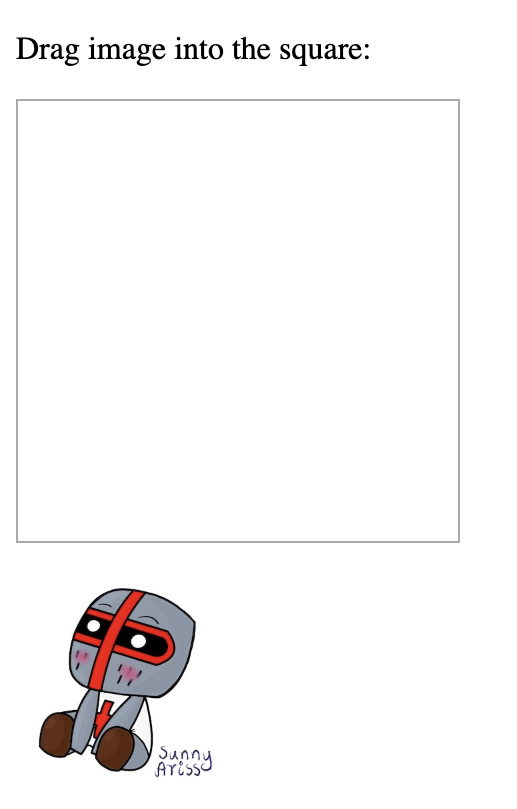

## Drag drop

To make an element `draggable`, set the `draggable` attribute to true

`ondragstart` attribute calls a function, `drag(event)`, that specifies what data to be dragged

`dataTransfer.setData()` method sets the data type and the value of the dragged data

`ondragover` specifies where the dragged data can be dropped

`event.preventDefault()` to allow a drop 

`preventDefault()` to prevent the browser default handling of the data 

`dataTransfer.getData()` method return any data that was set to the same type in the `setData()` method

The dragged data is the id of the dragged element ("drag1")

Append the dragged element into the drop element


```
<!DOCTYPE HTML>
<html>
<head>
<style>
#div1 {
  width: 200px;
  height: 200px;
  padding: 10px;
  border: 1px solid #aaaaaa;
}
</style>
<script>
function allowDrop(ev) {
  ev.preventDefault();
}

function drag(ev) {
  ev.dataTransfer.setData("text", ev.target.id);
}

function drop(ev) {
  ev.preventDefault();
  var data = ev.dataTransfer.getData("text");
  ev.target.appendChild(document.getElementById(data));
}
</script>
</head>
<body>

<p>Drag image into the square:</p>

<div id="div1" ondrop="drop(event)" ondragover="allowDrop(event)"></div>
<br>


</body>
</html>
```




