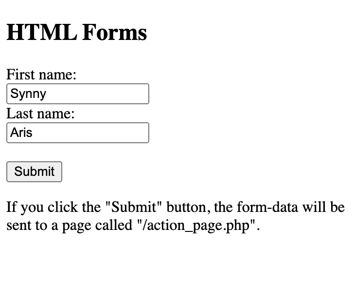
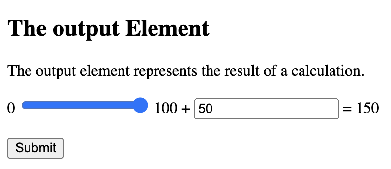

HTML form is used to collect user input. The user input is most often sent to a server for processing


## `<form>` element

The `<form>` element is a container for different types of input elements, such as: text fields, checkboxes, radio buttons, submit buttons, etc.

```
<!DOCTYPE html>
<html>
<body>

<h2>HTML Forms</h2>

<form action="/action_page.php">
  <label for="fname">First name:</label><br>
  <input type="text" id="fname" name="fname" value="John"><br>
  <label for="lname">Last name:</label><br>
  <input type="text" id="lname" name="lname" value="Doe"><br><br>
  <input type="submit" value="Submit">
</form> 

<p>If you click the "Submit" button, the form-data will be sent to a page called "/action_page.php".</p>

</body>
</html>
```



`<label>` element


`<label>` element is useful for screen-reader users, because the screen-reader will read out loud the label when the user focuses on the input element.

`<label>` element also helps users who have difficulty clicking on very small regions because when the user clicks the text within the `<label>` element, it toggles the radio button/checkbox.

The for attribute of the `<label>` tag should be equal to the id attribute of the `<input>` element to bind them together.


## Target attribute

The `target` attribute specifies where to display the response that is received after submitting the form.

`target` attribute can have one of the values:

`_blank` - response is displayed in a new window or tab

`_self` - response is displayed in the current window

`_parent` - response is displayed in the parent frame

`_top` - response is displayed in the full body of the window

`framename`	- response is displayed in a named iframe

```
<!DOCTYPE html>
<html>
<body>

<h2>The form target attribute</h2>

<p>When submitting this form, the result will be opened in a new browser tab:</p>

<form action="/action_page.php" target="_blank">
  <label for="fname">First name:</label><br>
  <input type="text" id="fname" name="fname" value="John"><br>
  <label for="lname">Last name:</label><br>
  <input type="text" id="lname" name="lname" value="Doe"><br><br>
  <input type="submit" value="Submit">
</form> 

</body>
</html>
```

## Method attribute

`method` attribute specifies the HTTP method to be used when submitting the form data.

The form-data can be sent as URL variables (with method="get") or as HTTP post transaction (with method="post").

#### GET values is visible in the address bar of the new browser tab

```
<!DOCTYPE html>
<html>
<body>

<h2>The method Attribute</h2>

<p>This form will be submitted using the GET method:</p>

<form action="/action_page.php" target="_blank" method="get">
  <label for="fname">First name:</label><br>
  <input type="text" id="fname" name="fname" value="Sunny"><br>
  <label for="lname">Last name:</label><br>
  <input type="text" id="lname" name="lname" value="Aris"><br><br>
  <input type="submit" value="Submit">
</form>

<p>After you submit, notice that the form values is visible in the address bar of the new browser tab.</p>

</body>
</html>
```

#### POST form values is not visible in the address bar of the new browser tab

```
<!DOCTYPE html>
<html>
<body>

<h2>The method Attribute</h2>

<p>This form will be submitted using the POST method:</p>

<form action="/action_page.php" target="_blank" method="post">
  <label for="fname">First name:</label><br>
  <input type="text" id="fname" name="fname" value="Sunny"><br>
  <label for="lname">Last name:</label><br>
  <input type="text" id="lname" name="lname" value="Aris"><br><br>
  <input type="submit" value="Submit">
</form>

<p>After you submit, notice that, unlike the GET method, the form values is NOT visible in the address bar of the new browser tab.</p>

</body>
</html>
```
### For form data that contains sensitive or personal information use POST

In GET submitted form data is visible in the URL

## Autocomplete attribute

```
<!DOCTYPE html>
<html>
<body>

<h1>The form autocomplete attribute</h1>

<p>Fill in and submit the form, then reload the page, start to fill in the form again - and see how autocomplete works.</p>

<p>Then, try to set autocomplete to "off".</p>

<form action="/action_page.php" autocomplete="on">
  <label for="fname">First name:</label>
  <input type="text" id="fname" name="fname"><br><br>
  <label for="email">Email:</label>
  <input type="text" id="email" name="email"><br><br>
  <input type="submit">
</form>

</body>
</html>
```


## Novalidate attribute

`novalidate` specifies that the form-data (input) should not be validated when submitted.

```
<!DOCTYPE html>
<html>
<body>

<h1>The form novalidate attribute</h1>

<p>The novalidate attribute indicates that the form input is not to be validated on submit:</p>

<form action="/action_page.php" novalidate>
  <label for="email">Enter your email:</label>
  <input type="email" id="email" name="email"><br><br>
  <input type="submit">
</form>

</body>
</html>
```
## `<select>` element

```
<!DOCTYPE html>
<html>
<body>

<h2>The select Element</h2>

<p>The select element defines a drop-down list:</p>

<form action="/action_page.php">
  <label for="book">Choose a book genre:</label>
  <select id="book" name="book">
    <option value="horror">Horror</option>
    <option value="drama">Drama</option>
    <option value="thriller">Thriller</option>
    <option value="fantasy">Fantasy</option>
  </select>
  <input type="submit">
</form>

</body>
</html>
```


The `<option>` element defines an option that can be selected.

By default, the first item in the drop-down list is selected.

```
<!DOCTYPE html>
<html>
<body>

<h2>Pre-selected Option</h2>

<p>You can preselect an option with the selected attribute:</p>

<form action="/action_page.php">
  <label for="book">Choose a book genre:</label>
  <select id="book" name="book">
    <option value="horror">Horror</option>
    <option value="drama">Drama</option>
    <option value="Drama" selected>Fantasy</option>
    <option value="thriller">Thriller</option>
  </select>
  <input type="submit">
</form>

</body>
</html>
```


## Visible Values - `size` attribute

```
<!DOCTYPE html>
<html>
<body>

<h2>Visible Option Values</h2>

<p>Use the size attribute to specify the number of visible values.</p>

<form action="/action_page.php">
  <label for="cars">Choose a book genre:</label>
  <select id="book" name="book" size="3">
    <option value="horror">Horror</option>
    <option value="drama">Drama</option>
    <option value="thriller">Thriller</option>
    <option value="fantasy">Fantasy</option>
  </select><br><br>
  <input type="submit">
</form>

</body>
</html>
```


## Multiple selections

```
<!DOCTYPE html>
<html>
<body>

<h2>Allow Multiple Selections</h2>

<p>Use the multiple attribute to allow the user to select more than one value.</p>

<form action="/action_page.php">
  <label for="book">Choose a book genre:</label>
  <select id="book" name="book" size="4" multiple>
    <option value="horror">Horror</option>
    <option value="drama">Drama</option>
    <option value="thriller">Thriller</option>
    <option value="fantasy">Fantasy</option>
  </select><br><br>
  <input type="submit">
</form>

<p>Hold down the Ctrl (windows) / Command (Mac) button to select multiple options.</p>

</body>
</html>
```


## `<textarea>` element


`rows` attribute specifies the visible number of lines in a text area.

`cols` attribute specifies the visible width of a text area.

```
<!DOCTYPE html>
<html>
<body>

<h2>Textarea</h2>
<p>The textarea element defines a multi-line input field.</p>

<form action="/action_page.php">
  <textarea name="message" rows="5" cols="25">The cat was playing in the garden.</textarea>
  <br><br>
  <input type="submit">
</form>

</body>
</html>
```


### CSS Textarea

```
<!DOCTYPE html>
<html>
<body>

<h2>Styling Textarea</h2>

<p>Use CSS to change the size of the textarea:</p>

<form action="/action_page.php">
  <textarea name="message" style="width:200px; height:200px;">The cat was playing in the garden.</textarea>
  <br>
  <input type="submit">
</form>

</body>
</html>
```


## `<fieldset>` and `<legend>` elements


`<fieldset>` element is used to group related data in a form.

`<legend>` element defines a caption for the `<fieldset>` element.

```
<!DOCTYPE html>
<html>
<body>

<h2>Grouping Form Data with Fieldset</h2>

<p>The fieldset element is used to group related data in a form, and the legend element defines a caption for the fieldset element.</p>

<form action="/action_page.php">
  <fieldset>
    <legend>Personalia:</legend>
    <label for="fname">First name:</label><br>
    <input type="text" id="fname" name="fname" value="Sunny"><br>
    <label for="lname">Last name:</label><br>
    <input type="text" id="lname" name="lname" value="Aris"><br><br>
    <input type="submit" value="Submit">
  </fieldset>
</form>

</body>
</html>
```


## `<datalist>` element

`<datalist>` element specifies a list of pre-defined options for an `<input>` element.


```
<!DOCTYPE html>
<html>
<body>

<h2>The datalist Element</h2>

<p>The datalist element specifies a list of pre-defined options for an input element.</p>

<form action="/action_page.php">
  <input list="book" name="book">
  <datalist id="book">
    <option value="Drama">
    <option value="Horror">
    <option value="Thriller">
    <option value="Fantasy">
  </datalist>
  <input type="submit">
</form>

</body>
</html>
```


## `<output>` element

`<output>` element represents the result of a calculation

```
<!DOCTYPE html>
<html>
<body>

<h2>The output Element</h2>
<p>The output element represents the result of a calculation.</p>

<form action="/action_page.php"
oninput="x.value=parseInt(a.value)+parseInt(b.value)">
  0
  <input type="range" id="a" name="a" value="50">
  100 +
  <input type="number" id="b" name="b" value="50">
  =
  <output name="x" for="a b"></output>
  <br><br>
  <input type="submit">
</form>

</body>
</html>
```




