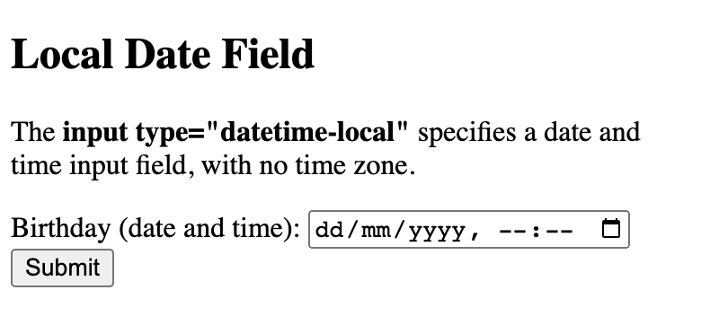

## `<input>` element

`<input>` element can be displayed in many ways, depending on the `type` attribute.

`<input type="button">`

`<input type="checkbox">`

`<input type="color">`

`<input type="date">`

`<input type="datetime-local">`

`<input type="email">`

`<input type="file">`

`<input type="hidden">`

`<input type="image">`

`<input type="month">`

`<input type="number">`

`<input type="password">`

`<input type="radio">`

`<input type="range">`

`<input type="reset">`

`<input type="search">`

`<input type="submit">`

`<input type="tel">`

`<input type="text">`

`<input type="time">`

`<input type="url">`

`<input type="week">`


Each input field must have a `name` attribute to be submitted.

If the `name` attribute is omitted, the value of the input field will not be sent at all.

## Submit button

`<input type="submit">` defines a button for submitting the form data to a form-handler.

The form-handler is specified in the form's `action` attribute.


`action` attribute defines the action to be performed when the form is submitted.

The form data is sent to a file on the server when the user clicks on the submit button.

## `<button>` element

```
<!DOCTYPE html>
<html>
<body>

<h2>The button Element</h2>

<button type="button" onclick="alert('Hello World!')">Click Me!</button>

</body>
</html>
```


## Checkboxes

`<input type="checkbox"> defines a checkbox.`

Checkboxes let a user select zero or menny options of a limited number of choices

```
<!DOCTYPE html>
<html>
<body>

<h2>Checkboxes</h2>
<p>The <strong>input type="checkbox"</strong> defines a checkbox:</p>

<form action="/action_page.php">
  <input type="checkbox" id="genre1" name="genre1" value="Drama">
  <label for="genre1"> I like a horror books</label><br>
  <input type="checkbox" id="genre2" name="genre2" value="Horror">
  <label for="genre2"> I like a drama books</label><br>
  <input type="checkbox" id="genre3" name="genre3" value="Thriller">
  <label for="genre3"> I like a thriller books</label><br><br>
  <input type="submit" value="Submit">
</form> 

</body>
</html>
```


## Color

`<input type="color">` is used for input fields that should contain a color.

```
<!DOCTYPE html>
<html>
<body>

<h2>Show a Color Picker</h2>

<p>The <strong>input type="color"</strong> is used for input fields that should contain a color.</p>

<form action="/action_page.php">
  <label for="favcolor">Select your favorite color:</label>
  <input type="color" id="favcolor" name="favcolor" value="#0000ff">
  <input type="submit" value="Submit">
</form>

</body>
</html>
```


## Date 

`<input type="date">` is used for input fields that should contain a date.

```
<!DOCTYPE html>
<html>
<body>

<h2>Date Field</h2>

<p>The <strong>input type="date"</strong> is used for input fields that should contain a date.</p>

<form action="/action_page.php">
  <label for="birthday">Birthday:</label>
  <input type="date" id="birthday" name="birthday">
  <input type="submit" value="Submit">
</form>

<p><strong>Note:</strong> type="date" is not supported in Internet Explorer 11.</p>

</body>
</html>
```


### Date min max

```
<!DOCTYPE html>
<html>
<body>

<h2>Date Field Restrictions</h2>

<p>Use the min and max attributes to add restrictions to dates:</p>

<form action="/action_page.php">
  <label for="datemin">Enter a date after 2020-01-01:</label>
  <input type="date" id="datemin" name="datemin" min="2020-01-01"><br><br>

  <label for="datemax">Enter a date before 2000-01-01:</label>
  <input type="date" id="datemax" name="datemax" max="2000-01-01"><br><br>
  
  <input type="submit" value="Submit">
</form>


</body>
</html>
```


## Datetime-local

`<input type="datetime-local">` specifies a date and time input field, with no time zone.

```
<!DOCTYPE html>
<html>
<body>

<h2>Local Date Field</h2>

<p>The <strong>input type="datetime-local"</strong> specifies a date and time input field, with no time zone.</p>

<form action="/action_page.php">
  <label for="birthdaytime">Birthday (date and time):</label>
  <input type="datetime-local" id="birthdaytime" name="birthdaytime">
  <input type="submit" value="Submit">
</form>

</body>
</html>
```


## Email

`<input type="email">` is used for input fields that should contain an e-mail address.

Depending on browser support, the e-mail address can be automatically validated when submitted.

```
<!DOCTYPE html>
<html>
<body>

<h2>Email Field</h2>

<p>The <strong>input type="email"</strong> is used for input fields that should contain an e-mail address:</p>

<form action="/action_page.php">
  <label for="email">Enter your email:</label>
  <input type="email" id="email" name="email">
  <input type="submit" value="Submit">
</form>

</body>
</html>
```

## File

`<input type="file">` defines a file-select field and a "Browse" button for file uploads.


```
<!DOCTYPE html>
<html>
<body>

<h1>File upload</h1>

<p>Show a file-select field which allows a file to be chosen for upload:</p>
<form action="/action_page.php">
  <label for="myfile">Select a file:</label>
  <input type="file" id="myfile" name="myfile"><br><br>
  <input type="submit" value="Submit">
</form>

</body>
</html>
```


## Hidden

A hidden field lets web developers include data that cannot be seen or modified by users when a form is submitted.

A hidden field often stores what database record that needs to be updated when the form is submitted.

```
<!DOCTYPE html>
<html>
<body>

<h1>A Hidden Field (look in source code)</h1>

<form action="/action_page.php">
  <label for="fname">First name:</label>
  <input type="text" id="fname" name="fname"><br><br>
  <input type="hidden" id="custId" name="custId" value="3487">
  <input type="submit" value="Submit">
</form>

<p><strong>Note:</strong> The hidden field is not shown to the user, but the data is sent when the form is submitted.</p>

</body>
</html>
```
## Image

`<input type="image">` defines an image as a submit button.

The path to the image is specified in the src attribute.

```
<!DOCTYPE html>
<html>
<body>

<h2>Display an Image as the Submit button</h2>

<form action="/action_page.php">
  <label for="fname">First name: </label>
  <input type="text" id="fname" name="fname"><br><br>
  <label for="lname">Last name: </label>
  <input type="text" id="lname" name="lname"><br><br>
  <input type="image" src="img_submit.gif" alt="Submit" width="100" height="100">
</form>

<p><b>Note:</b> The input type="image" sends the X and Y coordinates of the click that activated the image button.</p>

</body>
</html>

```


## Month

`<input type="month">` allows the user to select a month and year.


```
<!DOCTYPE html>
<html>
<body>

<h2>Month Field</h2>

<p>The <strong>input type="month"</strong> allows the user to select a month and year.</p>

<form action="/action_page.php">
  <label for="bdaymonth">Birthday (month and year):</label>
  <input type="month" id="bdaymonth" name="bdaymonth">
  <input type="submit" value="Submit">
</form>

</body>
</html>
```

## Number

`<input type="number">` defines a numeric input field.

```
<!DOCTYPE html>
<html>
<body>

<h2>Number Field</h2>

<p>The <strong>input type="number"</strong> defines a numeric input field.</p>

<p>You can use the min and max attributes to add numeric restrictions in the input field:</p>

<form action="/action_page.php">
  <label for="quantity">Quantity (between 1 and 5):</label>
  <input type="number" id="quantity" name="quantity" min="1" max="5">
  <input type="submit" value="Submit">
</form>

</body>
</html>
```


## Password

`<input type="password">` defines a password field

```
<!DOCTYPE html>
<html>
<body>

<h2>Password field</h2>

<p>The <strong>input type="password"</strong> defines a password field:</p>

<form action="/action_page.php">
  <label for="username">Username:</label><br>
  <input type="text" id="username" name="username"><br>
  <label for="pwd">Password:</label><br>
  <input type="password" id="pwd" name="pwd"><br><br>
  <input type="submit" value="Submit">
</form>

<p>The characters in a password field are masked (shown as asterisks or circles).</p>

</body>
</html>
```


## Radio buttons

`<input type="radio">` defines a radio button.

Radio buttons let a user select ONE of a limited number of choices.

```
<!DOCTYPE html>
<html>
<body>

<h2>Radio Buttons</h2>

<p>Choose your favorite genres of books:</p>

<form>
  <input type="radio" id="drama" name="fav_books" value="drama">
  <label for="html">Drama</label><br>
  <input type="radio" id="horror" name="fav_books" value="horror">
  <label for="horror">Horror</label><br>
  <input type="radio" id="thriller" name="fav_books" value="thriller">
  <label for="javascript">Thriller</label>
</form> 

</body>
</html>
```


## Range

`<input type="range">` defines a control for entering a number whose exact value is not important. Default range is 0 to 100. However, you can set restrictions on what numbers are accepted with the min, max, and step attributes

```
<!DOCTYPE html>
<html>
<body>

<h2>Range Field</h2>

<p>Depending on browser support: The input type "range" can be displayed as a slider control.</p>

<form action="/action_page.php" method="get">
  <label for="vol">Volume (between 0 and 50):</label>
  <input type="range" id="vol" name="vol" min="0" max="50">
  <input type="submit" value="Submit">
</form>

</body>
</html>
```


## Reset button

```
<!DOCTYPE html>
<html>
<body>

<h2>Reset Button</h2>

<p>The <strong>input type="reset"</strong> defines a reset button that resets all form values to their default values:</p>

<form action="/action_page.php">
  <label for="fname">First name:</label><br>
  <input type="text" id="fname" name="fname" value="Sunny"><br>
  <label for="lname">Last name:</label><br>
  <input type="text" id="lname" name="lname" value="Aris"><br><br>
  <input type="submit" value="Submit">
  <input type="reset" value="Reset">
</form> 

<p>If you change the input values and then click the "Reset" button, the form-data will be reset to the default values.</p>

</body>
</html>
```


## Serch

```
<!DOCTYPE html>
<html>
<body>

<h2>Search Field</h2>
<p>The <strong>input type="search"</strong> is used for search fields (behaves like a regular text field):</p>

<form action="/action_page.php">
  <label for="gsearch">Search Google:</label>
  <input type="search" id="gsearch" name="gsearch">
  <input type="submit" value="Submit">
</form>

</body>
</html>
```


## Submit

`<input type="submit">` defines a button for submitting form data to a form-handler.

```
<!DOCTYPE html>
<html>
<body>

<h2>Submit Button</h2>

<p>The <strong>input type="submit"</strong> defines a button for submitting form data to a form-handler:</p>

<form action="/action_page.php">
  <label for="fname">First name:</label><br>
  <input type="text" id="fname" name="fname" value="Sunny"><br>
  <label for="lname">Last name:</label><br>
  <input type="text" id="lname" name="lname" value="Aris"><br><br>
  <input type="submit" value="Submit">
</form> 

<p>If you click "Submit", the form-data will be sent to a page called "/action_page.php".</p>

</body>
</html>
```


## Telephone

```
<!DOCTYPE html>
<html>
<body>

<h2>Telephone Field</h2>

<p>The <strong>input type="tel"</strong> is used for input fields that should contain a telephone number:</p>

<form action="/action_page.php">
  <label for="phone">Enter a phone number:</label><br><br>
  <input type="tel" id="phone" name="phone" placeholder="123-45-678" pattern="[0-9]{3}-[0-9]{2}-[0-9]{3}" required><br><br>
  <small>Format: 123-45-678</small><br><br>
  <input type="submit" value="Submit">
</form>

</body>
</html>
```


## Text Fields

```
<!DOCTYPE html>
<html>
<body>

<h2>Text input fields</h2>

<form>
  <label for="fname">First name:</label><br>
  <input type="text" id="fname" name="fname" value="Sunny"><br>
  <label for="lname">Last name:</label><br>
  <input type="text" id="lname" name="lname" value="Aris">
</form>

<p>The form itself is not visible.</p>

<p>The default width of text input fields is 20 characters.</p>

</body>
</html>
```


## Time

```
<!DOCTYPE html>
<html>
<body>

<h1>Show a Time Input Control</h1>

<p>The <strong>input type="time"</strong> allows the user to select a time (no time zone):</p>

<p>If the browser supports it, a time picker pops up when entering the input field.</p>

<form action="/action_page.php">
  <label for="appt">Select a time:</label>
  <input type="time" id="appt" name="appt">
  <input type="submit" value="Submit">
</form>

</body>
</html>
```


## URL

```
<!DOCTYPE html>
<html>
<body>

<h1>Display a URL Input Field</h1>

<p>The <strong>input type="url"</strong> is used for input fields that should contain a URL address:</p>

<form action="/action_page.php">
  <label for="homepage">Add your homepage:</label>
  <input type="url" id="homepage" name="homepage">
  <input type="submit" value="Submit">
</form>

</body>
</html>
```


## Week

```
<!DOCTYPE html>
<html>
<body>

<h1>Display a Week Input Control</h1>

<p>The <strong>input type="week"</strong> allows the user to select a week and year.</p>

<p>If the browser supports it, a date picker pops up when entering the input field.</p>

<form action="/action_page.php">
  <label for="week">Select a week:</label>
  <input type="week" id="week" name="week">
  <input type="submit" value="Submit">
</form>

</body>
</html>
```


