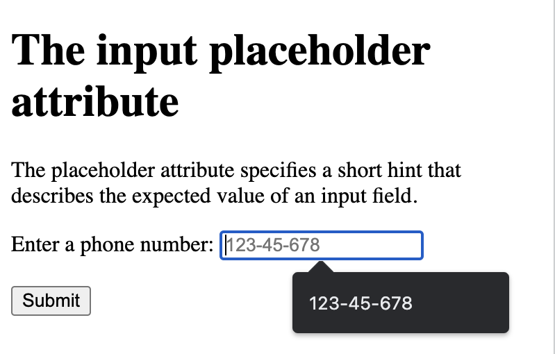
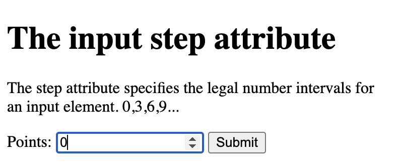

## `readonly` attribute

`readonly` attribute specifies that an input field is read-only

```
<!DOCTYPE html>
<html>
<body>

<h1>The input readonly attribute</h1>

<p>The readonly attribute specifies that an input field should be read-only (cannot be changed):</p>

<form action="/action_page.php">
  <label for="fname">First name:</label><br>
  <input type="text" id="fname" name="fname" value="Sunny" readonly><br>
  <label for="lname">Last name:</label><br>
  <input type="text" id="lname" name="lname" value="Aris"><br><br>
  <input type="submit" value="Submit">
</form>

</body>
</html>
```


## `disabled` attribute

`disabled` input field is unusable and un-clickable

```
<!DOCTYPE html>
<html>
<body>

<h1>The input disabled attribute</h1>

<p>The disabled attribute specifies that an input field should be disabled (unusable and un-clickable):</p>

<form action="/action_page.php">
  <label for="fname">First name:</label><br>
  <input type="text" id="fname" name="fname" value="Sunny" disabled><br>
  <label for="lname">Last name:</label><br>
  <input type="text" id="lname" name="lname" value="Aris"><br><br>
  <input type="submit" value="Submit">
</form>

</body>
</html>
```


## `size` attribute

```
<!DOCTYPE html>
<html>
<body>

<h1>The input size attribute</h1>

<p>The size attribute specifies the width (in characters) of an input field:</p>

<form action="/action_page.php">
  <label for="email">e-mail:</label><br>
  <input type="text" id="email" name="email" size="50"><br>
  <label for="pin">PIN:</label><br>
  <input type="text" id="pin" name="pin" size="4"><br><br>
  <input type="submit" value="Submit">
</form>

</body>
</html>
```


## `maxlength` attribute

```
<!DOCTYPE html>
<html>
<body>

<h1>The input maxlength attribute</h1>

<p>The maxlength attribute specifies the maximum number of characters allowed in an input field:</p>

<form action="/action_page.php">
  <label for="email">e-mail:</label><br>
  <input type="text" id="email" name="email" size="50"><br>
  <label for="pin">PIN:</label><br>
  <input type="text" id="pin" name="pin" maxlength="4" size="4"><br><br>
  <input type="submit" value="Submit">
</form>

</body>
</html>
```


## `min` and `max` attributes

```
<!DOCTYPE html>
<html>
<body>

<h1>The input min and max attributes</h1>

<p>The min and max attributes specify the minimum and maximum values for an input element.</p>

<form action="/action_page.php">
  <label for="datemax">Enter a date before 2000-01-01:</label>
  <input type="date" id="datemax" name="datemax" max="2000-01-01"><br><br>

  <label for="datemin">Enter a date after 2020-01-01:</label>
  <input type="date" id="datemin" name="datemin" min="2020-01-01"><br><br>
  
  <label for="quantity">Quantity (between 1 and 10):</label>
  <input type="number" id="quantity" name="quantity" min="1" max="10"><br><br>

  <input type="submit" value="Submit">
</form>

</body>
</html>
```


## `multiple` attribute


```
<!DOCTYPE html>
<html>
<body>

<h1>The input multiple attributes</h1>

<p>The multiple attribute specifies that the user is allowed to enter more than one value in an input field.</p>

<form action="/action_page.php">
  <label for="files">Select files:</label>
  <input type="file" id="files" name="files" multiple><br><br>
  <input type="submit" value="Submit">
</form>

<p>To select multiple files, hold down the CTRL or SHIFT key while selecting.</p>

</body>
</html>
```


## `pattern` attribute

```
<!DOCTYPE html>
<html>
<body>

<h1>The input pattern attribute</h1>

<p>The pattern attribute specifies a regular expression that the input element's value is checked against.</p>

<form action="/action_page.php">
  <label for="password">password:</label>
  <input type="text" id="password" name="password" pattern="[A-Za-z]{3}" title="Three letter password"><br><br>
  <input type="submit" value="Submit">
</form>

</body>
</html>
```


## `placeholder` attribute

```
<!DOCTYPE html>
<html>
<body>

<h1>The input placeholder attribute</h1>

<p>The placeholder attribute specifies a short hint that describes the expected value of an input field.</p>

<form action="/action_page.php">
  <label for="phone">Enter a phone number:</label>
  <input type="tel" id="phone" name="phone" placeholder="123-45-678" pattern="[0-9]{3}-[0-9]{2}-[0-9]{3}"><br><br>
  <input type="submit" value="Submit">
</form>

</body>
</html>
```


## `required` attribute

```
<!DOCTYPE html>
<html>
<body>

<h1>The input required attribute</h1>

<p>The required attribute specifies that an input field must be filled out before submitting the form.</p>

<form action="/action_page.php">
  <label for="username">Username:</label>
  <input type="text" id="username" name="username" required>
  <input type="submit" value="Submit">
</form>

</body>
</html>
```


## `step` attribute

if step="3", legal numbers could be -3, 0, 3, 6, etc.

This attribute can be used together with the max and min attributes to create a range of legal values.

```
<!DOCTYPE html>
<html>
<body>

<h1>The input step attribute</h1>

<p>The step attribute specifies the legal number intervals for an input element. 0,3,6,9...</p>

<form action="/action_page.php">
  <label for="points">Points:</label>
  <input type="number" id="points" name="points" step="3">
  <input type="submit" value="Submit">
</form>

</body>
</html>
```


## `autofocus` attribute

```
<!DOCTYPE html>
<html>
<body>

<h1>The input autofocus attribute</h1>

<p>The autofocus attribute specifies that the input field should automatically get focus when the page loads.</p>

<form action="/action_page.php">
  <label for="fname">First name:</label><br>
  <input type="text" id="fname" name="fname" autofocus><br>
  <label for="lname">Last name:</label><br>
  <input type="text" id="lname" name="lname"><br><br>
  <input type="submit" value="Submit">
</form>

</body>
</html>
```


## `formaction` attribute

An HTML form with two submit buttons, with different actions


```
<!DOCTYPE html>
<html>
<body>

<h1>The input formaction attribute</h1>

<p>The formaction attribute specifies the URL of a file that will process the input when the form is submitted.</p>

<form action="/action_page.php">
  <label for="fname">First name:</label>
  <input type="text" id="fname" name="fname"><br><br>
  <label for="lname">Last name:</label>
  <input type="text" id="lname" name="lname"><br><br>
  <input type="submit" value="Submit">
  <input type="submit" formaction="/action_page2.php" value="Submit as Admin">
</form>

</body>
</html>
```


```
<!DOCTYPE html>
<html>
<body>

<h1>The formaction attribute</h1>

<form action="/action_page.php">
  <label for="fname">First name:</label>
  <input type="text" id="fname" name="fname"><br><br>
  <label for="lname">Last name:</label>
  <input type="text" id="lname" name="lname"><br><br>
  <input type="submit" value="Submit">
  <input type="submit" formaction="/action_page2.php" value="Submit to another page">
</form>

</body>
</html>
```


## `formenctype` attribute

A form with two submit buttons. The first sends the form-data with default encoding, the second sends the form-data encoded as "multipart/form-data"

specifies how the form-data should be encoded when submitted only for forms with method="post"

```
<!DOCTYPE html>
<html>
<body>

<h1>The input formenctype attribute</h1>

<p>The formenctype attribute specifies how the form data should be encoded when submitted.</p>

<form action="/action_page_binary.asp" method="post">
  <label for="fname">First name:</label>
  <input type="text" id="fname" name="fname"><br><br>
  <input type="submit" value="Submit">
  <input type="submit" formenctype="multipart/form-data" value="Submit as Multipart/form-data">
</form>

</body>
</html>
```


## `formmethod` attribute

A form with two submit buttons. The first sends the form-data with method="get". The second sends the form-data with method="post":

```
<!DOCTYPE html>
<html>
<body>

<h1>The input formmethod Attribute</h1>

<p>The formmethod attribute defines the HTTP method for sending form-data to the action URL.</p>

<form action="/action_page.php" method="get" target="_blank">
  <label for="fname">First name:</label>
  <input type="text" id="fname" name="fname"><br><br>
  <label for="lname">Last name:</label>
  <input type="text" id="lname" name="lname"><br><br>
  <input type="submit" value="Submit using GET">
  <input type="submit" formmethod="post" value="Submit using POST">
</form>

</body>
</html>
```


## `formtarget` attribute

The input formtarget attribute specifies a name or a keyword that indicates where to display the response that is received after submitting the form (submit to a new window)

```
<!DOCTYPE html>
<html>
<body>

<h1>The input formtarget attribute</h1>

<p>The formtarget attribute specifies a name or a keyword that indicates where to display the response that is received after submitting the form.</p>

<form action="/action_page.php">
  <label for="fname">First name:</label>
  <input type="text" id="fname" name="fname"><br><br>
  <label for="lname">Last name:</label>
  <input type="text" id="lname" name="lname"><br><br>
  <input type="submit" value="Submit">
  <input type="submit" formtarget="_blank" value="Submit to a new window/tab">
</form>

</body>
</html>
```


## `formnovalidate` attribute

The input formnovalidate attribute specifies that an `<input>` element should not be validated when submitted.

A form with two submit buttons (with and without validation):
```
<!DOCTYPE html>
<html>
<body>

<h1>The input formnovalidate attribute</h1>

<form action="/action_page.php">
  <label for="email">Enter your email:</label>
  <input type="email" id="email" name="email" required><br><br>
  <input type="submit" value="Submit">
  <input type="submit" formnovalidate="formnovalidate" value="Submit without validation">
</form>

</body>
</html>
```


## `novalidate` attribute

`novalidate` specifies that all of the form-data should not be validated when submitted.

```
<!DOCTYPE html>
<html>
<body>

<h1>The form novalidate attribute</h1>

<p>The novalidate attribute specifies that the form data should not be validated when submitted.</p>

<form action="/action_page.php" novalidate>
  <label for="email">Enter your email:</label>
  <input type="email" id="email" name="email" required><br><br>
  <input type="submit" value="Submit">
</form>

</body>
</html>
```
