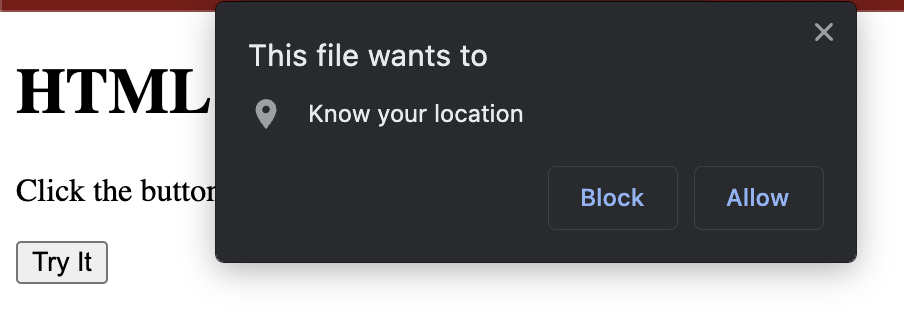
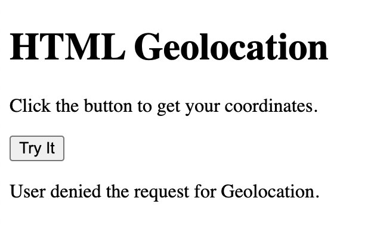

## Basic geolocation script with no error handling.


```
<!DOCTYPE html>
<html>
<body>
<h1>HTML Geolocation</h1>
<p>Click the button to get your coordinates.</p>

<button onclick="getLocation()">Try It</button>

<p id="demo"></p>

<script>
const x = document.getElementById("demo");

function getLocation() {
  if (navigator.geolocation) {
    navigator.geolocation.getCurrentPosition(showPosition);
  } else { 
    x.innerHTML = "Geolocation is not supported by this browser.";
  }
}

function showPosition(position) {
  x.innerHTML = "Latitude: " + position.coords.latitude + 
  "<br>Longitude: " + position.coords.longitude;
}
</script>

</body>
</html>
```



## Geolocation script with method is used to handle errors

```
<!DOCTYPE html>
<html>
<body>
<h1>HTML Geolocation</h1>
<p>Click the button to get your coordinates.</p>

<button onclick="getLocation()">Try It</button>

<p id="demo"></p>

<script>
const x = document.getElementById("demo");

function getLocation() {
  if (navigator.geolocation) {
    navigator.geolocation.getCurrentPosition(showPosition, showError);
  } else { 
    x.innerHTML = "Geolocation is not supported by this browser.";
  }
}

function showPosition(position) {
  x.innerHTML = "Latitude: " + position.coords.latitude + 
  "<br>Longitude: " + position.coords.longitude;
}

function showError(error) {
  switch(error.code) {
    case error.PERMISSION_DENIED:
      x.innerHTML = "User denied the request for Geolocation."
      break;
    case error.POSITION_UNAVAILABLE:
      x.innerHTML = "Location information is unavailable."
      break;
    case error.TIMEOUT:
      x.innerHTML = "The request to get user location timed out."
      break;
    case error.UNKNOWN_ERROR:
      x.innerHTML = "An unknown error occurred."
      break;
  }
}
</script>

</body>
</html>
```



## `getCurrentPosition()` 

`coords.latitude`	

The latitude as a decimal number (always returned)

`coords.longitude`	

The longitude as a decimal number (always returned)

`coords.accuracy`	

The accuracy of position (always returned)

`coords.altitude`	

The altitude in meters above the mean sea level (returned if available)

`coords.altitudeAccuracy`	

The altitude accuracy of position (returned if available)

`coords.heading`	

The heading as degrees clockwise from North (returned if available)

`coords.speed`	

The speed in meters per second (returned if available)

`timestamp`	

The date/time of the response (returned if available)

## `watchPosition()`

`watchPosition()` - Returns the current position of the user and continues to return updated position as the user moves (like the GPS in a car).

`clearWatch()` - Stops the watchPosition() method.

```
<!DOCTYPE html>
<html>
<body>
<h1>HTML Geolocation</h1>
<p>Click the button to get your coordinates.</p>

<button onclick="getLocation()">Try It</button>

<p id="demo"></p>

<script>
const x = document.getElementById("demo");

function getLocation() {
  if (navigator.geolocation) {
    navigator.geolocation.watchPosition(showPosition);
  } else { 
    x.innerHTML = "Geolocation is not supported by this browser.";
  }
}
    
function showPosition(position) {
    x.innerHTML="Latitude: " + position.coords.latitude + 
    "<br>Longitude: " + position.coords.longitude;
}
</script>

</body>
</html>
```
