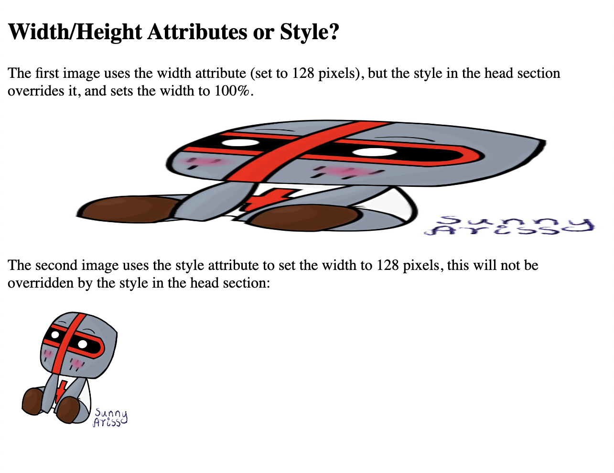

## HTML Images

HTML images are defined with the `` tag.

The source file `src`, alternative text `alt`, `width`, and `height` are provided as attributes

If the CSS `width` property is set to 100%, the image will be responsive and scale up and down.

If the `max-width` property is set to 100%, the image will scale down if it has to, but never scale up to be larger than its original size


### File path examples


``

	The "picture.jpg" file is located in the same folder as the current page

``

	The "picture.jpg" file is located in the images folder in the current folder
``

	The "picture.jpg" file is located in the images folder at the root of the current web
``

	The "picture.jpg" file is located in the folder one level up from the current folder


```
<!DOCTYPE html>
<html>
<body>

<h2>HTML Images</h2>
<p>HTML images are defined with the img tag:</p>


</body>
</html>
```


```
<!DOCTYPE html>
<html>
<head>
<style>
/* This style sets the width of all images to 100%: */
img {
  width: 100%;
}
</style>
</head>
<body>

<h2>Width/Height Attributes or Style?</h2>

<p>The first image uses the width attribute (set to 128 pixels), but the style in the head section overrides it, and sets the width to 100%.</p>


<p>The second image uses the style attribute to set the width to 128 pixels, this will not be overridden by the style in the head section:</p>


</body>
</html>
```



## Images in Another Folder

```
<!DOCTYPE html>
<html>
<body>

<h2>Images in Another Folder</h2>
<p>It is common to store images in a sub-folder. You must then include the folder name in the src attribute:</p>


</body>
</html>
```


## Images on Another Server

```
<!DOCTYPE html>
<html>
<body>

<h2>Images on Another Server</h2>


</body>
</html>
```


## Animated Images

```
<!DOCTYPE html>
<html>
<body>

<h2>Animated Images</h2>

<p>HTML allows moving images:</p>


</body>
</html>
```


## Floating Images

```
<!DOCTYPE html>
<html>
<body>

<h2>Floating Images</h2>
<p><strong>Float the image to the right:</strong></p>

<p>

A paragraph with a floating image. A paragraph with a floating image. A paragraph with a floating image.
</p>

<p><strong>Float the image to the left:</strong></p>
<p>

A paragraph with a floating image. A paragraph with a floating image. A paragraph with a floating image.  
</p>

</body>
</html>
```


### Image Maps

The HTML `<map>` tag defines an image map. An image map is an image with clickable areas. The areas are defined with one or more `<area>` tags.


```
<!DOCTYPE html>
<html>
<body>

<h2>Image Maps</h2>
<p>Click on the paladin or octopus to go to a new page and read more about the topic:</p>


<map name="workmap">
  <area shape="rect" coords="358,373,500,47" alt="paladin" href="http://git.artemi.uk/">
  <area shape="circle" coords="92,271,106" alt="octopus" href="http://git.artemi.uk/">
</map>

</body>
</html>
```


### How to create a image map

1. Add to `` tag `usemap`  value with a hash tag `#` followed by the name of the image map this create a relationship between the image and the image map.

2. Add `<map>` element with `name` atribute with the same name as usemap `#`

3. Add the clickable areas using `<area>` element 

4. Define the `shape` of the clikable area: 
- rect - defines a rectangular region
- circle - defines a circular region
- poly - defines a polygonal region
- default - defines the entire region

5. Define some `coordinates` to be able to place the clickable area onto the image. 

6. Add link to destination page in `href` attribute.

## HTML Background Images 

To add a background image on an HTML element, use the HTML `style` attribute and the CSS `background-image` property


```
<!DOCTYPE html>
<html>
<body>

<h2>Background Image</h2>

<p>A background image for a `p` element:</p>

<p style="background-image: url('doc-files/clouds.jpg');">
You can specify background images<br>
for any visible HTML element.<br>
In this example, the background image<br>
is specified for a p element.<br>
By default, the background-image<br>
will repeat itself in the direction(s)<br>
where it is smaller than the element<br>
where it is specified. Try resizing the<br>
browser window to see how the<br>
background image behaves.
</p>

</body>
</html>
```


### Background image in the `<style>` element, in the `<head>` section:

```
<!DOCTYPE html>
<html>
<head>
<style>
p {
  background-image: url('doc-files/clouds.jpg');
}
</style>
</head>
<body>

```
## Background Image on a Page

Entire page as a background image specify the background image on the <body> element:


```
<!DOCTYPE html>
<html>
<head>
<style>
body {
  background-image: url('doc-files/clouds.jpg');
}
</style>
</head>
<body>

<h2>Background Image</h2>

<p>By default, the background image will repeat itself if it is smaller than the element where it is specified, in this case the body element.</p>

</body>
</html>
```


### To avoid the background image from repeating itself, set the background-repeat property to no-repeat

```
<!DOCTYPE html>
<html>
<head>
<style>
body {
  background-image: url('doc-files/clouds.jpg');
  background-repeat: no-repeat;
}
</style>
</head>
<body>

<h2>Background No Repeat</h2>

<p>You can avoid the image from being repeated by setting the background-repeat property to "no-repeat".</p>

</body>
</html>
```


### All Background Cover

Set the `background-repeat` property to `no-repeat`

Set the `background-size` property to `cover` 

Set the `background-attachment`` property to `fixed`:

```
<!DOCTYPE html>
<html>
<head>
<style>
body {
  background-image: url('doc-files/clouds.jpg');
  background-repeat: no-repeat;
  background-attachment: fixed;  
  background-size: cover;
}
</style>
</head>
<body>

<h2>Background Cover</h2>

<p>Set the background-size property to "cover" and the background image will cover the entire element, in this case the body element.</p>

</body>
</html>
```


### Background Stretch

To stretch image to fit the entire element, you can set the `background-size` property to `100% 100%`:

```
<!DOCTYPE html>
<html>
<head>
<style>
body {
  background-image: url('doc-files/clouds.jpg');
  background-repeat: no-repeat;
  background-attachment: fixed; 
  background-size: 100% 100%;
}
</style>
</head>
<body>

<h2>Background Stretch</h2>

<p>Set the background-size property to "100% 100%" and the background image will be stretched to cover the entire element, in this case the body element.</p>

</body>
</html>
```
## The HTML `<picture>` Element

The `<picture>` element contains one or more `<source>` elements, each referring to different images through the `srcset` attribute. This way the browser can choose the image that best fits the current view and/or device.

Each `<source>` element has a `media` attribute that defines when the image `srcset` is the most suitable.

```
<!DOCTYPE html>
<html>
<head>
    <meta name="viewport" content="width=device-width, initial-scale=1.0">
</head>
<body>

<h2>The picture Element</h2>

<picture>
  <source media="(min-width: 650px)" srcset="doc-files/rycerzs.jpg">
  <source media="(min-width: 465px)" srcset="doc-files/clouds.jpg">
  
</picture>

<p>Resize the browser to see different versions of the picture loading at different viewport sizes.
    The browser looks for the first source element where the media query matches the user's current viewport width,
    and fetches the image specified in the srcset attribute.</p>
    
    <p>The img element is required as the last child tag of the picture declaration block.
    The img element is used to provide backward compatibility for browsers that do not support the picture element, or if none of the source tags matched.
    </p>
    
    <p><strong>Note:</strong> The picture element is not supported in IE12 and earlier or Safari 9.0 and earlier.</p>

</body>
</html>
```


```
<!DOCTYPE html>
<html>
<head>
    <meta name="viewport" content="width=device-width, initial-scale=1.0">
</head>
<body>

<h2>The picture Element</h2>

<picture>
  <source srcset="doc-files/chibi2.jpg">
  <source srcset="doc-files/clouds.jpg">
  
</picture>

<p>The picture element can be used when the image format is not supported by all devices.</p>

<p>The device will use the first image format it supports, and ignore the rest of the images.</p>

</body>
</html>
```


## HTML Favicon

```
<!DOCTYPE html>
<html>
<head>
  <title>My Page Title</title>
  <link rel="icon" type="image/x-icon" href="images/favicon.ico">
</head>
<body>

<h1>Heading</h1>
<p>Paragraph.</p>

</body>
</html>
```


### `<meta>` element

The `<meta>` element is typically used to specify the character set, page description, keywords, author of the document, and viewport settings.

Define the character set used:

`<meta charset="UTF-8">`

Define keywords for search engines:

`<meta name="keywords" content="HTML, CSS, JavaScript">`

Define a description of your web page:

`<meta name="description" content="Free Web tutorials">`

Define the author of a page:

`<meta name="author" content="John Doe">`

Refresh document every 30 seconds:

`<meta http-equiv="refresh" content="30">`

Setting the viewport to make your website look good on all devices:

<`meta name="viewport" content="width=device-width, initial-scale=1.0">`

```
<!DOCTYPE html>
<html>
<head>
  <meta charset="UTF-8">
  <meta name="description" content="Free Web tutorials">
  <meta name="keywords" content="HTML, CSS, JavaScript">
  <meta name="author" content="John Doe">
</head>
<body>

<p>All meta information goes inside the head section.</p>

</body>
</html>
```

### Setting the viewport

```
<meta name="viewport" content="width=device-width, initial-scale=1.0">
```

`<meta>` element in all your web pages gives the browser instructions on how to control the page's dimensions and scaling

The `width=device-width` part sets the width of the page to follow the screen-width of the device 

The `initial-scale=1.0` part sets the initial zoom level when the page is first loaded by the browser.


