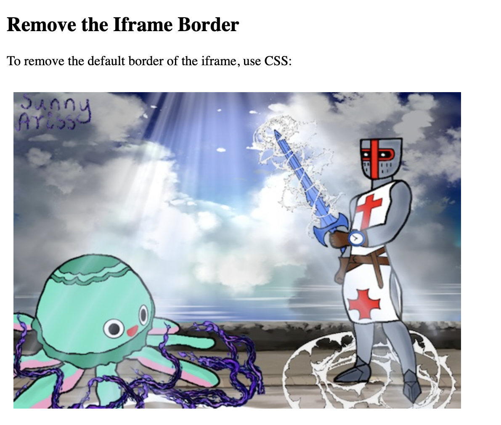
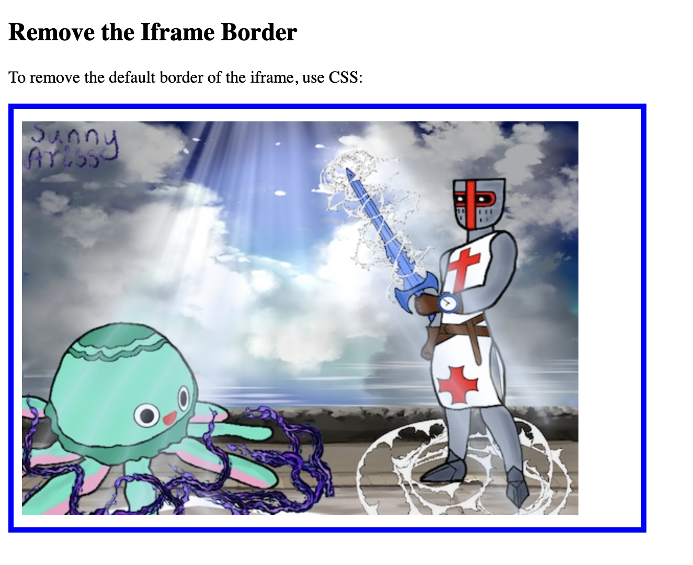
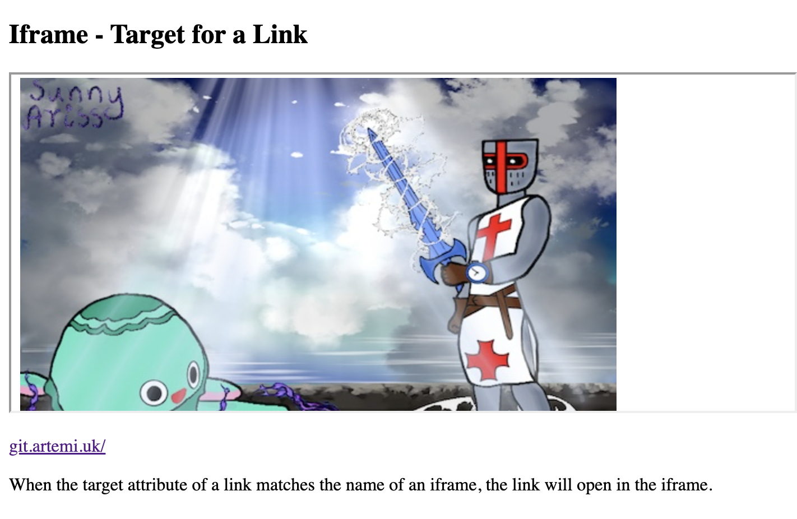

## HTML iframe syntax

The HTML `<iframe>` tag specifies an inline frame.

An inline frame is used to embed another document within the current HTML document.

```
<iframe src="url" title="description"></iframe>
```
### Set Height and Width

```
<!DOCTYPE html>
<html>
<body>

<h2>HTML Iframes</h2>
<p>You can use the height and width attributes to specify the size of the iframe:</p>

<iframe src="https://sunnyaris.github.io/" height="400" width="600" title="Iframe Example"></iframe>

</body>
</html>
```


### Add the style attribute and use the CSS height and width properties

```
<!DOCTYPE html>
<html>
<body>

<h2>HTML Iframes</h2>
<p>You can also use the CSS height and width properties to specify the size of the iframe:</p>

<iframe src="https://sunnyaris.github.io/" style="height:400px;width:600px" title="Iframe Example"></iframe>

</body>
</html>
```


### Iframe - remove the border

```
<!DOCTYPE html>
<html>
<body>

<h2>Remove the Iframe Border</h2>
<p>To remove the default border of the iframe, use CSS:</p>

<iframe src="https://sunnyaris.github.io/"  style="height:400px;width:600px; border:none;"  title="Iframe Example"></iframe>

</body>
</html>
```



### Change the size, style and color of the iframe's border:

```
<!DOCTYPE html>
<html>
<body>

<h2>Remove the Iframe Border</h2>
<p>To remove the default border of the iframe, use CSS:</p>

<iframe src="https://sunnyaris.github.io/"  style="height:400px;width:600px; border:5px solid blue;"  title="Iframe Example"></iframe>

</body>
</html>
```


### Iframe - target for a link

The `target` attribute of the link must refer to the `name` attribute of the iframe

```
<!DOCTYPE html>
<html>
<body>

<h2>Iframe - Target for a Link</h2>

<iframe src="https://sunnyaris.github.io/" name="iframe_a" height="300px" width="100%" title="Iframe Example"></iframe>

<p><a href="http://git.artemi.uk/" target="iframe_a">git.artemi.uk/</a></p>

<p>When the target attribute of a link matches the name of an iframe, the link will open in the iframe.</p>

</body>
</html>
```
