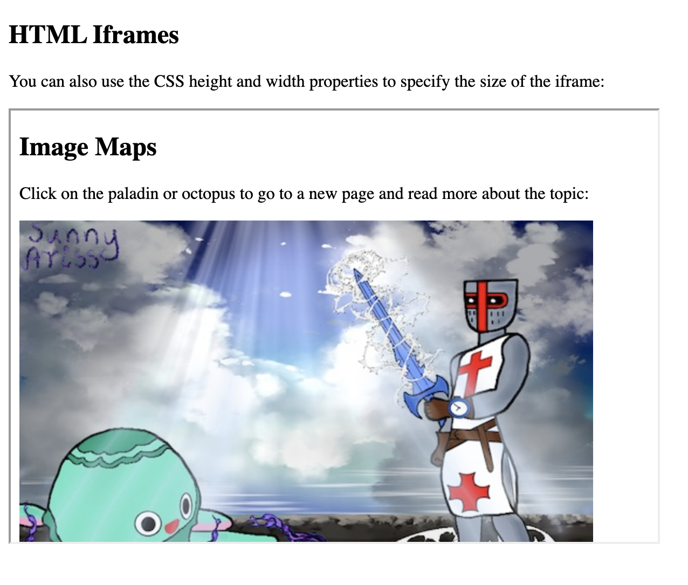

## HTML iframe syntax

The HTML `<iframe>` tag specifies an inline frame.

An inline frame is used to embed another document within the current HTML document.

```
<iframe src="url" title="description"></iframe>
```
### Set Height and Width

```
<!DOCTYPE html>
<html>
<body>

<h2>HTML Iframes</h2>
<p>You can use the height and width attributes to specify the size of the iframe:</p>

<iframe src="https://sunnyaris.github.io/" height="400" width="600" title="Iframe Example"></iframe>

</body>
</html>
```


### Add the style attribute and use the CSS height and width properties

```
<!DOCTYPE html>
<html>
<body>

<h2>HTML Iframes</h2>
<p>You can also use the CSS height and width properties to specify the size of the iframe:</p>

<iframe src="https://sunnyaris.github.io/" style="height:400px;width:600px" title="Iframe Example"></iframe>

</body>
</html>
```



