## Ordered, Unordered HTML List

Ordered list starts with the `<ol>` tag.

Unordered list starts with the `<ul>` tag. 

Each list item starts with the `<li>` tag.


```
<!DOCTYPE html>
<html>
<body>

<h2>An Unordered HTML List</h2>

<ul>
  <li>Fiction</li>
  <li>Detective</li>
  <li>Drama</li>
</ul>  

<h2>An Ordered HTML List</h2>

<ol>
  <li>Fiction</li>
  <li>Detective</li>
  <li>Drama</li>
</ol> 

</body>
</html>
```
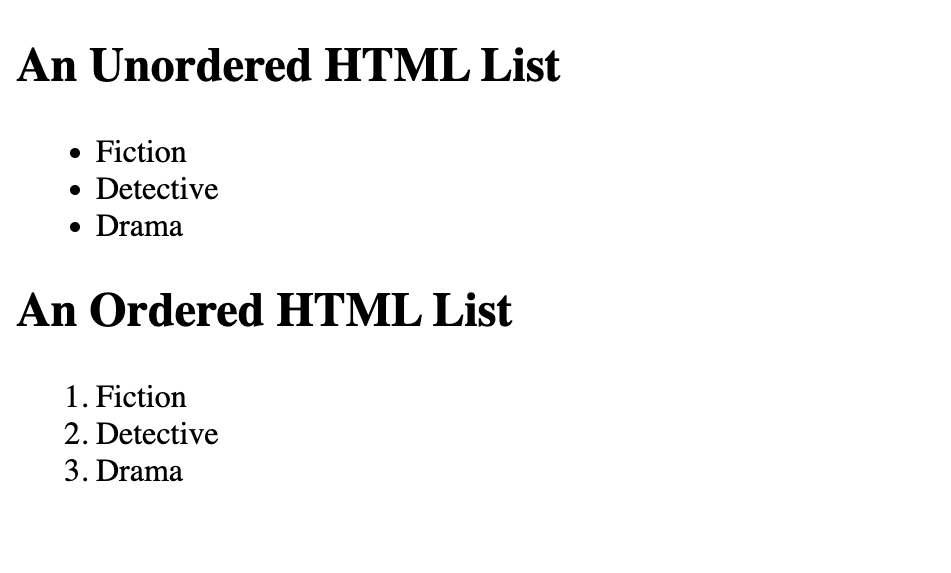

## HTML Ordered Lists

The `type` attribute of the `<ol>` tag, defines the type of the list item marker:

`type="1"`	The list items will be numbered with numbers (default)

```
<!DOCTYPE html>
<html>
<body>

<h2>Ordered List with Numbers</h2>

<ol type="1">
  <li>Fiction</li>
  <li>Detective</li>
  <li>Drama</li>
</ol>  

</body>
</html>
```

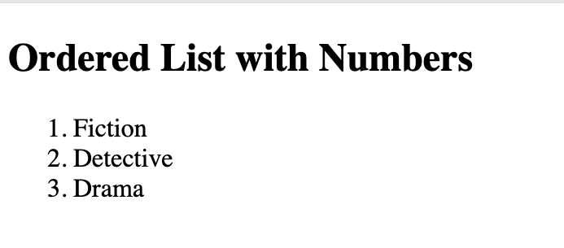

`type="A"`	The list items will be numbered with uppercase letters

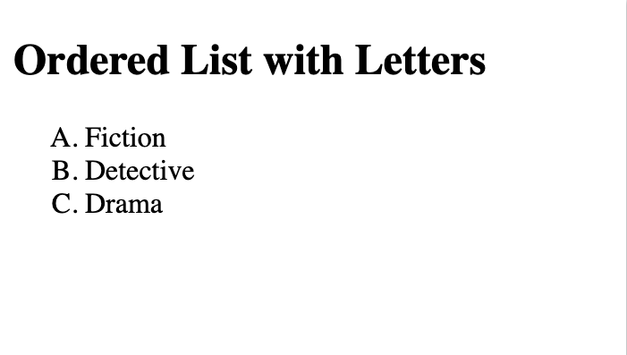

`type="a"`	The list items will be numbered with lowercase letters

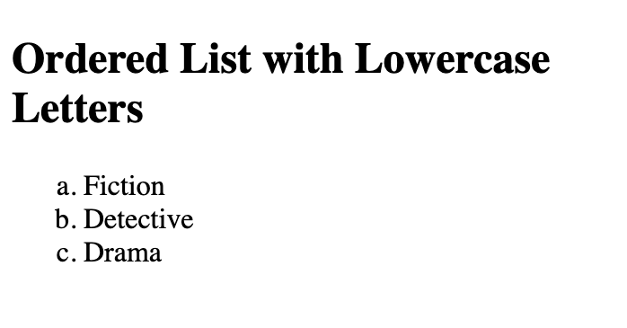

`type="I"`	The list items will be numbered with uppercase roman numbers

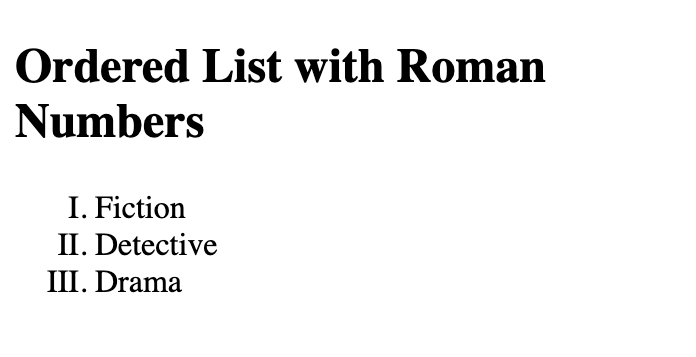

`type="i"`	The list items will be numbered with lowercase roman numbers

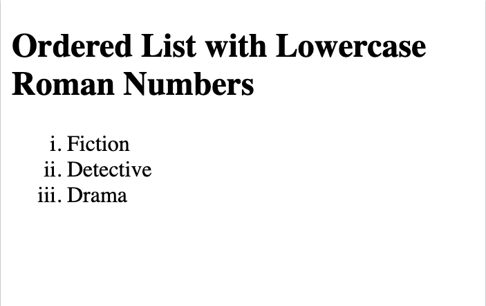

### Control List Counting

```
<!DOCTYPE html>
<html>
<body>

<h2>The start attribute</h2>
<p>By default, an ordered list will start counting from 1. Use the start attribute to start counting from a specified number:</p>

<ol start="50">
  <li>Fiction</li>
  <li>Detective</li>
  <li>Drama</li>
</ol>

<ol type="I" start="50">
  <li>Fiction</li>
  <li>Detective</li>
  <li>Drama</li>
</ol>

</body>
</html>
```
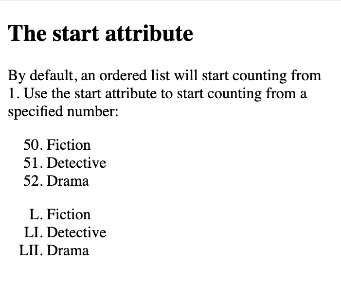

### Nested HTML Lists

```
<!DOCTYPE html>
<html>
<body>

<h2>A Nested List</h2>
<p>Lists can be nested (list inside list):</p>

<ol>
  <li>Non-Fiction</li>
  <li>Fiction
    <ol>
      <li>Fantasy</li>
      <li>Science Fiction</li>
    </ol>
  </li>
  <li>Semi-Fiction</li>
</ol>

</body>
</html>
```
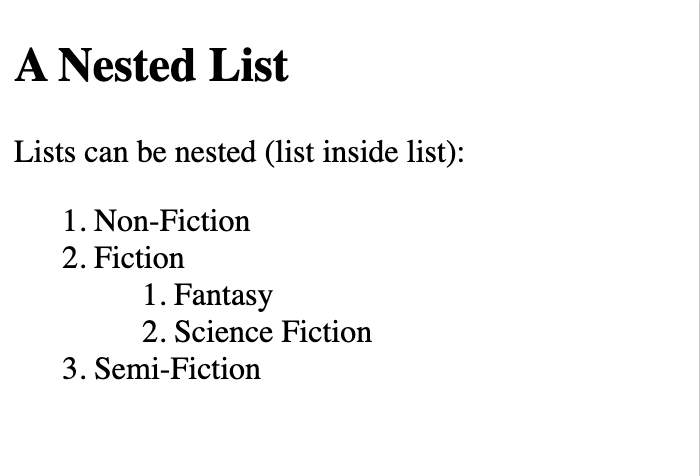

## HTML Unordered Lists

The CSS `list-style-type` property is used to define the style of the list item marker. 

It can have one of the following values:

`disc` - sets the list item marker to a bullet (default)

`circle` - sets the list item marker to a circle

`square` - sets the list item marker to a square

`none` - the list items will not be marked

### disc

```
<!DOCTYPE html>
<html>
<body>

<h2>Unordered List with Disc Bullets</h2>

<ul style="list-style-type:disc;">
  <li>Fiction</li>
  <li>Detective</li>
  <li>Drama</li>
</ul>  

</body>
</html>
```
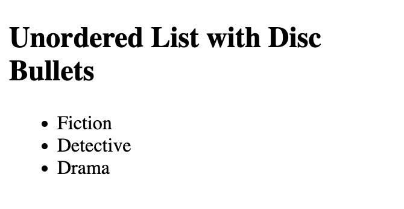

### circle

```
<!DOCTYPE html>
<html>
<body>

<h2>Unordered List with Circle Bullets</h2>

<ul style="list-style-type:circle;">
  <li>Fiction</li>
  <li>Detective</li>
  <li>Drama</li>
</ul>  

</body>
</html>
```
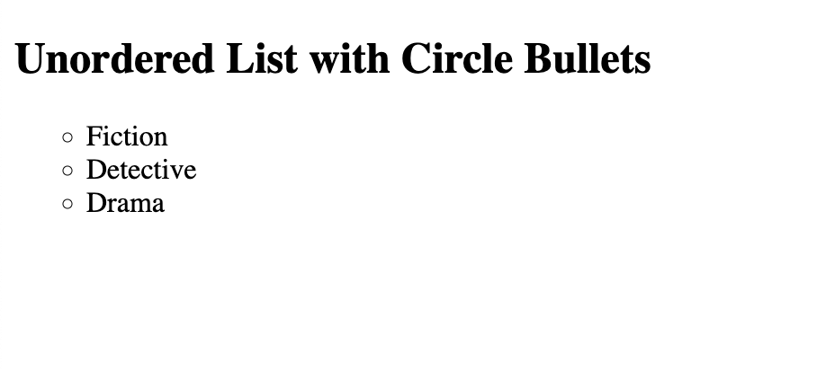

### square

```
<!DOCTYPE html>
<html>
<body>

<h2>Unordered List with Square Bullets</h2>

<ul style="list-style-type:square;">
  <li>Fiction</li>
  <li>Detective</li>
  <li>Drama</li>
</ul>

</body>
</html>
```

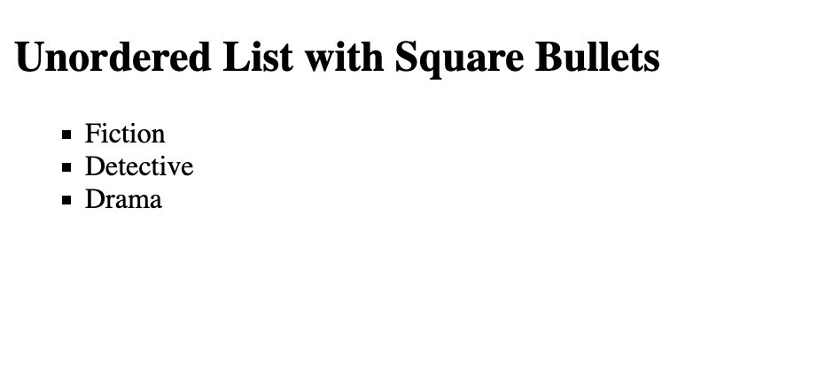

### none 

```
<!DOCTYPE html>
<html>
<body>

<h2>Unordered List without Bullets</h2>

<ul style="list-style-type:none;">
  <li>Fiction</li>
  <li>Detective</li>
  <li>Drama</li>
</ul>  

</body>
</html>
```
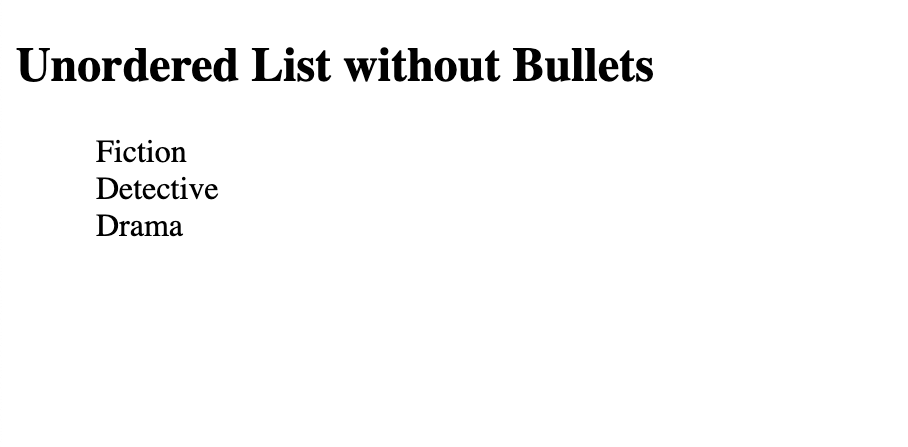


## Nested HTML Lists

```
<!DOCTYPE html>
<html>
<body>

<h2>A Nested List</h2>
<p>Lists can be nested (list inside list):</p>

<ul>
  <li>Non-Fiction</li>
  <li>Fiction
    <ul>
      <li>Fantasy</li>
      <li>Science Fiction</li>
    </ul>
  </li>
  <li>Semi-Fiction</li>
</ul>

</body>
</html>
```

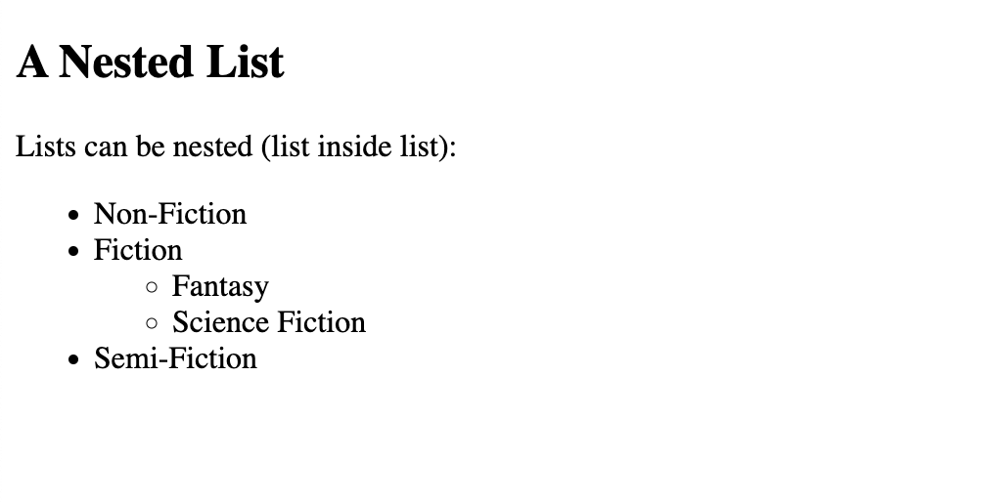


## HTML Description Lists

The `<dl>` tag defines the description list

 `<dt>` tag defines the term (name)

 `<dd>` tag describes each term:

```
<!DOCTYPE html>
<html>
<body>

<h2>A Description List</h2>

<dl>
  <dt>Author</dt>
  <dd>- J. K. Rowling</dd>
  <dd>- Arthur Conan Doyle</dd>
  <dt>Title</dt>
  <dd>- Harry Potter</dd>
  <dd>- Sherlock Holmes</dd>
</dl>

</body>
</html>
```
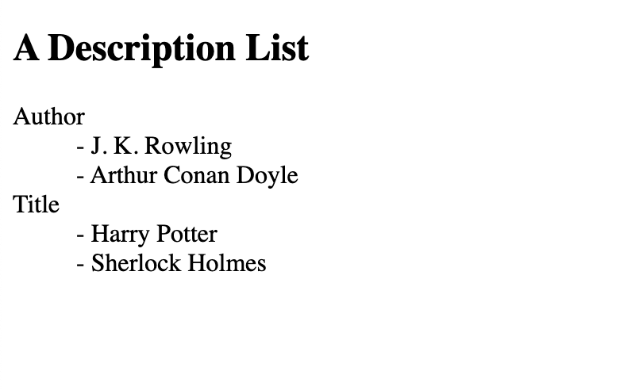

## Horizontal List with CSS

```
<!DOCTYPE html>
<html>
<head>
<style>
ul {
  list-style-type: none;
  margin: 0;
  padding: 0;
  overflow: hidden;
  background-color: #333333;
}

li {
  float: left;
}

li a {
  display: block;
  color: white;
  text-align: center;
  padding: 16px;
  text-decoration: none;
}

li a:hover {
  background-color: #111111;
}
</style>
</head>
<body>

<h2>Navigation Menu</h2>
<p>In this example, we use CSS to style the list horizontally, to create a navigation menu:</p>

<ul>
  <li><a href="#home">Home</a></li>
  <li><a href="#news">News</a></li>
  <li><a href="#contact">Contact</a></li>
  <li><a href="#about">About</a></li>
</ul>

</body>
</html>
```
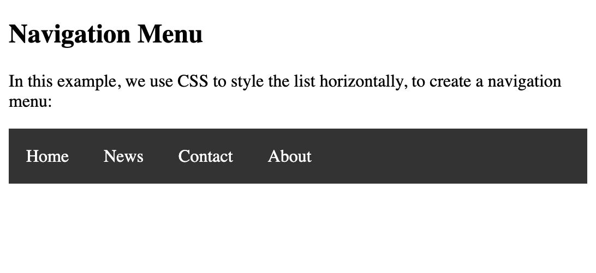
