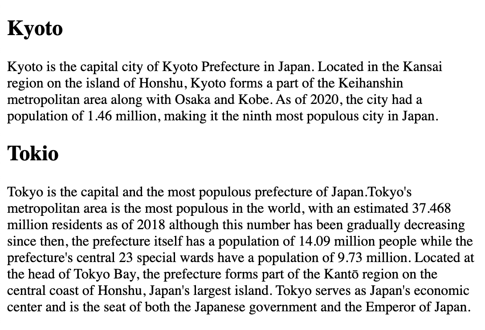
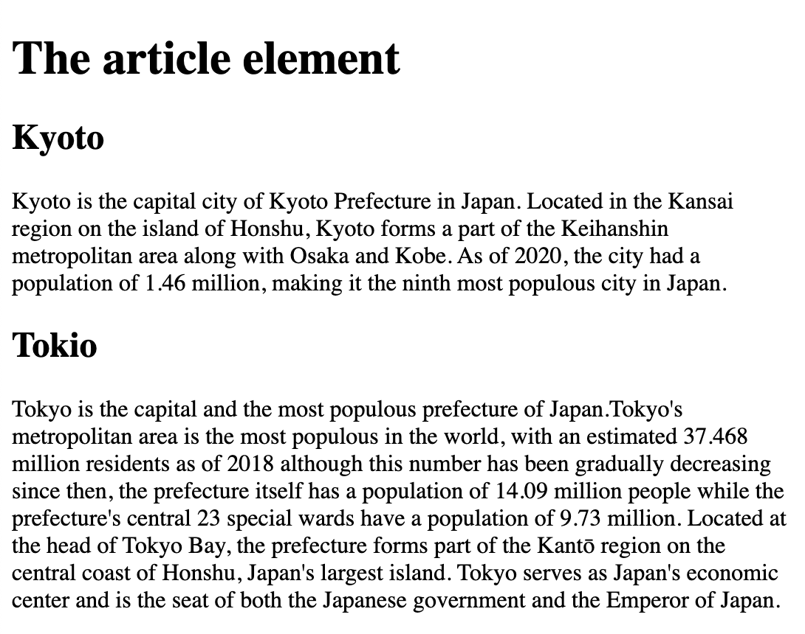
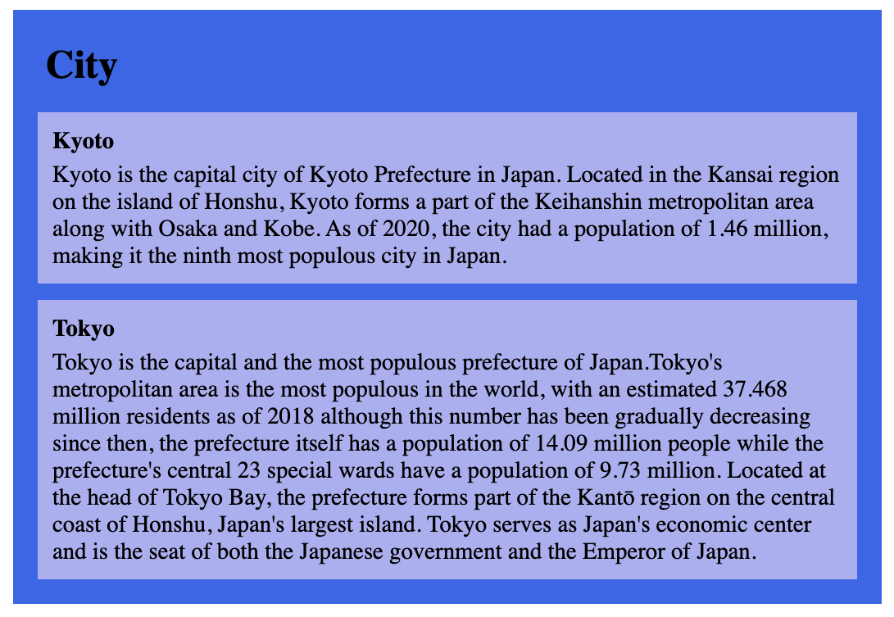
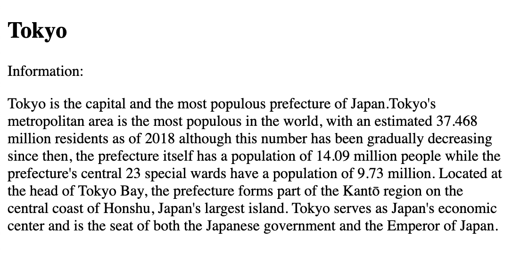
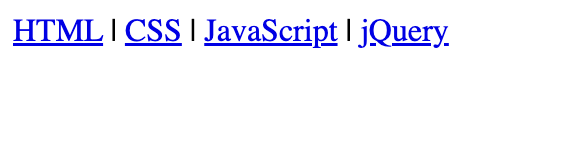
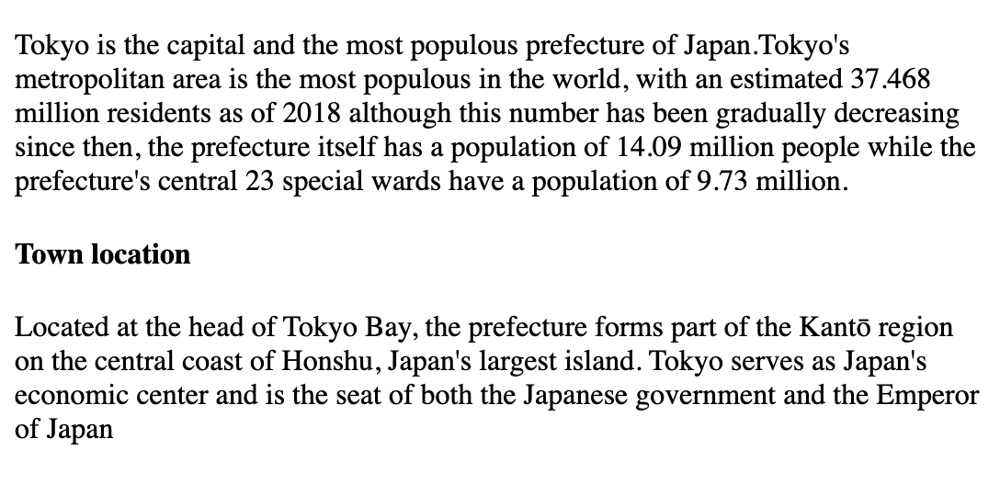
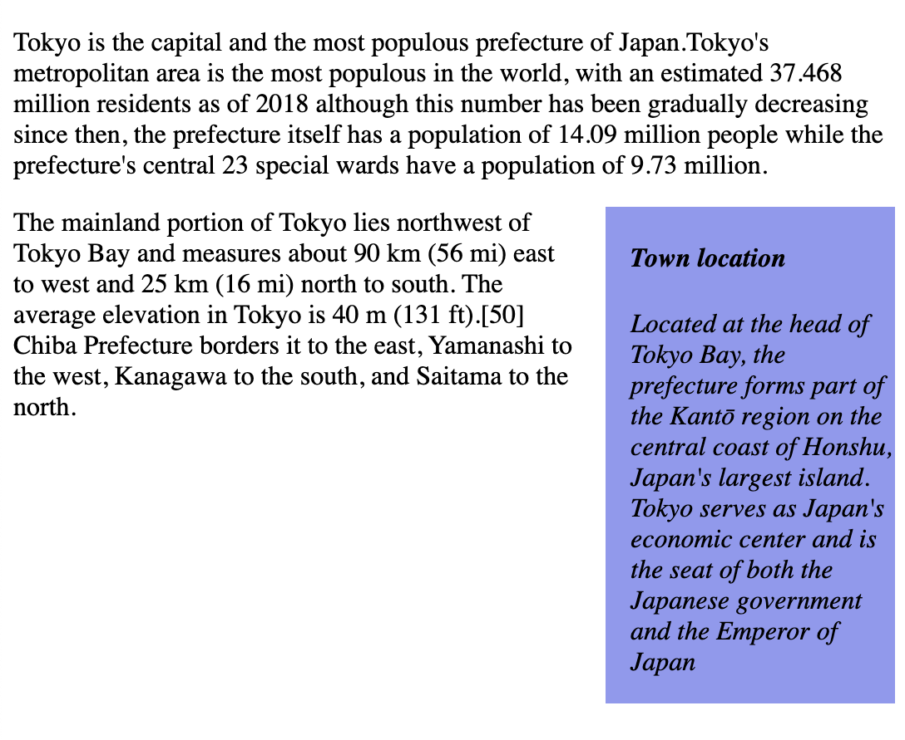
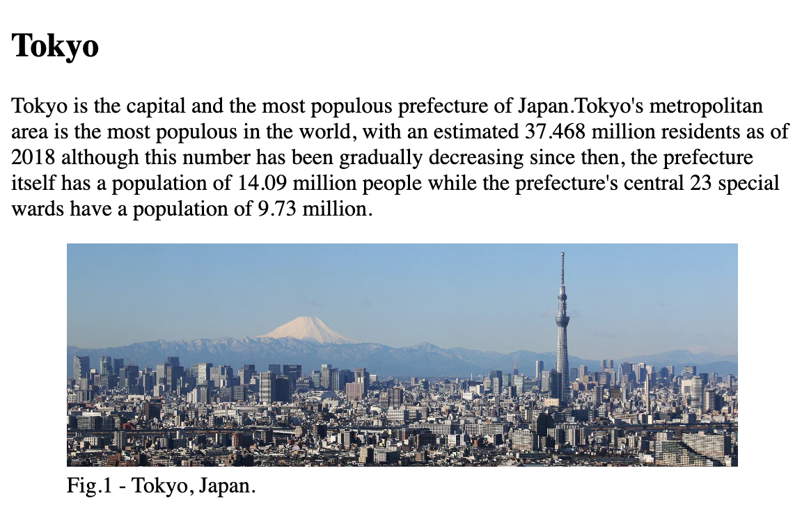

A `semantic` element clearly describes its meaning to both the browser and the developer.

Examples of `non-semantic` elements: `<div>` and `<span>` - Tells nothing about its content.

Examples of `semantic` elements: `<form>`, `<table>`, and `<article>` - Clearly defines its content.

## Semantic elemrnts 

`<article>` `<aside>` `<details>` `<figcaption>` `<figure>` `<footer>` `<header>` `<main>` `<mark>` `<nav>` `<section>` `<summary>` `<time>`

### HTML `<section>` element

The `<section>` element defines a section in a document.

```
<!DOCTYPE html>
<html>
<body>

<section>
  <h1>Kyoto</h1>
  <p>Kyoto is the capital city of Kyoto Prefecture in Japan. Located in the Kansai region on the island of Honshu, Kyoto forms a part of the Keihanshin metropolitan area along with Osaka and Kobe. As of 2020, the city had a population of 1.46 million, making it the ninth most populous city in Japan.</p>
</section>

<section>
  <h1>Tokio</h1>
  <p>Tokyo is the capital and the most populous prefecture of Japan.Tokyo's metropolitan area is the most populous in the world, with an estimated 37.468 million residents as of 2018 although this number has been gradually decreasing since then, the prefecture itself has a population of 14.09 million people while the prefecture's central 23 special wards have a population of 9.73 million. Located at the head of Tokyo Bay, the prefecture forms part of the Kantō region on the central coast of Honshu, Japan's largest island. Tokyo serves as Japan's economic center and is the seat of both the Japanese government and the Emperor of Japan.</p>
</section>

</body>
</html>
```


## HTML `<article>` element

The `<article>` element specifies independent, self-contained content

```
<!DOCTYPE html>
<html>
<body>

<h1>The article element</h1>

<article>
  <h1>Kyoto</h1>
  <p>Kyoto is the capital city of Kyoto Prefecture in Japan. Located in the Kansai region on the island of Honshu, Kyoto forms a part of the Keihanshin metropolitan area along with Osaka and Kobe. As of 2020, the city had a population of 1.46 million, making it the ninth most populous city in Japan.</p>
</article>

<article>
  <h1>Tokio</h1>
  <p>Tokyo is the capital and the most populous prefecture of Japan.Tokyo's metropolitan area is the most populous in the world, with an estimated 37.468 million residents as of 2018 although this number has been gradually decreasing since then, the prefecture itself has a population of 14.09 million people while the prefecture's central 23 special wards have a population of 9.73 million. Located at the head of Tokyo Bay, the prefecture forms part of the Kantō region on the central coast of Honshu, Japan's largest island. Tokyo serves as Japan's economic center and is the seat of both the Japanese government and the Emperor of Japan.</p>
</article>


</body>
</html>
```


### CSS style `<article>`


```
<!DOCTYPE html>
<html>
<head>
<style>
.all-browsers {
  margin: 0;
  padding: 5px;
  background-color: rgb(46, 103, 236);
}

.all-browsers > h1, .browser {
  margin: 10px;
  padding: 5px;
}

.browser {
  background: rgb(171, 175, 243);
}

.browser > h2, p {
  margin: 4px;
  font-size: 90%;
}
</style>
</head>
<body>

<article class="all-browsers">
  <h1>City</h1>
  <article class="browser">
    <h2>Kyoto</h2>
    <p>Kyoto is the capital city of Kyoto Prefecture in Japan. Located in the Kansai region on the island of Honshu, Kyoto forms a part of the Keihanshin metropolitan area along with Osaka and Kobe. As of 2020, the city had a population of 1.46 million, making it the ninth most populous city in Japan.</p>
  </article>
  <article class="browser">
    <h2>Tokyo</h2>
    <p>Tokyo is the capital and the most populous prefecture of Japan.Tokyo's metropolitan area is the most populous in the world, with an estimated 37.468 million residents as of 2018 although this number has been gradually decreasing since then, the prefecture itself has a population of 14.09 million people while the prefecture's central 23 special wards have a population of 9.73 million. Located at the head of Tokyo Bay, the prefecture forms part of the Kantō region on the central coast of Honshu, Japan's largest island. Tokyo serves as Japan's economic center and is the seat of both the Japanese government and the Emperor of Japan.</p>
  </article>
</article>

</body>
</html>
```


### HTML `<header>` element

A `<header>` element typically contains:

- one or more heading elements (`<h1>` - `<h6>`) 
- logo or icon 
- authorship information

### Difference between `<head>` and `<header>`

The `<head>` tag is used for holding Meta information, title, links, etc. and is not displayed on the page. The `<header>` tag is used within the body of the website and can be used multiple times if required, e.g. to determine the top of an article .

```
<!DOCTYPE html>
<html>
<body>

<article>
  <header>
    <h1>Tokyo</h1>
    <p>Information:</p>
  </header>
  <p>Tokyo is the capital and the most populous prefecture of Japan.Tokyo's metropolitan area is the most populous in the world, with an estimated 37.468 million residents as of 2018 although this number has been gradually decreasing since then, the prefecture itself has a population of 14.09 million people while the prefecture's central 23 special wards have a population of 9.73 million. Located at the head of Tokyo Bay, the prefecture forms part of the Kantō region on the central coast of Honshu, Japan's largest island. Tokyo serves as Japan's economic center and is the seat of both the Japanese government and the Emperor of Japan.</p>
</article>

</body>
</html>
```


### HTML `<footer>` element

A `<footer>` element typically contains:

- authorship information
- copyright information
- contact information
- sitemap
- back to top links
- related documents

```
<!DOCTYPE html>
<html>
<body>

<footer>
  <p>Author: XYZ</p>
  <p><a href="mailto:xyz@example.com">xyz@example.com</a></p>
</footer>

</body>
</html>
```

### HTML `<nav>` element

The `<nav>` element defines a set of navigation links.


```
<!DOCTYPE html>
<html>
<body>

<nav>
  <a href="/html/">HTML</a> |
  <a href="/css/">CSS</a> |
  <a href="/js/">JavaScript</a> |
  <a href="/jquery/">jQuery</a>
</nav>

</body>
</html>
```


### HTML `<aside>` element

The `<aside>` element defines some content aside from the content it is placed in (like a sidebar)


```
<!DOCTYPE html>
<html>
<body>

<p>Tokyo is the capital and the most populous prefecture of Japan.Tokyo's metropolitan area is the most populous in the world, with an estimated 37.468 million residents as of 2018 although this number has been gradually decreasing since then, the prefecture itself has a population of 14.09 million people while the prefecture's central 23 special wards have a population of 9.73 million.</p> 

<aside>
  <h4>Town location</h4>
  <p>Located at the head of Tokyo Bay, the prefecture forms part of the Kantō region on the central coast of Honshu, Japan's largest island. Tokyo serves as Japan's economic center and is the seat of both the Japanese government and the Emperor of Japan</p>
</aside>

</body>
</html>
```


### CSS to style the `<aside>` element

```
<!DOCTYPE html>
<html>
<head>
<style>
aside {
  width: 30%;
  padding-left: 15px;
  margin-left: 15px;
  float: right;
  font-style: italic;
  background-color: rgb(143, 153, 241);
}
</style>
</head>
<body>

<p>Tokyo is the capital and the most populous prefecture of Japan.Tokyo's metropolitan area is the most populous in the world, with an estimated 37.468 million residents as of 2018 although this number has been gradually decreasing since then, the prefecture itself has a population of 14.09 million people while the prefecture's central 23 special wards have a population of 9.73 million.</p> 

<aside>
  <h4>Town location</h4>
  <p>Located at the head of Tokyo Bay, the prefecture forms part of the Kantō region on the central coast of Honshu, Japan's largest island. Tokyo serves as Japan's economic center and is the seat of both the Japanese government and the Emperor of Japan</p>
</aside>

<p>The mainland portion of Tokyo lies northwest of Tokyo Bay and measures about 90 km (56 mi) east to west and 25 km (16 mi) north to south. The average elevation in Tokyo is 40 m (131 ft).[50] Chiba Prefecture borders it to the east, Yamanashi to the west, Kanagawa to the south, and Saitama to the north.</p>

</body>
</html>
```



### HTML `<figure>` and `<figcaption>` elements

The `<figure>` tag specifies self-contained content, like illustrations, diagrams, photos, code listings, etc.

The `<figcaption>` tag defines a caption for a `<figure>` element. The `<figcaption>` element can be placed as the first or as the last child of a `<figure>` element.

The `` element defines the actual image/illustration. 

```
<!DOCTYPE html>
<html>
<body>

<h2>Tokyo</h2>

<p>Tokyo is the capital and the most populous prefecture of Japan.Tokyo's metropolitan area is the most populous in the world, with an estimated 37.468 million residents as of 2018 although this number has been gradually decreasing since then, the prefecture itself has a population of 14.09 million people while the prefecture's central 23 special wards have a population of 9.73 million.</p>

<figure>
  
  <figcaption>Fig.1 - Tokyo, Japan.</figcaption>
</figure>

</body>
</html>
```



