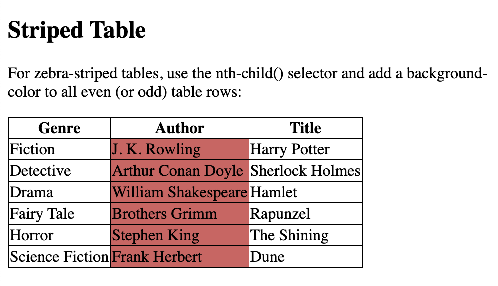
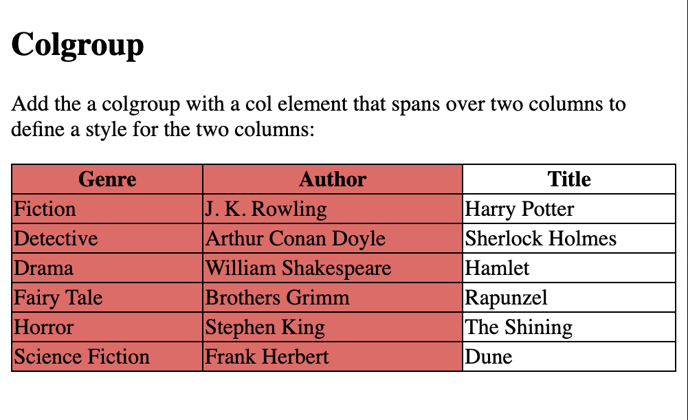

### The `<colgroup>` element should be used as a container for the column specifications.

### Each group is specified with a `<col>` element.

### The `span` attribute specifies how many columns that get the style.

### The `style` attribute specifies the style to give the columns.


## Table With Invisible Borders

```
<!DOCTYPE html>
<html>
<head>
<style>
table, th, td {
  border: 1px solid white;
  border-collapse: collapse;
}
th, td {
  background-color: #e37979;
}
</style>
</head>
<body>

<h2>Table With Invisible Borders</h2>

<p>Style the table with white borders and a background color of the cells to make the impression of invisible borders.</p>

<table style="width:100%">
  <tr>
    <th>Genre</th>
    <th>Author</th>
    <th>Title</th>
  </tr>
  <tr>
    <td>Fiction</td>
    <td>J. K. Rowling</td>
    <td>Harry Potter</td>
  </tr>
  <tr>
    <td>Detective</td>
    <td>Arthur Conan Doyle</td>
    <td>Sherlock Holmes</td>
  </tr>
  <tr>
    <td>Drama</td>
    <td>William Shakespeare</td>
    <td>Hamlet</td>
  </tr>
</table>

</body>
</html>
```


## Table With Zebra Stripes `:nth-child(even)`

```
<!DOCTYPE html>
<html>
<head>
<style>
  table {
    font-family: arial, sans-serif;
    border-collapse: collapse;
    width: 100%;
  }
  
  td, th {
    border: 1px solid #d54242;
    text-align: left;
    padding: 8px;
  }
  
  tr:nth-child(even) {
    background-color: #c99c9c;
  }
  </style>
  </head>
  <body>
  
  <h2>HTML Table</h2>
  
  <table>
    <tr>
      <th>Genre</th>
      <th>Author</th>
      <th>Title</th>
    </tr>
    <tr>
      <td>Fiction</td>
      <td>J. K. Rowling</td>
      <td>Harry Potter</td>
    </tr>
    <tr>
      <td>Detective</td>
      <td>Arthur Conan Doyle</td>
      <td>Sherlock Holmes</td>
    </tr>
    <tr>
      <td>Drama</td>
      <td>William Shakespeare</td>
      <td>Hamlet</td>
    </tr>
    <tr>
      <td>Fairy Tale</td>
      <td>Brothers Grimm</td>
      <td>Rapunzel</td>
    </tr>
    <tr>
      <td>Horror</td>
      <td>Stephen King</td>
      <td>The Shining</td>
    </tr>
    <tr>
      <td>Science Fiction </td>
      <td>Frank Herbert</td>
      <td>Dune</td>
    </tr>
  </table>
  
  </body>
  </html>
```


### Use (odd) instead of (even) and the styling will occur on row 1,3,5 etc. instead of 2,4,6

## HTML Table - Vertical Zebra Stripes

```
<!DOCTYPE html>
<html>
<head>
<style>
  table, th, td {
  border: 1px solid black;
  border-collapse: collapse;
}

th:nth-child(even),td:nth-child(even) {
  background-color: #d65f5f;
}
  
  </style>
  </head>
  <body>
  
    <h2>Striped Table</h2>
    <p>For zebra-striped tables, use the nth-child() selector and add a background-color to all even (or odd) table rows:</p>
  
  <table>
    <tr>
      <th>Genre</th>
      <th>Author</th>
      <th>Title</th>
    </tr>
    <tr>
      <td>Fiction</td>
      <td>J. K. Rowling</td>
      <td>Harry Potter</td>
    </tr>
    <tr>
      <td>Detective</td>
      <td>Arthur Conan Doyle</td>
      <td>Sherlock Holmes</td>
    </tr>
    <tr>
      <td>Drama</td>
      <td>William Shakespeare</td>
      <td>Hamlet</td>
    </tr>
    <tr>
      <td>Fairy Tale</td>
      <td>Brothers Grimm</td>
      <td>Rapunzel</td>
    </tr>
    <tr>
      <td>Horror</td>
      <td>Stephen King</td>
      <td>The Shining</td>
    </tr>
    <tr>
      <td>Science Fiction </td>
      <td>Frank Herbert</td>
      <td>Dune</td>
    </tr>
  </table>
  
  </body>
  </html>
```


```
th:nth-child(even) {
  background-color: #d65f5f;
}
```


```
td:nth-child(even) {
  background-color: #d65f5f;
}
```



## Combine Vertical and Horizontal Zebra Stripes


```
<!DOCTYPE html>
<html>
<head>
<style>
table, th, td {
  border: 1px solid black;
  border-collapse: collapse;
}

tr:nth-child(even) {
  background-color: rgba(226, 74, 74, 0.4);
}

th:nth-child(even),td:nth-child(even) {
  background-color: rgba(226, 74, 74, 0.4);
}
  
  </style>
  </head>
  <body>

    <h2>Striped Table</h2>

    <p>For zebra-striped tables, use the nth-child() selector and add a background-color to all even (or odd) table rows:</p>
  
  <table>
    <tr>
      <th>Genre</th>
      <th>Author</th>
      <th>Title</th>
    </tr>
    <tr>
      <td>Fiction</td>
      <td>J. K. Rowling</td>
      <td>Harry Potter</td>
    </tr>
    <tr>
      <td>Detective</td>
      <td>Arthur Conan Doyle</td>
      <td>Sherlock Holmes</td>
    </tr>
    <tr>
      <td>Drama</td>
      <td>William Shakespeare</td>
      <td>Hamlet</td>
    </tr>
    <tr>
      <td>Fairy Tale</td>
      <td>Brothers Grimm</td>
      <td>Rapunzel</td>
    </tr>
    <tr>
      <td>Horror</td>
      <td>Stephen King</td>
      <td>The Shining</td>
    </tr>
    <tr>
      <td>Science Fiction </td>
      <td>Frank Herbert</td>
      <td>Dune</td>
    </tr>
  </table>
  
  </body>
  </html>
```


## Hoverable Table

Use the `:hover` selector on tr to highlight table rows on mouse over:

```
<!DOCTYPE html>
<html>
<head>
<style>
table {
  border-collapse: collapse;
  width: 100%;
}

th, td {
  padding: 8px;
  text-align: left;
  border-bottom: 1px solid #DDD;
}

tr:hover {background-color: #d43131;}
</style>
</head>
<body>

<h2>Hoverable Table</h2>
<p>Move the mouse over the table rows to see the effect.</p>


  <table>
    <tr>
      <th>Genre</th>
      <th>Author</th>
      <th>Title</th>
    </tr>
    <tr>
      <td>Fiction</td>
      <td>J. K. Rowling</td>
      <td>Harry Potter</td>
    </tr>
    <tr>
      <td>Detective</td>
      <td>Arthur Conan Doyle</td>
      <td>Sherlock Holmes</td>
    </tr>
    <tr>
      <td>Drama</td>
      <td>William Shakespeare</td>
      <td>Hamlet</td>
    </tr>
    <tr>
      <td>Fairy Tale</td>
      <td>Brothers Grimm</td>
      <td>Rapunzel</td>
    </tr>
    <tr>
      <td>Horror</td>
      <td>Stephen King</td>
      <td>The Shining</td>
    </tr>
    <tr>
      <td>Science Fiction </td>
      <td>Frank Herbert</td>
      <td>Dune</td>
    </tr>
  </table>
  
  </body>
  </html>
```


## HTML Table Colgroup

```
<!DOCTYPE html>
<html>
<head>
<style>
table, th, td {
  border: 1px solid black;
  border-collapse: collapse;
}
</style>
</head>
<body>

<h2>Colgroup</h2>
<p>Add the a colgroup with a col element that spans over two columns to define a style for the two columns:</p>

<table style="width: 100%;">
<colgroup>
  <col span="2" style="background-color: #ed6363">
</colgroup>
    <tr>
      <th>Genre</th>
      <th>Author</th>
      <th>Title</th>
    </tr>
    <tr>
      <td>Fiction</td>
      <td>J. K. Rowling</td>
      <td>Harry Potter</td>
    </tr>
    <tr>
      <td>Detective</td>
      <td>Arthur Conan Doyle</td>
      <td>Sherlock Holmes</td>
    </tr>
    <tr>
      <td>Drama</td>
      <td>William Shakespeare</td>
      <td>Hamlet</td>
    </tr>
    <tr>
      <td>Fairy Tale</td>
      <td>Brothers Grimm</td>
      <td>Rapunzel</td>
    </tr>
    <tr>
      <td>Horror</td>
      <td>Stephen King</td>
      <td>The Shining</td>
    </tr>
    <tr>
      <td>Science Fiction </td>
      <td>Frank Herbert</td>
      <td>Dune</td>
    </tr>
  </table>
  
  </body>
  </html>
```


## Multiple Col Elements

```
<!DOCTYPE html>
<html>
<head>
<style>
table, th, td {
  border: 1px solid black;
  border-collapse: collapse;
}
</style>
</head>
<body>

<h2>Multiple Col Elements</h2>
<p>Add multiple col elements in the colgroup:</p>

<table style="width: 100%;">
  <colgroup>
    <col span="2" style="background-color: #e94747">
    <col span="3" style="background-color: rgb(243, 179, 190)">
  </colgroup>
<tr>
<th>MON</th>
<th>TUE</th>
<th>WED</th>
<th>THU</th>
<th>FRI</th>
<th>SAT</th>
<th>SUN</th>
</tr>
<tr>
<td>1</td>
<td>2</td>
<td>3</td>
<td>4</td>
<td>5</td>
<td>6</td>
<td>7</td>
</tr>
<tr>
<td>8</td>
<td>9</td>
<td>10</td>
<td>11</td>
<td>12</td>
<td>13</td>
<td>14</td>
</tr>
<tr>
<td>15</td>
<td>16</td>
<td>17</td>
<td>18</td>
<td>19</td>
<td>20</td>
<td>21</td>
</tr>
<tr>
<td>22</td>
<td>23</td>
<td>24</td>
<td>25</td>
<td>26</td>
<td>27</td>
<td>28</td>
</tr>
</table>

</body>
</html>
```


## Empty Colgroups
```
<!DOCTYPE html>
<html>
<head>
<style>
table, th, td {
  border: 1px solid black;
  border-collapse: collapse;
}
</style>
</head>
<body>

<h2>Empty Colgroups</h2>
<p>Add "empty" col elements that represents the columns before the columns you want to style:</p>

<table style="width: 100%;">
<colgroup>
  <col span="3">
  <col span="2" style="background-color: pink">
</colgroup>
<tr>
<th>MON</th>
<th>TUE</th>
<th>WED</th>
<th>THU</th>
<th>FRI</th>
<th>SAT</th>
<th>SUN</th>
</tr>
<tr>
<td>1</td>
<td>2</td>
<td>3</td>
<td>4</td>
<td>5</td>
<td>6</td>
<td>7</td>
</tr>
<tr>
<td>8</td>
<td>9</td>
<td>10</td>
<td>11</td>
<td>12</td>
<td>13</td>
<td>14</td>
</tr>
<tr>
<td>15</td>
<td>16</td>
<td>17</td>
<td>18</td>
<td>19</td>
<td>20</td>
<td>21</td>
</tr>
<tr>
<td>22</td>
<td>23</td>
<td>24</td>
<td>25</td>
<td>26</td>
<td>27</td>
<td>28</td>
</tr>
</table>

</body>
</html>
```


### Hide Columns

```
<colgroup>
    <col span="2">
    <col span="3" style="visibility: collapse">
  </colgroup>
  ```

