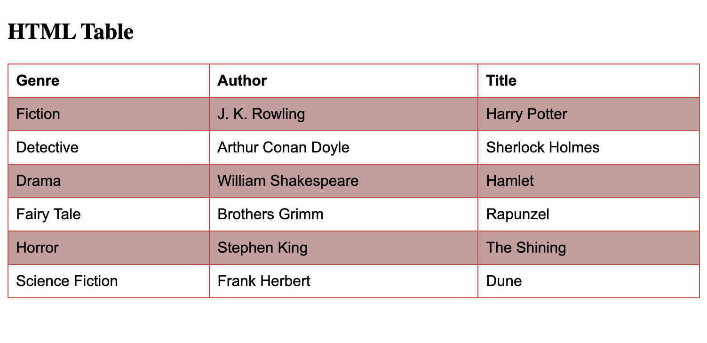

## Table With Invisible Borders

```
<!DOCTYPE html>
<html>
<head>
<style>
table, th, td {
  border: 1px solid white;
  border-collapse: collapse;
}
th, td {
  background-color: #e37979;
}
</style>
</head>
<body>

<h2>Table With Invisible Borders</h2>

<p>Style the table with white borders and a background color of the cells to make the impression of invisible borders.</p>

<table style="width:100%">
  <tr>
    <th>Genre</th>
    <th>Author</th>
    <th>Title</th>
  </tr>
  <tr>
    <td>Fiction</td>
    <td>J. K. Rowling</td>
    <td>Harry Potter</td>
  </tr>
  <tr>
    <td>Detective</td>
    <td>Arthur Conan Doyle</td>
    <td>Sherlock Holmes</td>
  </tr>
  <tr>
    <td>Drama</td>
    <td>William Shakespeare</td>
    <td>Hamlet</td>
  </tr>
</table>

</body>
</html>
```


## Table With Zebra Stripes `:nth-child(even)`

```
<!DOCTYPE html>
<html>
<head>
<style>
  table {
    font-family: arial, sans-serif;
    border-collapse: collapse;
    width: 100%;
  }
  
  td, th {
    border: 1px solid #d54242;
    text-align: left;
    padding: 8px;
  }
  
  tr:nth-child(even) {
    background-color: #c99c9c;
  }
  </style>
  </head>
  <body>
  
  <h2>HTML Table</h2>
  
  <table>
    <tr>
      <th>Genre</th>
      <th>Author</th>
      <th>Title</th>
    </tr>
    <tr>
      <td>Fiction</td>
      <td>J. K. Rowling</td>
      <td>Harry Potter</td>
    </tr>
    <tr>
      <td>Detective</td>
      <td>Arthur Conan Doyle</td>
      <td>Sherlock Holmes</td>
    </tr>
    <tr>
      <td>Drama</td>
      <td>William Shakespeare</td>
      <td>Hamlet</td>
    </tr>
    <tr>
      <td>Fairy Tale</td>
      <td>Brothers Grimm</td>
      <td>Rapunzel</td>
    </tr>
    <tr>
      <td>Horror</td>
      <td>Stephen King</td>
      <td>The Shining</td>
    </tr>
    <tr>
      <td>Science Fiction </td>
      <td>Frank Herbert</td>
      <td>Dune</td>
    </tr>
  </table>
  
  </body>
  </html>
```


### Use (odd) instead of (even) and the styling will occur on row 1,3,5 etc. instead of 2,4,6

## HTML Table - Vertical Zebra Stripes

```
<!DOCTYPE html>
<html>
<head>
<style>
  table, th, td {
  border: 1px solid black;
  border-collapse: collapse;
}

th:nth-child(even),td:nth-child(even) {
  background-color: #d65f5f;
}
  
  </style>
  </head>
  <body>
  
    <h2>Striped Table</h2>
    <p>For zebra-striped tables, use the nth-child() selector and add a background-color to all even (or odd) table rows:</p>
  
  <table>
    <tr>
      <th>Genre</th>
      <th>Author</th>
      <th>Title</th>
    </tr>
    <tr>
      <td>Fiction</td>
      <td>J. K. Rowling</td>
      <td>Harry Potter</td>
    </tr>
    <tr>
      <td>Detective</td>
      <td>Arthur Conan Doyle</td>
      <td>Sherlock Holmes</td>
    </tr>
    <tr>
      <td>Drama</td>
      <td>William Shakespeare</td>
      <td>Hamlet</td>
    </tr>
    <tr>
      <td>Fairy Tale</td>
      <td>Brothers Grimm</td>
      <td>Rapunzel</td>
    </tr>
    <tr>
      <td>Horror</td>
      <td>Stephen King</td>
      <td>The Shining</td>
    </tr>
    <tr>
      <td>Science Fiction </td>
      <td>Frank Herbert</td>
      <td>Dune</td>
    </tr>
  </table>
  
  </body>
  </html>
```


```
th:nth-child(even) {
  background-color: #d65f5f;
}
```


```
td:nth-child(even) {
  background-color: #d65f5f;
}
```


## Combine Vertical and Horizontal Zebra Stripes


```
<!DOCTYPE html>
<html>
<head>
<style>
table, th, td {
  border: 1px solid black;
  border-collapse: collapse;
}

tr:nth-child(even) {
  background-color: rgba(226, 74, 74, 0.4);
}

th:nth-child(even),td:nth-child(even) {
  background-color: rgba(226, 74, 74, 0.4);
}
  
  </style>
  </head>
  <body>

    <h2>Striped Table</h2>

    <p>For zebra-striped tables, use the nth-child() selector and add a background-color to all even (or odd) table rows:</p>
  
  <table>
    <tr>
      <th>Genre</th>
      <th>Author</th>
      <th>Title</th>
    </tr>
    <tr>
      <td>Fiction</td>
      <td>J. K. Rowling</td>
      <td>Harry Potter</td>
    </tr>
    <tr>
      <td>Detective</td>
      <td>Arthur Conan Doyle</td>
      <td>Sherlock Holmes</td>
    </tr>
    <tr>
      <td>Drama</td>
      <td>William Shakespeare</td>
      <td>Hamlet</td>
    </tr>
    <tr>
      <td>Fairy Tale</td>
      <td>Brothers Grimm</td>
      <td>Rapunzel</td>
    </tr>
    <tr>
      <td>Horror</td>
      <td>Stephen King</td>
      <td>The Shining</td>
    </tr>
    <tr>
      <td>Science Fiction </td>
      <td>Frank Herbert</td>
      <td>Dune</td>
    </tr>
  </table>
  
  </body>
  </html>
```


