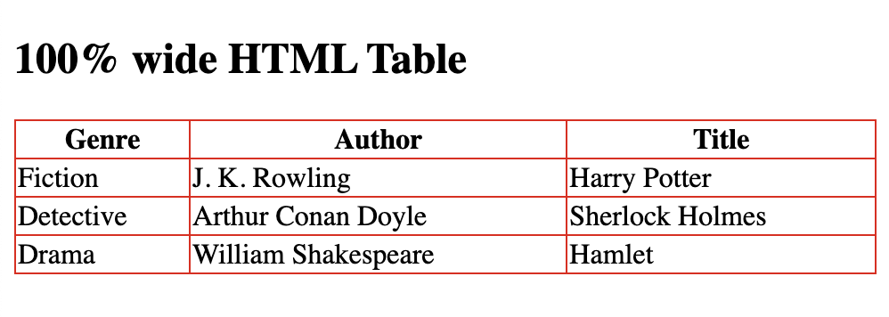
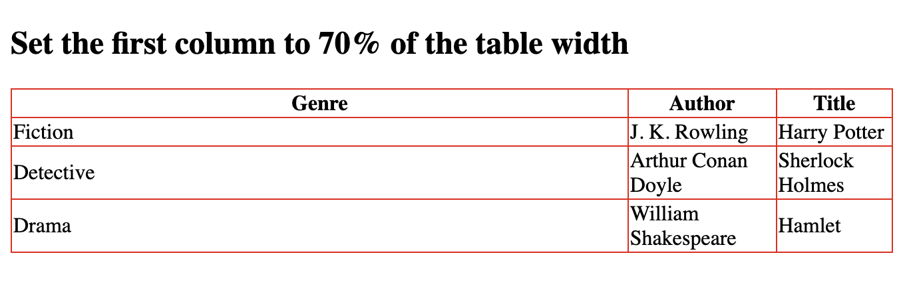
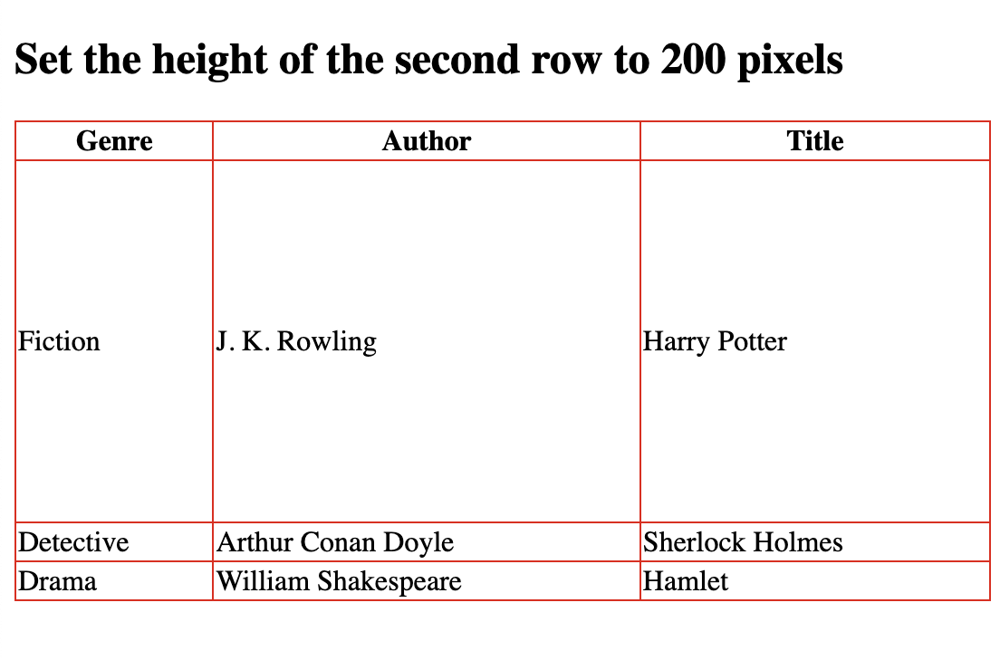

## HTML Table Sizes Width

```
<!DOCTYPE html>
<html>
<style>
table, th, td {
  border:1px solid rgb(233, 10, 10);
  border-collapse: collapse;
}
</style>

<body>

<h2>100% wide HTML Table</h2>


<table style="width:100%">
  <tr>
    <th>Genre</th>
    <th>Author</th>
    <th>Title</th>
  </tr>
  <tr>
    <td>Fiction</td>
    <td>J. K. Rowling</td>
    <td>Harry Potter</td>
  </tr>
  <tr>
    <td>Detective</td>
    <td>Arthur Conan Doyle</td>
    <td>Sherlock Holmes</td>
  </tr>
  <tr>
    <td>Drama</td>
    <td>William Shakespeare</td>
    <td>Hamlet</td>
  </tr>
</table>

</body>
</html>
```


### 70% width

```
<!DOCTYPE html>
<html>
<style>
table, th, td {
  border:1px solid rgb(235, 9, 9);
  border-collapse: collapse;
}
</style>
<body>

<h2>Set the first column to 70% of the table width</h2>

<table style="width:100%">
  <tr>
    <th style="width:70%">Genre</th>
    <th>Author</th>
    <th>Title</th>
  </tr>
  <tr>
    <td>Fiction</td>
    <td>J. K. Rowling</td>
    <td>Harry Potter</td>
  </tr>
  <tr>
    <td>Detective</td>
    <td>Arthur Conan Doyle</td>
    <td>Sherlock Holmes</td>
  </tr>
  <tr>
    <td>Drama</td>
    <td>William Shakespeare</td>
    <td>Hamlet</td>
  </tr>
</table>

</body>
</html>
```


## HTML table height

```
<!DOCTYPE html>
<html>
<style>
table, th, td {
  border:1px solid rgb(234, 6, 6);
  border-collapse: collapse;
}
</style>
<body>

<h2>Set the height of the second row to 200 pixels</h2>

<table style="width:100%">
  <tr>
    <th>Genre</th>
    <th>Author</th>
    <th>Title</th>
  </tr>
  <tr style="height:200px">
    <td>Fiction</td>
    <td>J. K. Rowling</td>
    <td>Harry Potter</td>
  </tr>
  <tr>
    <td>Detective</td>
    <td>Arthur Conan Doyle</td>
    <td>Sherlock Holmes</td>
  </tr>
  <tr>
    <td>Drama</td>
    <td>William Shakespeare</td>
    <td>Hamlet</td>
  </tr>
</table>

</body>
</html>
```

