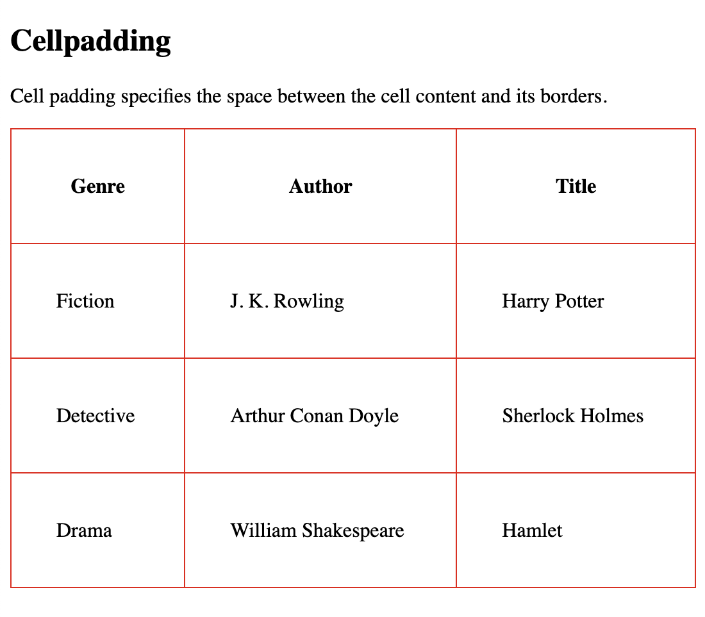
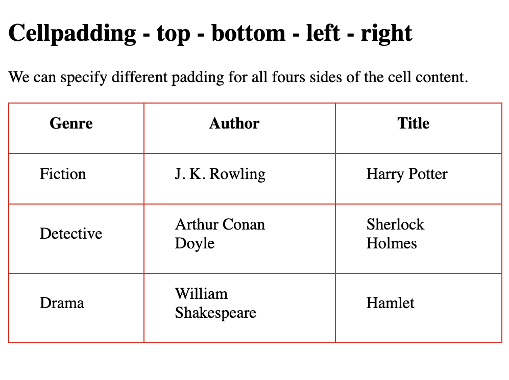
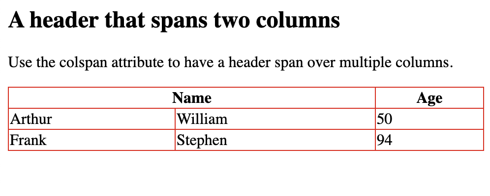
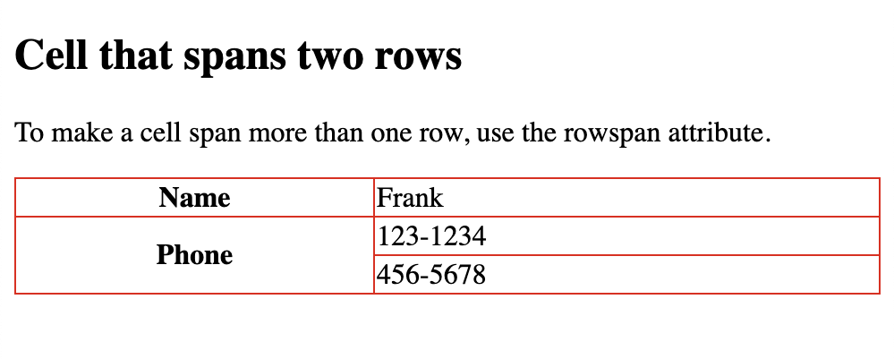
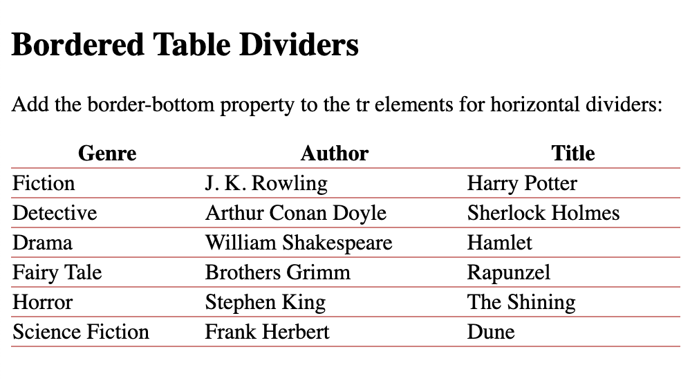

## HTML Table Sizes Width

```
<!DOCTYPE html>
<html>
<style>
table, th, td {
  border:1px solid rgb(233, 10, 10);
  border-collapse: collapse;
}
</style>

<body>

<h2>100% wide HTML Table</h2>


<table style="width:100%">
  <tr>
    <th>Genre</th>
    <th>Author</th>
    <th>Title</th>
  </tr>
  <tr>
    <td>Fiction</td>
    <td>J. K. Rowling</td>
    <td>Harry Potter</td>
  </tr>
  <tr>
    <td>Detective</td>
    <td>Arthur Conan Doyle</td>
    <td>Sherlock Holmes</td>
  </tr>
  <tr>
    <td>Drama</td>
    <td>William Shakespeare</td>
    <td>Hamlet</td>
  </tr>
</table>

</body>
</html>
```


### 70% width

```
<!DOCTYPE html>
<html>
<style>
table, th, td {
  border:1px solid rgb(235, 9, 9);
  border-collapse: collapse;
}
</style>
<body>

<h2>Set the first column to 70% of the table width</h2>

<table style="width:100%">
  <tr>
    <th style="width:70%">Genre</th>
    <th>Author</th>
    <th>Title</th>
  </tr>
  <tr>
    <td>Fiction</td>
    <td>J. K. Rowling</td>
    <td>Harry Potter</td>
  </tr>
  <tr>
    <td>Detective</td>
    <td>Arthur Conan Doyle</td>
    <td>Sherlock Holmes</td>
  </tr>
  <tr>
    <td>Drama</td>
    <td>William Shakespeare</td>
    <td>Hamlet</td>
  </tr>
</table>

</body>
</html>
```


## HTML table height

```
<!DOCTYPE html>
<html>
<style>
table, th, td {
  border:1px solid rgb(234, 6, 6);
  border-collapse: collapse;
}
</style>
<body>

<h2>Set the height of the second row to 200 pixels</h2>

<table style="width:100%">
  <tr>
    <th>Genre</th>
    <th>Author</th>
    <th>Title</th>
  </tr>
  <tr style="height:200px">
    <td>Fiction</td>
    <td>J. K. Rowling</td>
    <td>Harry Potter</td>
  </tr>
  <tr>
    <td>Detective</td>
    <td>Arthur Conan Doyle</td>
    <td>Sherlock Holmes</td>
  </tr>
  <tr>
    <td>Drama</td>
    <td>William Shakespeare</td>
    <td>Hamlet</td>
  </tr>
</table>

</body>
</html>
```


## HTML table padding, spacing

Cell padding is the space between the cell edges and the cell content.

By default the padding is set to 0.

```
<!DOCTYPE html>
<html>
<head>
<style>
table, th, td {
  border: 1px solid rgb(235, 6, 6);
  border-collapse: collapse;
}
th, td {
  padding: 35px;
}
</style>
</head>
<body>

<h2>Cellpadding</h2>
<p>Cell padding specifies the space between the cell content and its borders.</p>

<table style="width:100%">
  <tr>
    <th>Genre</th>
    <th>Author</th>
    <th>Title</th>
  </tr>
  <tr>
    <td>Fiction</td>
    <td>J. K. Rowling</td>
    <td>Harry Potter</td>
  </tr>
  <tr>
    <td>Detective</td>
    <td>Arthur Conan Doyle</td>
    <td>Sherlock Holmes</td>
  </tr>
  <tr>
    <td>Drama</td>
    <td>William Shakespeare</td>
    <td>Hamlet</td>
  </tr>
</table>

</body>
</html>
```


```
<!DOCTYPE html>
<html>
<head>
<style>
table, th, td {
  border: 1px solid rgb(234, 5, 5);
  border-collapse: collapse;
}
th, td {
  padding-top: 10px;
  padding-bottom: 20px;
  padding-left: 30px;
  padding-right: 40px;
}
</style>
</head>
<body>

<h2>Cellpadding - top - bottom - left - right </h2>
<p>We can specify different padding for all fours sides of the cell content.</p>

<table style="width:100%">
  <tr>
    <th>Genre</th>
    <th>Author</th>
    <th>Title</th>
  </tr>
  <tr>
    <td>Fiction</td>
    <td>J. K. Rowling</td>
    <td>Harry Potter</td>
  </tr>
  <tr>
    <td>Detective</td>
    <td>Arthur Conan Doyle</td>
    <td>Sherlock Holmes</td>
  </tr>
  <tr>
    <td>Drama</td>
    <td>William Shakespeare</td>
    <td>Hamlet</td>
  </tr>
</table>

</body>
</html>
```



## HTML table colspan, rowspan

```
<!DOCTYPE html>
<html>
<head>
<style>
  table, th, td {
    border: 1px solid rgb(234, 10, 10);
    border-collapse: collapse;
  }
  </style>
  </head>
  <body>
  
  <h2>A header that spans two columns</h2>
  
  <p>Use the colspan attribute to have a header span over multiple columns.</p>
  
  <table style="width:100%">
    <tr>
      <th colspan="2">Name</th>
      <th>Age</th>
    </tr>
    <tr>
      <td>Arthur</td>
      <td>William</td>
      <td>50</td>
    </tr>
    <tr>
      <td>Frank</td>
      <td>Stephen</td>
      <td>94</td>
    </tr>
  </table>
  </body>
  </html>
```


```
<!DOCTYPE html>
<html>
<head>
<style>
  table, th, td {
    border: 1px solid rgb(234, 10, 10);
    border-collapse: collapse;
  }
  </style>
  </head>
  <body>
  
<h2>Cell that spans two rows</h2>

<p>To make a cell span more than one row, use the rowspan attribute.</p>

  
  <table style="width:100%">
    <tr>
      <th>Name</th>
      <td>Frank</td>
    </tr>
    <tr>
      <th rowspan="2">Phone</th>
      <td>123-1234</td>
    </tr>
    <tr>
      <td>456-5678</td>
    </tr>
  </table>
  </body>
  </html>
```


## Horizontal Dividers

```
<!DOCTYPE html>
<html>
<head>
<style>
table {
  border-collapse: collapse;
  width: 100%;
}

tr {
  border-bottom: 1px solid #db7a7a;
}
</style>
</head>
<body>

<h2>Bordered Table Dividers</h2>
<p>Add the border-bottom property to the tr elements for horizontal dividers:</p>


  <table>
    <tr>
      <th>Genre</th>
      <th>Author</th>
      <th>Title</th>
    </tr>
    <tr>
      <td>Fiction</td>
      <td>J. K. Rowling</td>
      <td>Harry Potter</td>
    </tr>
    <tr>
      <td>Detective</td>
      <td>Arthur Conan Doyle</td>
      <td>Sherlock Holmes</td>
    </tr>
    <tr>
      <td>Drama</td>
      <td>William Shakespeare</td>
      <td>Hamlet</td>
    </tr>
    <tr>
      <td>Fairy Tale</td>
      <td>Brothers Grimm</td>
      <td>Rapunzel</td>
    </tr>
    <tr>
      <td>Horror</td>
      <td>Stephen King</td>
      <td>The Shining</td>
    </tr>
    <tr>
      <td>Science Fiction </td>
      <td>Frank Herbert</td>
      <td>Dune</td>
    </tr>
  </table>
  
  </body>
  </html>
```




