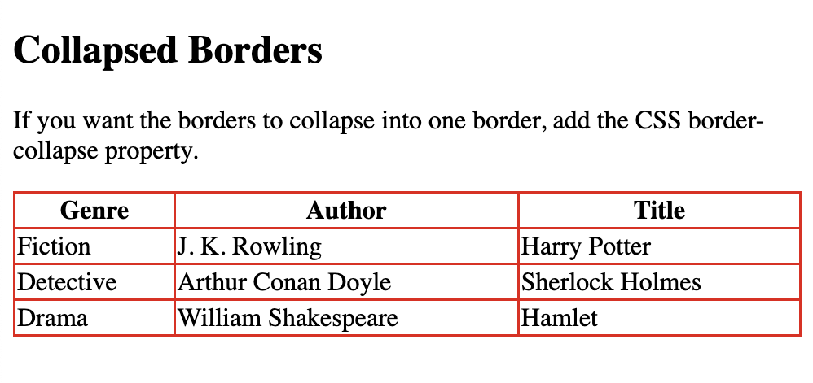
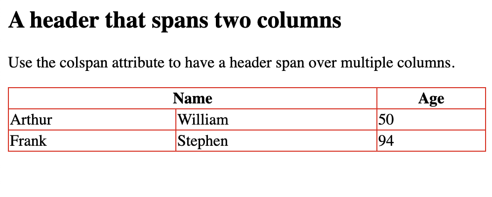

## HTML Tables

Each table row starts with a `<tr>` and ends with a `</tr>` tag.

`<th> </th>` stands for table header.

`<td> </td>` stands for table data.

Set appearance of the border:


```
<!DOCTYPE html>
<html>
<style>
table, th, td {
  border:1px solid rgb(214, 92, 92);
}
</style>
<body>

<h2>TD elements define table cells</h2>

<table style="width:100%">
  <tr>
    <th>Genre</th>
    <th>Author</th>
    <th>Title</th>
  </tr>
</table>

<p>To better understand the example add borders to the table.</p>

</body>
</html>
```


```
<!DOCTYPE html>
<html>
<head>
<style>
  table {
    font-family: arial, sans-serif;
    border-collapse: collapse;
    width: 100%;
  }
  
  td, th {
    border: 1px solid #d54242;
    text-align: left;
    padding: 8px;
  }
  
  tr:nth-child(even) {
    background-color: #c99c9c;
  }
  </style>
  </head>
  <body>
  
  <h2>HTML Table</h2>
  
  <table>
    <tr>
      <th>Genre</th>
      <th>Author</th>
      <th>Title</th>
    </tr>
    <tr>
      <td>Fiction</td>
      <td>J. K. Rowling</td>
      <td>Harry Potter</td>
    </tr>
    <tr>
      <td>Detective</td>
      <td>Arthur Conan Doyle</td>
      <td>Sherlock Holmes</td>
    </tr>
    <tr>
      <td>Drama</td>
      <td>William Shakespeare</td>
      <td>Hamlet</td>
    </tr>
    <tr>
      <td>Fairy Tale</td>
      <td>Brothers Grimm</td>
      <td>Rapunzel</td>
    </tr>
    <tr>
      <td>Horror</td>
      <td>Stephen King</td>
      <td>The Shining</td>
    </tr>
    <tr>
      <td>Science Fiction </td>
      <td>Frank Herbert</td>
      <td>Dune</td>
    </tr>
  </table>
  
  </body>
  </html>
```


```
<!DOCTYPE html>
<html>
<style>
table, th, td {
  border:1px solid rgb(219, 73, 73);
}
</style>
<body>

<h2>A basic HTML table</h2>

<table style="width:100%">
  <tr>
    <th>Genre</th>
    <th>Author</th>
    <th>Title</th>
  </tr>
  <tr>
    <td>Horror</td>
    <td>Stephen King</td>
    <td>The Shining</td>
  </tr>
  <tr>
    <td>Science Fiction </td>
    <td>Frank Herbert</td>
    <td>Dune</td>
  </tr>
  <tr>
    <td>Detective</td>
    <td>Arthur Conan Doyle</td>
    <td>Sherlock Holmes</td>
  </tr>
</table>

<p>A table in HTML consists of table cells inside rows and columns.

</p>

</body>
</html>
```


## HTML Table Borders

To add a border, use the CSS `border` property on `table`, `th`, and `td` elements:

```
<!DOCTYPE html>
<html>
<style>
table, th, td {
  border:1px solid rgb(214, 92, 92);
}
</style>
<body>

<h2>Table With Border</h2>

<table style="width:100%">
  <tr>
    <th>Genre</th>
    <th>Author</th>
    <th>Title</th>
  </tr>
</table>

</body>
</html>
```


## Collapsed Table Borders

To avoid having double borders set the CSS `border-collapse` property to `collapse`.

This will make the borders collapse into a single border:

```
<!DOCTYPE html>
<html>
<head>
<style>
table, th, td {
  border: 1px solid rgb(233, 15, 15);
  border-collapse: collapse;
}
</style>
</head>
<body>

  <h2>Collapsed Borders</h2>
  <p>If you want the borders to collapse into one border, add the CSS border-collapse property.</p>
  
<table style="width:100%">
  <tr>
    <th>Genre</th>
    <th>Author</th>
    <th>Title</th>
  </tr>
  <tr>
    <td>Fiction</td>
    <td>J. K. Rowling</td>
    <td>Harry Potter</td>
  </tr>
  <tr>
    <td>Detective</td>
    <td>Arthur Conan Doyle</td>
    <td>Sherlock Holmes</td>
  </tr>
  <tr>
    <td>Drama</td>
    <td>William Shakespeare</td>
    <td>Hamlet</td>
  </tr>
</table>

</body>
</html>
```


```
<!DOCTYPE html>
<html>
<head>
<style>
table, th, td {
  border: solid rgb(233, 15, 15);
  border-collapse: collapse;
}
</style>
</head>
<body>

  <h2>Collapsed Borders</h2>
  <p>If you want the borders to collapse into one border, add the CSS border-collapse property.</p>
  
<table style="width:100%">
  <tr>
    <th>Genre</th>
    <th>Author</th>
    <th>Title</th>
  </tr>
  <tr>
    <td>Fiction</td>
    <td>J. K. Rowling</td>
    <td>Harry Potter</td>
  </tr>
  <tr>
    <td>Detective</td>
    <td>Arthur Conan Doyle</td>
    <td>Sherlock Holmes</td>
  </tr>
  <tr>
    <td>Drama</td>
    <td>William Shakespeare</td>
    <td>Hamlet</td>
  </tr>
</table>

</body>
</html>
```



## Style Table Borders

```
<!DOCTYPE html>
<html>
<head>
<style>
table, th, td {
  border: 1px solid white;
  border-collapse: collapse;
}
th, td {
  background-color: #e37979;
}
</style>
</head>
<body>

<h2>Table With Invisible Borders</h2>

<p>Style the table with white borders and a background color of the cells to make the impression of invisible borders.</p>

<table style="width:100%">
  <tr>
    <th>Genre</th>
    <th>Author</th>
    <th>Title</th>
  </tr>
  <tr>
    <td>Fiction</td>
    <td>J. K. Rowling</td>
    <td>Harry Potter</td>
  </tr>
  <tr>
    <td>Detective</td>
    <td>Arthur Conan Doyle</td>
    <td>Sherlock Holmes</td>
  </tr>
  <tr>
    <td>Drama</td>
    <td>William Shakespeare</td>
    <td>Hamlet</td>
  </tr>
</table>

</body>
</html>
```


## Round Table Borders

```
<!DOCTYPE html>
<html>
<head>
<style>
table, th, td {
  border: 1px solid rgb(226, 21, 21);
  border-radius: 10px;
}
</style>
</head>
<body>

<h2>Table With Rounded Borders</h2>

<p>Use the CSS border-radius property to add rounded corners to the borders.</p>

<table style="width:100%">
  <tr>
    <th>Genre</th>
    <th>Author</th>
    <th>Title</th>
  </tr>
  <tr>
    <td>Fiction</td>
    <td>J. K. Rowling</td>
    <td>Harry Potter</td>
  </tr>
  <tr>
    <td>Detective</td>
    <td>Arthur Conan Doyle</td>
    <td>Sherlock Holmes</td>
  </tr>
  <tr>
    <td>Drama</td>
    <td>William Shakespeare</td>
    <td>Hamlet</td>
  </tr>
</table>

</body>
</html>
```


```
<!DOCTYPE html>
<html>
<head>
<style>
th, td {
  border: 1px solid rgb(226, 21, 21);
  border-radius: 10px;
}
</style>
</head>
<body>

<h2>Table With Rounded Borders</h2>

<table style="width:100%">
  <tr>
    <th>Genre</th>
    <th>Author</th>
    <th>Title</th>
  </tr>
  <tr>
    <td>Fiction</td>
    <td>J. K. Rowling</td>
    <td>Harry Potter</td>
  </tr>
  <tr>
    <td>Detective</td>
    <td>Arthur Conan Doyle</td>
    <td>Sherlock Holmes</td>
  </tr>
  <tr>
    <td>Drama</td>
    <td>William Shakespeare</td>
    <td>Hamlet</td>
  </tr>
</table>

</body>
</html>
```


### Dotted Table Borders

```
<!DOCTYPE html>
<html>
<head>
<style>
th, td {
  border-style: dotted;
}
</style>
</head>
<body>

  <h2>Table With Dotted Borders</h2>
  <p>Use the CSS border-style property to set the style of the borders.</p>

<table style="width:100%">
  <tr>
    <th>Genre</th>
    <th>Author</th>
    <th>Title</th>
  </tr>
  <tr>
    <td>Fiction</td>
    <td>J. K. Rowling</td>
    <td>Harry Potter</td>
  </tr>
  <tr>
    <td>Detective</td>
    <td>Arthur Conan Doyle</td>
    <td>Sherlock Holmes</td>
  </tr>
  <tr>
    <td>Drama</td>
    <td>William Shakespeare</td>
    <td>Hamlet</td>
  </tr>
</table>

</body>
</html>
```


## HTML table headers

Vertical table headers 

```
<!DOCTYPE html>
<html>
<head>
<style>
table, th, td {
  border: 1px solid rgb(233, 15, 15);
  border-collapse: collapse;
}
</style>
</head>
<body>

<h2>Vertical Table Headers</h2>

<p>The first column becomes table headers if you set the first table cell in each table row to a TH element:</p>

<table style="width:100%">
  <tr>
    <th>Genre</th>
    <td>Fiction</td>
    <td>Detective</td>
    <td>Drama</td>
  </tr>
  <tr>
    <th>Author</th>
    <td>J. K. Rowling</td>
    <td>Arthur Conan Doyle</td>
    <td>William Shakespeare</td>
  </tr>
  <tr>
    <th>Title</th>
    <td>Harry Potter</td>
    <td>Sherlock Holmes</td>
    <td>Hamlet</td>
  </tr>
</table>

</body>
</html>
```


## Align table headers

```
<!DOCTYPE html>
<html>
<head>
<style>
table, th, td {
  border: 1px solid rgb(233, 15, 15);
  border-collapse: collapse;
}
th {
  text-align: left;
}
</style>
</head>
<body>

  <h2>Left-align Headers</h2>

  <p>To left-align the table headers, use the CSS text-align property.</p> 

<table style="width:100%">
  <tr>
    <th>Genre</th>
    <th>Author</th>
    <th>Title</th>
  </tr>
  <tr>
    <td>Fiction</td>
    <td>J. K. Rowling</td>
    <td>Harry Potter</td>
  </tr>
  <tr>
    <td>Detective</td>
    <td>Arthur Conan Doyle</td>
    <td>Sherlock Holmes</td>
  </tr>
  <tr>
    <td>Drama</td>
    <td>William Shakespeare</td>
    <td>Hamlet</td>
  </tr>
</table>

</body>
</html>
```


## Header for multiple columns

```
<!DOCTYPE html>
<html>
<head>
<style>
  table, th, td {
    border: 1px solid rgb(234, 10, 10);
    border-collapse: collapse;
  }
  </style>
  </head>
  <body>
  
  <h2>A header that spans two columns</h2>
  
  <p>Use the colspan attribute to have a header span over multiple columns.</p>
  
  <table style="width:100%">
    <tr>
      <th colspan="2">Name</th>
      <th>Age</th>
    </tr>
    <tr>
      <td>Arthur</td>
      <td>William</td>
      <td>50</td>
    </tr>
    <tr>
      <td>Frank</td>
      <td>Stephen</td>
      <td>94</td>
    </tr>
  </table>
  </body>
  </html>
```



## Table `<caption>`

```
<!DOCTYPE html>
<html>
<head>
<style>
table, th, td {
  border: 1px solid rgb(244, 9, 9);
  border-collapse: collapse;
}
th, td {
  padding: 5px;
  text-align: left;
}
</style>
</head>
<body>

<h2>Table Caption</h2>
<p>To add a caption to a table, use the caption tag.</p>

<table style="width:100%">
  <caption>Male Age</caption>
  <tr>
    <th>Name</th>
    <th>Age</th>
  </tr>
  <tr>
    <td>Frank</td>
    <td>94</td>
  </tr>
  <tr>
    <td>William</td>
    <td>50</td>
  </tr>
</table>

</body>
</html>
```


