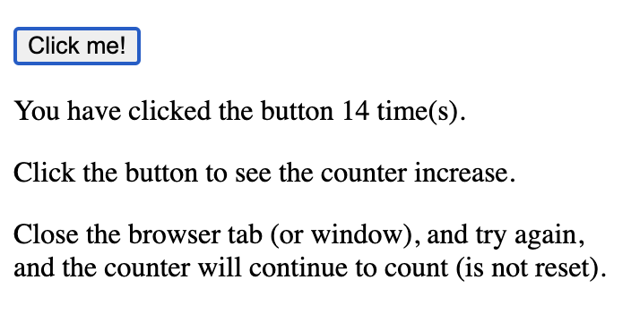
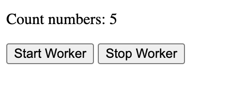

## HTML Web Storage Objects

`window.localStorage` - stores data with no expiration date

`window.sessionStorage` - stores data for one session (data is lost when the browser tab is closed)

```
<!DOCTYPE html>
<html>
<body>

<div id="result"></div>

<script>
// Check browser support
if (typeof(Storage) !== "undefined") {
  // Store
  localStorage.setItem("book", "Horror");
  // Retrieve
  document.getElementById("result").innerHTML = localStorage.getItem("book");
} else {
  document.getElementById("result").innerHTML = "Sorry, your browser does not support Web Storage...";
}
</script>

</body>
</html>
```
## Clicked a button

```
<!DOCTYPE html>
<html>
<head>
<script>
function clickCounter() {
  if (typeof(Storage) !== "undefined") {
    if (localStorage.clickcount) {
      localStorage.clickcount = Number(localStorage.clickcount)+1;
    } else {
      localStorage.clickcount = 1;
    }
    document.getElementById("result").innerHTML = "You have clicked the button " + localStorage.clickcount + " time(s).";
  } else {
    document.getElementById("result").innerHTML = "Sorry, your browser does not support web storage...";
  }
}
</script>
</head>
<body>

<p><button onclick="clickCounter()" type="button">Click me!</button></p>
<div id="result"></div>
<p>Click the button to see the counter increase.</p>
<p>Close the browser tab (or window), and try again, and the counter will continue to count (is not reset).</p>

</body>
</html>
```


## `sessionStorage` object

`sessionStorage` object is equal to the localStorage object, except that it stores the data for only one session. The data is deleted when the user closes the specific browser tab.

```
<!DOCTYPE html>
<html>
<head>
<script>
function clickCounter() {
  if (typeof(Storage) !== "undefined") {
    if (sessionStorage.clickcount) {
      sessionStorage.clickcount = Number(sessionStorage.clickcount)+1;
    } else {
      sessionStorage.clickcount = 1;
    }
    document.getElementById("result").innerHTML = "You have clicked the button " + sessionStorage.clickcount + " time(s) in this session.";
  } else {
    document.getElementById("result").innerHTML = "Sorry, your browser does not support web storage...";
  }
}
</script>
</head>
<body>

<p><button onclick="clickCounter()" type="button">Click me!</button></p>
<div id="result"></div>
<p>Click the button to see the counter increase.</p>
<p>Close the browser tab (or window), and try again, and the counter is reset.</p>

</body>
</html>
```

## HTML Web Workers

```
<!DOCTYPE html>
<html>
<body>

<p>Count numbers: <output id="result"></output></p>
<button onclick="startWorker()">Start Worker</button> 
<button onclick="stopWorker()">Stop Worker</button>

<script>
var w;

function startWorker() {
  if(typeof(Worker) !== "undefined") {
    if(typeof(w) == "undefined") {
      w = new Worker("demo_workers.js");
    }
    w.onmessage = function(event) {
      document.getElementById("result").innerHTML = event.data;
    };
  } else {
    document.getElementById("result").innerHTML = "Sorry, your browser does not support Web Workers...";
  }
}

function stopWorker() { 
  w.terminate();
  w = undefined;
}
</script>

</body>
</html>
```



## SSE Server-Sent Events

`server-sent event` is when a web page automatically gets updates from a server.

```
<!DOCTYPE html>
<html>
<body>

<h1>Getting server updates</h1>
<div id="result"></div>

<script>
if(typeof(EventSource) !== "undefined") {
  var source = new EventSource("demo_sse.php");
  source.onmessage = function(event) {
    document.getElementById("result").innerHTML += event.data + "<br>";
  };
} else {
  document.getElementById("result").innerHTML = "Sorry, your browser does not support server-sent events...";
}
</script>

</body>
</html>
```


