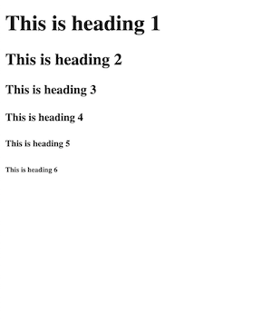
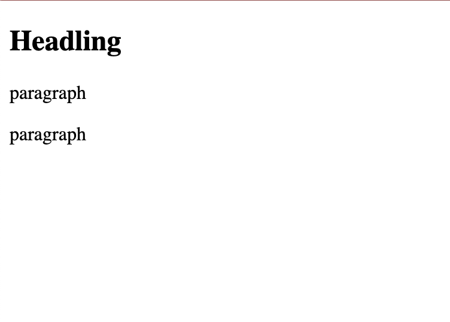
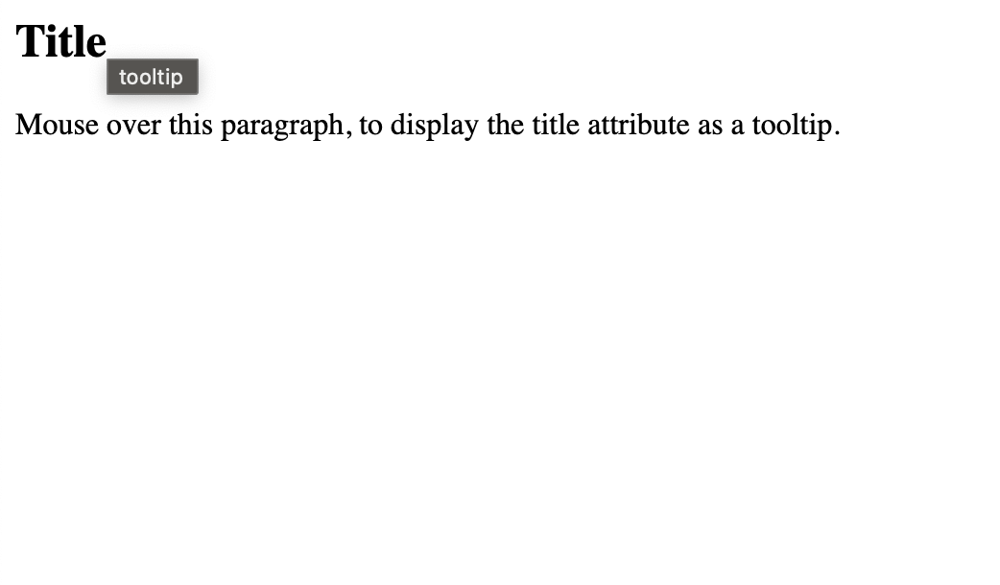
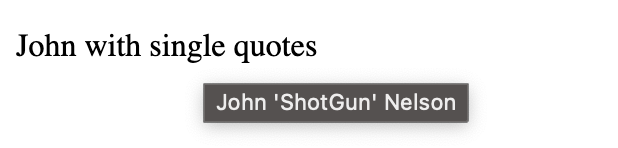
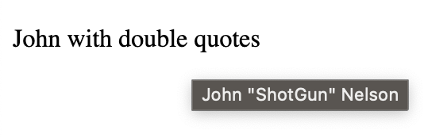
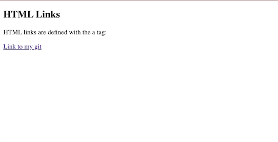

## Documents
1. All HTML documents must start with a document type declaration: `<!DOCTYPE html>`

2. The HTML document itself begins with `<html>` and ends with `</html>`.

3. The visible part of the HTML document is between `<body>` and `</body>`.


The `<html>` element is the root element and it defines the whole HTML document.

It has a start tag `<html>` and an end tag `</html>`

Then, inside the `<html>` element there is a `<body>` element

The `<body>` element defines the document's body.

It has a start tag `<body>` and an end tag `</body>`

Then, inside the `<body>` element there are two other elements: `<h1>` and `<p>`

The `<h1>` element defines a heading.

It has a start tag `<h1>` and an end tag `</h1>`


The `<p>` element defines a paragraph.

It has a start tag `<p>` and an end tag `</p>`


```
<!DOCTYPE html>
<html>
<body>

<h1>My First Heading</h1>

<p>My first paragraph.</p>

</body>
</html>
```

HTML elements with no content are called empty elements.

The `<br>` tag defines a line break, and is an empty element without a closing tag:

```
<!DOCTYPE html>
<html>
<body>

<h1>My First Heading</h1>

<p>My first paragraph.</p>

<p>This is a <br> paragraph with a line break.</p>

</body>
</html>
```


## `<!DOCTYPE>`

The `<!DOCTYPE>` declaration represents the document type, and helps browsers to display web pages correctly.

It appear once, at the top of the page, is not case sensitive (so you could write it in lowercase, if you wanted to. But as the official documents use the capitalized doctype. => You can write it the way you want, but I recommend writing it in uppercase letters.)

The `<!DOCTYPE>` declaration for HTML5 is: `<!DOCTYPE html>`


## `<html>`

### `lang`

Add `lang` attribute inside the `<html>` tag, to declare the language of the Web page. This is meant to assist search engines and browsers.
```
<!DOCTYPE html>
<html lang="en">
<body>

<h1>My First Heading</h1>

<p>My first paragraph.</p>

</body>
</html>
```
Country codes can also be added to the language code in the `lang` attribute.

`<html lang="en-US">`

## `<body>`

### HTML Headings `<h1>`

HTML headings are defined with the `<h1>` to `<h6>` tags.

`<h1>` - most important heading
`<h6>` - the least important heading
```
<!DOCTYPE html>
<html>
<body>

<h1>This is heading 1</h1>
<h2>This is heading 2</h2>
<h3>This is heading 3</h3>
<h4>This is heading 4</h4>
<h5>This is heading 5</h5>
<h6>This is heading 6</h6>

</body>
</html>
```


### HTML Paragraphs `<p>`
```
<!DOCTYPE html>
<html>
<body>

<h2>Headling</h2>
<p>paragraph</p>
<p>paragraph</p>

</body>
</html>
```


### Title

The `title` attribute defines some extra information about an element.

```
<!DOCTYPE html>
<html>
<body>

<h2 title="tooltip">Title</h2>

<p title="tooltip">Mouse over this paragraph, to display the title attribute as a tooltip.</p>

</body>
</html>
```


### Single and Double Quotes

`<p title="John 'ShotGun' Nelson">`



`<p title='John "ShotGun" Nelson'>`




### HTML Links
HTML links are defined with the `<a>` tag

```
<!DOCTYPE html>
<html>
<body>

<h2>HTML Links</h2>
<p>HTML links are defined with the a tag:</p>

<a href="http://git.artemi.uk/">Link to my git</a>

</body>
</html>

```



### HTML Images

HTML images are defined with the `` tag.

The source file `src`, alternative text `alt`, `width`, and `height` are provided as attributes

```
<!DOCTYPE html>
<html>
<body>

<h2>HTML Images</h2>
<p>HTML images are defined with the img tag:</p>


</body>
</html>

```


