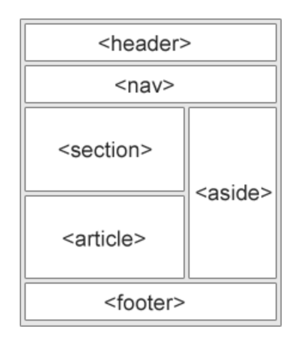
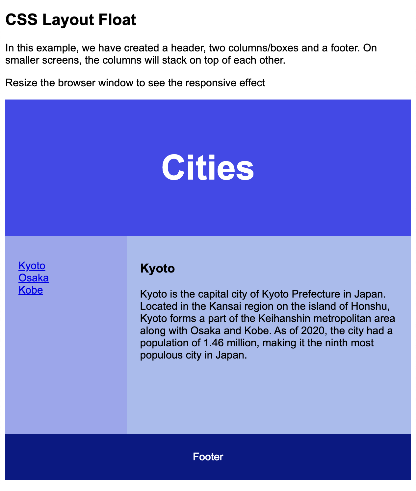
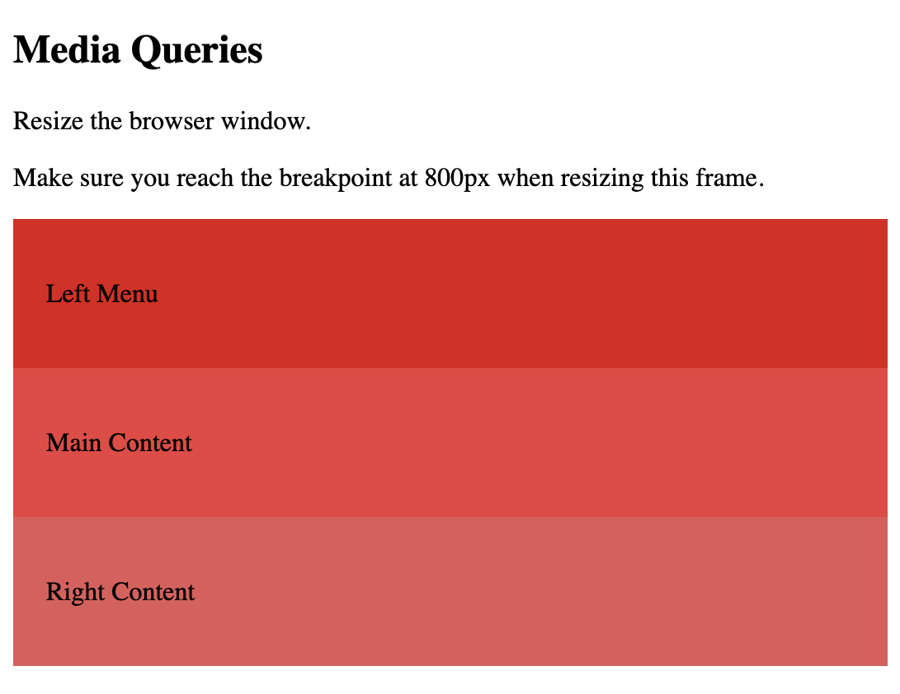
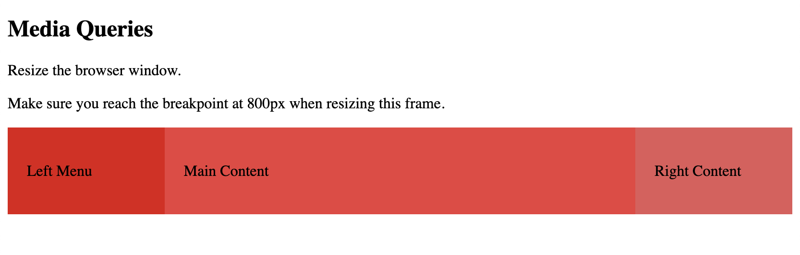

### HTML layout elements



`<header>` - Defines a header for a document or a section

`<nav>` - Defines a set of navigation links

`<section>` - Defines a section in a document

`<article>` - Defines an independent, self-contained content

`<aside>` - Defines content aside from the content (like a sidebar)

`<footer>` - Defines a footer for a document or a section

`<details>` - Defines additional details that the user can open and close on demand

`<summary>` - Defines a heading for the `<details>` element


```
<!DOCTYPE html>
<html lang="en">
<head>
<title>CSS Template</title>
<meta charset="utf-8">
<meta name="viewport" content="width=device-width, initial-scale=1">
<style>
* {
  box-sizing: border-box;
}

body {
  font-family: Arial, Helvetica, sans-serif;
}

/* Style the header */
header {
  background-color: #4149ee;
  padding: 30px;
  text-align: center;
  font-size: 35px;
  color: white;
}

/* Create two columns/boxes that floats next to each other */
nav {
  float: left;
  width: 30%;
  height: 300px; /* only for demonstration, should be removed */
  background: #9aa6f0;
  padding: 20px;
}

/* Style the list inside the menu */
nav ul {
  list-style-type: none;
  padding: 0;
}

article {
  float: left;
  padding: 20px;
  width: 70%;
  background-color: #a6bcef;
  height: 300px; /* only for demonstration, should be removed */
}

/* Clear floats after the columns */
section::after {
  content: "";
  display: table;
  clear: both;
}

/* Style the footer */
footer {
  background-color: #061986;
  padding: 10px;
  text-align: center;
  color: white;
}

/* Responsive layout - makes the two columns/boxes stack on top of each other instead of next to each other, on small screens */
@media (max-width: 600px) {
  nav, article {
    width: 100%;
    height: auto;
  }
}
</style>
</head>
<body>

<h2>CSS Layout Float</h2>
<p>In this example, we have created a header, two columns/boxes and a footer. On smaller screens, the columns will stack on top of each other.</p>
<p>Resize the browser window to see the responsive effect</p>

<header>
  <h2>Cities</h2>
</header>

<section>
  <nav>
    <ul>
      <li><a href="#">Kyoto</a></li>
      <li><a href="#">Osaka</a></li>
      <li><a href="#">Tokyo</a></li>
    </ul>
  </nav>
  
  <article>
    <h1>Kyoto</h1>
    <p>Kyoto is the capital city of Kyoto Prefecture in Japan. Located in the Kansai region on the island of Honshu, Kyoto forms a part of the Keihanshin metropolitan area along with Osaka and Kobe. As of 2020, the city had a population of 1.46 million, making it the ninth most populous city in Japan.</p>
  </article>
</section>

<footer>
  <p>Footer</p>
</footer>

</body>
</html>
```


## Responsive web pages

```
<!DOCTYPE html>
<html>
<head>
<meta name="viewport" content="width=device-width, initial-scale=1.0">
<style>
* {
  box-sizing: border-box;
}

.left {
  background-color: #e21313;
  padding: 20px;
  float: left;
  width: 20%; /* The width is 20%, by default */
}

.main {
  background-color: #ee3d3d;
  padding: 20px;
  float: left;
  width: 60%; /* The width is 60%, by default */
}

.right {
  background-color: #e35959;
  padding: 20px;
  float: left;
  width: 20%; /* The width is 20%, by default */
}

/* Use a media query to add a break point at 800px: */
@media screen and (max-width: 800px) {
  .left, .main, .right {
    width: 100%; /* The width is 100%, when the viewport is 800px or smaller */
  }
}
</style>
</head>
<body>

<h2>Media Queries</h2>
<p>Resize the browser window.</p>

<p>Make sure you reach the breakpoint at 800px when resizing this frame.</p>

<div class="left">
  <p>Left Menu</p>
</div>

<div class="main">
  <p>Main Content</p>
</div>

<div class="right">
  <p>Right Content</p>
</div>

</body>
</html>
```






